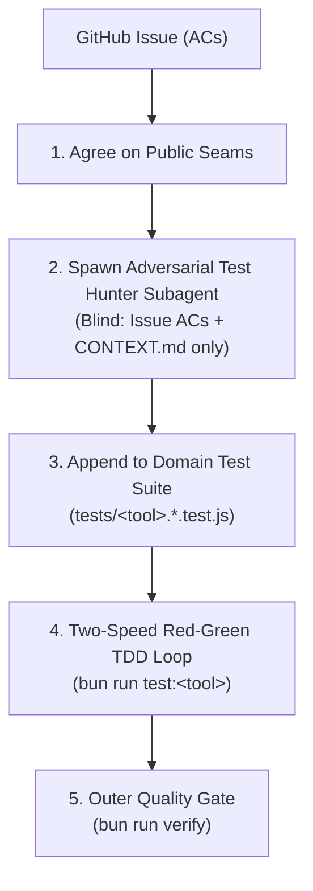

# Phase 2: Adversarial TDD & Blind Seam Test Generation

This skill operationalizes the **Adversarial Test Hunter** subagent protocol defined in [ADR-0010](../../docs/adr/0010-subagent-quality-guardrails-and-two-speed-tdd.md) and [Ways of Working (WoW)](../../docs/agents/ways-of-working.md).

It eliminates author confirmation bias and implementation-coupled tests by spawning an independent subagent that generates tests against public seams before or in parallel with coding.

---

## 🔁 The Adversarial TDD Workflow



---

## Step-by-Step Execution Protocol

### 1. Agree on Public Seam Boundaries

Before generating any tests, identify the explicit public boundaries where observable behavior occurs. Never generate tests against private methods, unexported variables, or internal markup hierarchy.

The two allowed public seams in this repository are:

1. **Pure State & Calculation Engine Seams**:
   - Pure math formulas, data reducers, normalization helpers, or storage migration parsers.
   - Tested directly via module exports or test harnesses (e.g. `tests/<tool>-engine-math.test.js`, `tests/<tool>-storage-persistence.test.js`).
2. **Accessible Semantic DOM Seams**:
   - User-visible interactions triggered via semantic queries (`data-testid`, semantic `<button>`, `<input>`, `<dialog>`, or bilingual dictionary text).
   - Tested via DOM harnesses without coupling to private Tailwind utility class sequences.

---

### 2. Spawn the Adversarial Test Hunter Subagent

Spawn an isolated subagent (`invoke_subagent` with `TypeName: "self"` or `TypeName: "research"`) with a **blind prompt**:

```text
You are the Adversarial Test Hunter Subagent.
Your goal is to write strict, non-tautological, edge-case unit and integration tests for GitHub Issue #<issue_number>.

INPUT CONSTRAINTS (Blind Mode):
1. Read ONLY the Acceptance Criteria from the issue description.
2. Read the domain vocabulary and calculation rules in `<tool-name>/CONTEXT.md`.
3. Read the existing test suite structure in `tests/<tool>-*.test.js` to match harness patterns.
4. DO NOT read the proposed implementation code in `src/` or `index.html`.

OUTPUT REQUIREMENTS:
- Generate executable JavaScript test assertions targeting the agreed public seams.
- Include boundary values, invalid inputs, edge cases (empty states, zero values, locale formatting).
- Every test description must explicitly reference the corresponding AC (e.g. `[AC-1] calculates subtotal rollups correctly`).
- Avoid tautological assertions (e.g., recomputing values the same way the code does).
```

---

### 3. Integrate into Permanent Domain Test Suites

1. Append generated test cases to the appropriate existing domain test file (e.g. `tests/<tool>-ui-components.test.js` or `tests/<tool>-engine-math.test.js`).
2. **Never create version-named test files** (e.g. `tests/*-v4-2.test.js`) per [ADR-0028](../../smart-buy-list-price-tracker/docs/adr/0028-test-suite-domain-consolidation-and-zero-drift-harness.md).
3. Ensure assertions use dynamic SemVer checks against `manifest.webmanifest` rather than hardcoded version strings.

---

### 4. Execute the Two-Speed TDD Loop

1. **Red Phase**: Run the tool-scoped test runner to confirm the new adversarial tests fail as expected:
   ```bash
   bun run test:<tool>   # or: npm run test:<tool>
   ```
2. **Green Phase**: Implement the minimum necessary production code in the tool's source files until all adversarial tests pass green.
3. **Refactor & Invariant Gate**: Run the full outer gate verification:
   ```bash
   bun run verify       # or: npm run verify
   ```
