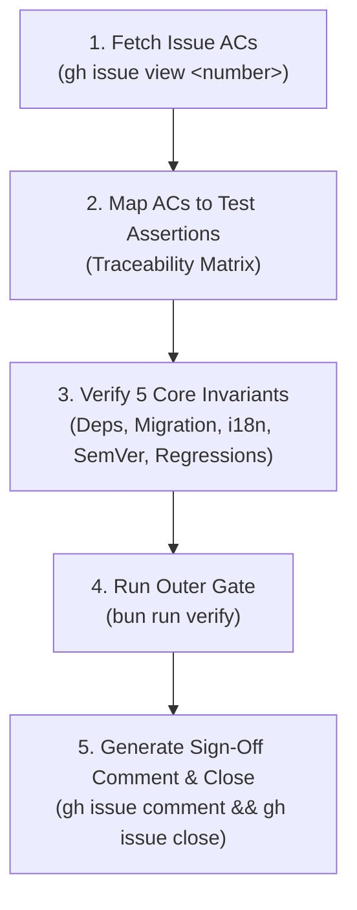

# Phase 4: Acceptance Criteria & Release Verification

This skill operationalizes the **AC Verification Subagent** protocol defined in [ADR-0010](../../docs/adr/0010-subagent-quality-guardrails-and-two-speed-tdd.md) and [Ways of Working (WoW)](../../docs/agents/ways-of-working.md).

It guarantees that no GitHub issue is closed and no PR is merged with unchecked or unverified Acceptance Criteria.

---

## 🔁 Verification Lifecycle



---

## Step-by-Step Execution Protocol

### 1. Fetch & Parse Issue Acceptance Criteria

Retrieve the authoritative acceptance criteria from the GitHub issue tracker:

```bash
gh issue view <issue-number> --json title,body
```

Extract every checkable `- [ ]` markdown item from the issue body. Ensure no bullet points or requirements are omitted.

---

### 2. Construct the PR Traceability Matrix

For every Acceptance Criterion (`AC-1`, `AC-2`, ...), locate the corresponding automated test assertion in the domain test suites (`tests/<tool>.*.test.js`).

Populate the PR description checklist using the mandatory format:

```markdown
## Acceptance Criteria & Test Traceability Matrix
- [x] **AC-1 (<Short Description>)**: Verified by `tests/<tool>.<domain>.test.js: '<Test Assertion Name>'`
- [x] **AC-2 (<Short Description>)**: Verified by `tests/<tool>.<domain>.test.js: '<Test Assertion Name>'`
```

> **Strict Rule**: If any AC cannot be tied directly to an automated test assertion or explicit verifiable artifact, the PR must NOT be opened or merged until the missing test is authored.

---

### 3. Verify the 5 Core Repository Invariants

Mechanically verify all 5 non-negotiable repository invariants:

1. **Zero Runtime Dependencies**: Confirm zero unbundled external npm dependencies in source/compiled HTML.
2. **Silent Data Migration**: If `localStorage` or `IndexedDB` schemas changed, verify backward-compatibility tests in `tests/*storage*.test.js`.
3. **Bilingual Parity**: Verify 100% Vietnamese (`vi`) and English (`en`) dictionary key parity:
   ```bash
   bun run test:i18n   # or: npm run test:i18n
   ```
4. **Dynamic SemVer**: Verify version is read dynamically from `manifest.webmanifest` (no version-named test files).
5. **Zero Regression**: Verify full suite pass:
   ```bash
   bun run verify      # or: npm run verify
   ```

---

### 4. Issue Closure & Formal Sign-Off

Upon successful squash-and-merge of the PR to `main`, post the standardized sign-off comment and close the issue:

```bash
gh issue comment <issue-number> --body "Verified via PR #<pr-number>. All acceptance criteria checked and 100% test suites passing (\`bun run verify\` / \`npm run verify\`)."
gh issue close <issue-number>
```
