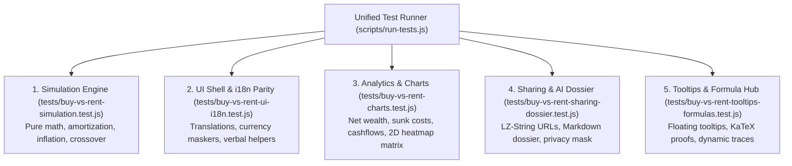

# 🧪 Buy vs. Rent Home Comparison — Requirements & Test Plan

> **Target:** `buy-vs-rent-home-comparison/index.html` & `buy-vs-rent-home-comparison/dist/index.html` (or `dist/buy-vs-rent-home-comparison/index.html`)  
> **Goal:** Deterministically validate all 35 feature requirements (R1–R35) across financial simulation mathematics, amortization schedules, opportunity cost delta reinvestment, bilingual i18n parity, analytics charts, URL sharing, AI decision dossiers, and compacted build packaging.  
> **Method:** Automated Node.js test runner (`npm test`) + Comprehensive manual QA checklist.

```bash
# Automated Test Suites for Buy vs. Rent Home Comparison
npm test                      # Run all repository test suites with unified multi-format reporting
npm run test:buy-rent         # Pure simulation engine unit tests & mathematical amortization tests
npm run test:buy-rent:ui      # UI shell, translation dictionary parity & currency masking tests
npm run test:buy-rent:charts  # Chart.js analytics, 2D sensitivity matrix & visualization tests
npm run test:buy-rent:dossier # LZ-String URL hash sharing, AI decision dossier & privacy mask tests
npm run test:buy-rent:tooltips# Floating tooltips, methodology hub & dynamic formula trace tests
```

---

## 📋 Feature Requirements Matrix (R1–R35)

| ID      | Feature                              | Requirement Specification                                                                                                            | ADR Reference                                                                              | Priority |
| :------ | :----------------------------------- | :----------------------------------------------------------------------------------------------------------------------------------- | :----------------------------------------------------------------------------------------- | :------- |
| **R1**  | Pure Dual-Path Simulation Engine     | Decoupled deterministic engine `simulateBuyVsRent(params)` computing month-by-month net wealth, cashflows, and cumulative sunk costs | [`ADR-0001`](./docs/adr/0001-dual-path-deterministic-wealth-simulation.md)                 | P0       |
| **R2**  | Dual Mortgage Amortization Schemes   | Support both Fixed EMI (Annuity) and Linear Principal Reduction (Reducing interest) with exact monthly schedules                     | [`ADR-0002`](./docs/adr/0002-dual-phase-mortgage-amortization-and-prepayment-penalties.md) | P0       |
| **R3**  | Dual-Phase Interest Rates            | Promotional teaser rate ($r_{\text{teaser}}$ for $M$ months) resetting to floating benchmark ($r_{\text{floating}}$)                 | [`ADR-0002`](./docs/adr/0002-dual-phase-mortgage-amortization-and-prepayment-penalties.md) | P0       |
| **R4**  | Prepayment & Penalty Schedule        | Optional monthly extra principal repayment with tiered early settlement penalty calculation (Years 1–3, 4–5, 6+)                     | [`ADR-0002`](./docs/adr/0002-dual-phase-mortgage-amortization-and-prepayment-penalties.md) | P1       |
| **R5**  | Opportunity Cost Delta Sweep         | Reinvest positive cashflow delta into Rent Investment Portfolio; withdraw during rental deficit with liquid debt tracking            | [`ADR-0003`](./docs/adr/0003-opportunity-cost-delta-reinvestment-and-deficit-handling.md)  | P0       |
| **R6**  | Realizable Home Equity & Friction    | Deduct configurable selling friction (2%–3%) from property market value; provide gross vs net equity toggle                          | [`ADR-0004`](./docs/adr/0004-realizable-home-equity-and-selling-friction.md)               | P0       |
| **R7**  | Decoupled Inflation & Appreciation   | Independent parameters for Property Appreciation ($r_{\text{prop}}$), Rent Inflation ($r_{\text{rent}}$), and CPI ($r_{\text{cpi}}$) | [`ADR-0005`](./docs/adr/0005-decoupled-inflation-and-continuous-purchasing-power.md)       | P0       |
| **R8**  | Purchasing Power (Real Value) Toggle | Continuous inflation-discounting toggle displaying Nominal vs Real Purchasing Power curves on charts and KPIs                        | [`ADR-0005`](./docs/adr/0005-decoupled-inflation-and-continuous-purchasing-power.md)       | P0       |
| **R9**  | Upfront Acquisition Breakdown        | Expandable breakdown: Downpayment, Registration Tax (0.5%), Notary/Legal, Furnishing Fit-out, Loan Insurance                         | [`CONTEXT.md`](./CONTEXT.md)                                                               | P1       |
| **R10** | Property Type Presets                | 1-click toggle for Apartment/Condo vs Landed House adjusting HOA dues, maintenance rates, and growth profiles                        | [`CONTEXT.md`](./CONTEXT.md)                                                               | P1       |
| **R11** | Rule-of-Thumb Valuation Badges       | Dynamic live badges for Price-to-Rent Ratio (PRR) and Gross Rental Yield with color-coded valuation benchmarks                       | [`CONTEXT.md`](./CONTEXT.md)                                                               | P1       |
| **R12** | Net Wealth Crossover Detector        | Highlight the exact crossover year and month, total wealth delta at horizon, and milestone timeline markers                          | [`ADR-0001`](./docs/adr/0001-dual-path-deterministic-wealth-simulation.md)                 | P0       |
| **R13** | Cumulative Sunk Cost Visualizer      | Side-by-side breakdown comparing Rent Paid vs Mortgage Interest + Taxes + HOA + Maintenance + Friction                               | [`CONTEXT.md`](./CONTEXT.md)                                                               | P1       |
| **R14** | Monthly Cashflow Delta Visualizer    | Chart showing monthly out-of-pocket obligation curves over time (highlighting mortgage payoff & rent crossover)                      | [`CONTEXT.md`](./CONTEXT.md)                                                               | P1       |
| **R15** | 2D Sensitivity Matrix Heatmap        | Interactive heatmap grid showing crossover horizon across Property Appreciation (2%–12%) vs Yields (4%–14%)                          | [`CONTEXT.md`](./CONTEXT.md)                                                               | P1       |
| **R16** | Strategy Persona Presets             | 4 Presets: _Urban Apartment Condo_, _Suburban Landed House_, _FIRE Renter & Investor_, _Short-Term Mobility_ with 5s undo            | [`CONTEXT.md`](./CONTEXT.md)                                                               | P1       |
| **R17** | State Persistence & Schema Migration | Save/load all simulation parameters in `localStorage` (`buyVsRent_params`) with versioned schema migration                           | —                                                                                          | P0       |
| **R18** | Shareable URL Hash (LZ-String)       | Serialize simulation parameters into URL hash via LZ-String compression with Base64 fallback; auto-load on visit                     | —                                                                                          | P1       |
| **R19** | Bilingual Localization (i18n)        | Complete English (`en`) and Vietnamese (`vi`) language parity with seamless toggle and persisted preference                          | [`CONTEXT.md`](./CONTEXT.md)                                                               | P1       |
| **R20** | Currency Masking & Verbal Helpers    | Locale-aware thousand separator masking (`.` for `vi`, `,` for `en`) with real-time Vietnamese verbal helpers                        | [`CONTEXT.md`](./CONTEXT.md)                                                               | P1       |
| **R21** | Quick Presets & Debounced Recalc     | Interactive 1-click preset chips under inputs (Price, Downpayment, Rent, Yield) with active highlighting                             | —                                                                                          | P1       |
| **R22** | AI Real Estate Decision Dossier      | Generate structured Markdown dossier with 5 consultation blueprints (Verdict, Debt Stress-Test, FIRE, Asset Allocation)              | [`CONTEXT.md`](./CONTEXT.md)                                                               | P1       |
| **R23** | Privacy Anonymization Mask           | Client-side toggle converting absolute sums in the AI Dossier to home price multiples and percentage shares                          | [`CONTEXT.md`](./CONTEXT.md)                                                               | P1       |
| **R24** | WCAG 2.1 Dark/Light Theme System     | Semantic CSS custom properties (`:root` / `:root.light`) with high-contrast compliance and Chart.js theme re-render                  | —                                                                                          | P1       |
| **R25** | Responsive Mobile Ergonomics         | Mobile-first layout with compact 2x2 metric cards, horizontally scrollable touch preset carousels, and action sheet                  | —                                                                                          | P1       |
| **R26** | Printable Executive Summary          | Clean `@media print` layout and PDF export styling via `window.print()`                                                              | —                                                                                          | P2       |
| **R27** | Chart Image Export                   | 1-click high-resolution PNG export of all active Chart.js canvas instances with solid background fill                                | —                                                                                          | P2       |
| **R28** | Contextual Tooltip Popovers          | Zero-dependency floating popover engine for all parameters, metric badges, and chart legends                                         | [`ADR-0006`](./docs/adr/0006-contextual-tooltips-and-methodology-formula-engine.md)        | P1       |
| **R29** | Modal Lifecycle Manager              | Single-active-dialog invariant, scroll locking, backdrop click dismissals, and unified `Esc` key interception                        | —                                                                                          | P1       |
| **R30** | Toast Notification Engine            | Non-blocking slide-in status, validation, and undo toasts with auto-dismiss timers                                                   | —                                                                                          | P1       |
| **R31** | Extreme Number & Boundary Guard      | Robust handling of 0% downpayments, 0% interest rates, 100B+ VND home valuations, and edge-case timelines                            | —                                                                                          | P0       |
| **R32** | Keyboard Shortcuts                   | Quick hotkeys: `Enter` (re-run/refresh), `Ctrl+S`/`Cmd+S` (save state), `Esc` (dismiss modals/sheets)                                | —                                                                                          | P2       |
| **R33** | Onboarding Tour Walkthrough          | 5-step guided interactive tour introducing key input sections, valuation badges, crossover charts, and AI dossier                    | —                                                                                          | P2       |
| **R34** | Reset to Defaults                    | 1-click restore to pristine default parameters and UI state with instant refresh                                                     | —                                                                                          | P1       |
| **R35** | Zero-Build Compaction Deliverable    | Single standalone HTML source file compacted into `dist/` verifying 100% offline standalone capability                               | Root [`ADR-0003`](../docs/adr/0003-compacted-standalone-html-build-pipeline.md)            | P0       |

---

## 🏗️ Automated Test Suites

The tool is verified through 5 dedicated Node.js test suites integrated directly into the unified test runner (`scripts/run-tests.js`):



---

## 🛡️ Manual QA Verification Checklist

Before opening a PR or merging to `main`, verify the following interactive behaviors in both Chromium and Safari/Firefox:

- [ ] **Dual Amortization Verification**: Switch between Fixed EMI and Linear Principal reduction; verify that Linear Principal displays declining monthly payments and lower lifetime interest.
- [ ] **Teaser Rate Reset**: Configure a 24-month promo teaser rate; inspect the monthly cashflow chart to verify the payment step-up at month 25.
- [ ] **Sensitivity Heatmap**: Hover over 2D sensitivity matrix cells; verify that break-even years match simulation expectations and cells are color-coded smoothly.
- [ ] **Dynamic Verbal Helpers**: Type `4500000000` into Home Price; verify that `4.5 Tỷ VND` (or `4.5 Billion VND` in English) updates instantaneously without cursor jumping.
- [ ] **AI Decision Dossier Bilingual Export**: Generate an AI Dossier in English and Vietnamese; switch between all 4 prompt blueprints (Verdict, Stress-Test, FIRE, Asset Allocation) and verify 100% bilingual parity across parameters, outcomes, and advisory consultation blueprints. Activate Privacy Anonymization Mask and verify all absolute numbers convert to localized home price multiples and percentages.
- [ ] **Methodology Hub & KaTeX Proofs**: Open the Methodology Hub; check that dynamic formula traces substitute active input values into mathematical equations in real time.
- [ ] **Single-File Compaction**: Run `npm run build:buy-rent` and open `buy-vs-rent-home-comparison/dist/index.html` via `file://` to ensure 100% offline standalone execution.
