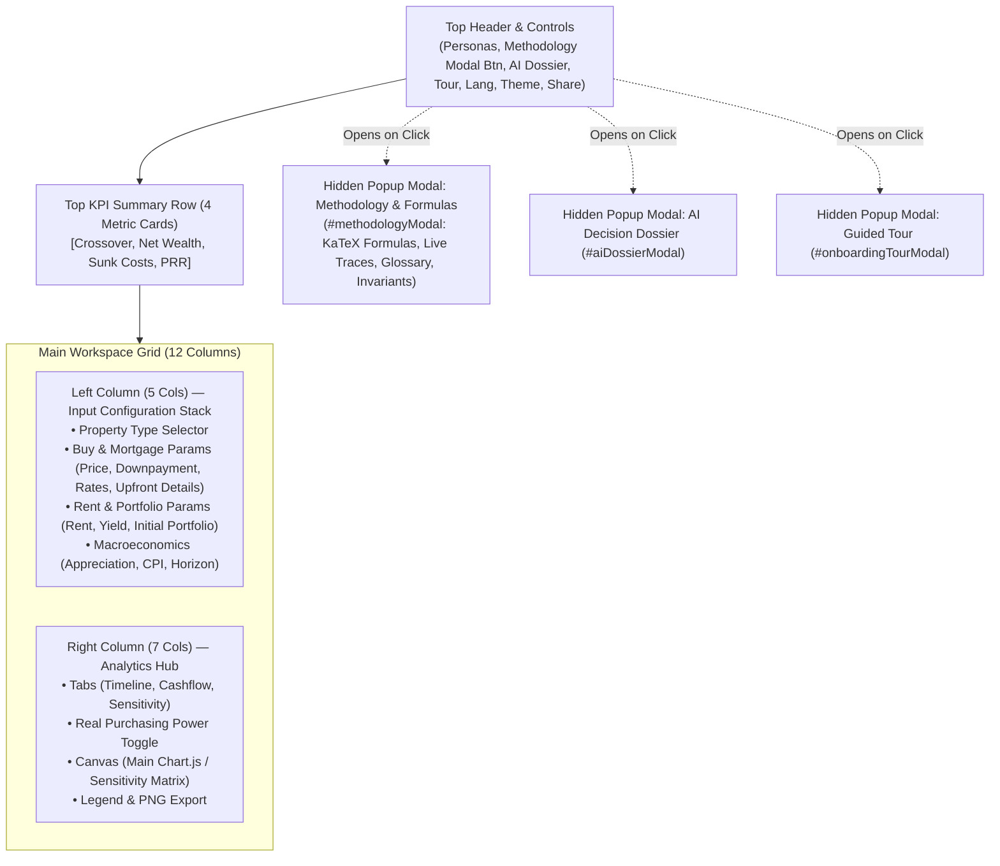
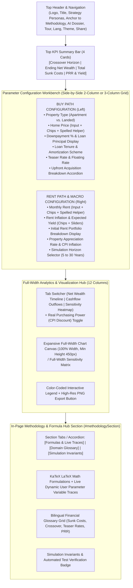

# UI/UX Research & Layout Architecture Review: Buy vs. Rent Home Comparison

> **Target Tool:** `buy-vs-rent-home-comparison/index.html`  
> **Review Date:** 2026-08-28  
> **Methodology:** Headless DOM & Layout Inspection via Lightpanda MCP, Component Hierarchy Audit, Human Factors & Financial Tool Usability Analysis.

---

## 🔍 1. Lightpanda MCP Inspection & Current Architecture Audit

### 1.1 Current Layout Hierarchy (As-Is)



<details>
<summary>ASCII Diagram (Text Fallback)</summary>

```text
+---------------------------------------------------------------------------------------------------+
| Top Header Bar: Title, Personas, [Methodology Modal Btn], [AI Dossier], Tour, Lang, Theme, Share  |
+---------------------------------------------------------------------------------------------------+
| KPI Cards: [1. Crossover Horizon] | [2. Net Wealth] | [3. Total Sunk Costs] | [4. Price-to-Rent] |
+---------------------------------------------------------------------------------------------------+
| MAIN WORKSPACE (lg:grid-cols-12):                                                                 |
|  LEFT (5 Cols):                                    | RIGHT (7 Cols):                              |
|  1. Property Type (Apartment / Landed)             | - Analytics Tabs (Timeline, Flow, Matrix)    |
|  2. Home Purchase & Mortgage Form                  | - Real Purchasing Power Toggle               |
|     - Price, Downpayment, Tenure, Rates, Fees      | - Chart Canvas / Sensitivity Heatmap         |
|  3. Renting & Investment Portfolio Form            | - Legend & Export Button                     |
|     - Rent, Inflation, Yield, Initial Seed         |                                              |
|  4. Macro & Horizon Form                           | (Leaves blank vertical dead space on right   |
|     - Appreciation, CPI, Horizon Years             |  due to tall 1200px input stack on left)     |
+---------------------------------------------------------------------------------------------------+
| MODAL POPUP (Hidden by default):                                                                  |
|  - Methodology & Mathematical Formulas (KaTeX Math, Live Substitution Traces, Glossary)           |
+---------------------------------------------------------------------------------------------------+
```

</details>

---

## ⚠️ 2. Core Usability & UI/UX Issues Identified

1. **Vertical Column Asymmetry & Dead Space**:
   - The parameter input stack on the left spans 4 rich cards with multiple sliders, chips, and accordions, measuring **~1250px in vertical height**.
   - The Analytics Hub on the right has a fixed minimum height of **~560px**.
   - _Result_: On desktop screens (1080p, 1440p, 4K), there is massive empty dead space below the chart, or when the user scrolls down to tweak Rent or Macro parameters, the chart scrolls completely out of viewport view.

2. **Hidden Methodological Transparency (Modal Trap)**:
   - Financial decision tools rely heavily on user trust. Mathematical formulations, formulas (EMI annuity, net equity with friction, opportunity cost sweep), and live numeric substitution traces are currently sealed inside a modal popup (`#methodologyModal`).
   - Modal popups block access to the underlying workbench, force extra clicks, and hide crucial proof points from users who want to review equations while adjusting assumptions.

3. **Restricted Horizontal Canvas Resolution for Long-Horizon Data**:
   - Compressing 30-year (360 monthly points) dual net-wealth curves, cashflow bars, and 6x6 sensitivity heatmaps into a 7-column width (~650px on standard laptops) cramps timeline legends, tooltips, and axis labels.
   - Moving the chart to a full-width bottom container expands the canvas width to **~1200px**, dramatically improving chart readability, milestone marker clarity, and sensitivity matrix tap targets.

---

## 🏛️ 3. Proposed Target Layout Architecture (To-Be)



<details>
<summary>ASCII Target Diagram (Text Fallback)</summary>

```text
+---------------------------------------------------------------------------------------------------+
| HEADER: Title, Strategy Personas, [Methodology Anchor], [AI Dossier], Tour, Lang, Theme, Share    |
+---------------------------------------------------------------------------------------------------+
| KPI SUMMARY ROW: [1. Crossover] | [2. Net Wealth] | [3. Total Sunk Costs] | [4. Price-to-Rent]    |
+---------------------------------------------------------------------------------------------------+
| CONFIGURATION WORKBENCH (Side-by-Side Dual Column Grid):                                          |
|  [LEFT: Buy Path Parameters]                   | [RIGHT: Rent Path & Macro Parameters]            |
|  • Property Type Selector                      | • Monthly Rent & Quick Chips                     |
|  • Home Purchase Price + Quick Chips           | • Rent Inflation & Investment Yield              |
|  • Downpayment % & Loan Principal              | • Initial Rent Portfolio Summary                 |
|  • Loan Tenure & Amortization Mode             | • Property Growth Rate & CPI Inflation           |
|  • Teaser & Floating Interest Rates            | • Simulation Horizon Selector                    |
|  • Upfront Fees & Renovation Breakdown         |                                                  |
+---------------------------------------------------------------------------------------------------+
| FULL-WIDTH ANALYTICS & VISUALIZATION HUB:                                                         |
|  [Tabs: Net Wealth Timeline | Cashflow Outflow | Sensitivity Matrix]    [Toggle: Real (CPI-Adj)]  |
|  ===============================================================================================  |
|  [ Expansive Full-Width Interactive Chart Canvas (1200px wide, high-resolution curves)        ]  |
|  ===============================================================================================  |
|  [Interactive Chart Legend & Milestone Badges]                         [Export High-Res PNG]      |
+---------------------------------------------------------------------------------------------------+
| IN-PAGE METHODOLOGY & MATHEMATICAL FORMULA HUB:                                                   |
|  [Tabs or Collapsible: Formulas & Live Traces | Financial Glossary | Simulation Invariants]        |
|  • Formula 1: Mortgage Amortization (Fixed EMI vs Linear) + LIVE VARIABLE SUBSTITUTION TRACE     |
|  • Formula 2: Realizable Home Equity with Friction + LIVE VARIABLE SUBSTITUTION TRACE           |
|  • Formula 3: Rent Opportunity Delta Sweep + LIVE VARIABLE SUBSTITUTION TRACE                   |
|  • Formula 4: Price-to-Rent Ratio & Gross Yield + LIVE VARIABLE SUBSTITUTION TRACE              |
|  • Ubiquitous Bilingual Terminology Dictionary & Modeling Invariants                             |
+---------------------------------------------------------------------------------------------------+
```

</details>

---

## 📐 4. Design Decision Tree & Architectural Trade-offs

1. **Workbench Layout (Inputs)**:
   - _Option A (Recommended)_: **Balanced 2-Column Grid** (`grid-cols-1 md:grid-cols-2`). Left side contains all Buy & Mortgage inputs; right side contains Rent, Yield, and Macro inputs. Both columns align naturally with identical visual height (~550px).
   - _Option B_: **3-Column Grid** (`grid-cols-1 lg:grid-cols-3`). Col 1: Buy, Col 2: Rent, Col 3: Macro & Presets. Can feel tight on 1024px screens.

2. **Methodology Hub Presentation**:
   - _Option A (Recommended)_: **In-Page Dedicated Card with Tabbed Internal Views** (Formulas & Traces, Glossary, Invariants) with smooth-scroll jump from the top header button (`#methodologyBtn` scrolls to `#methodologySection`).
   - _Option B_: **In-Page Collapsible Section (`<details>` / Accordion)** where users can expand or collapse the entire methodology section.
   - _Option C_: **Multi-Column Linear Document** rendering all formulas, glossary, and invariants without tabs.

3. **Chart Placement & Sizing**:
   - _Option A (Recommended)_: Full-width container directly below the configuration workbench with an optimized aspect ratio (~16:9 on desktop, min-height 420px–480px), ensuring the 360-month time-series and crossover markers render with maximum legibility.
