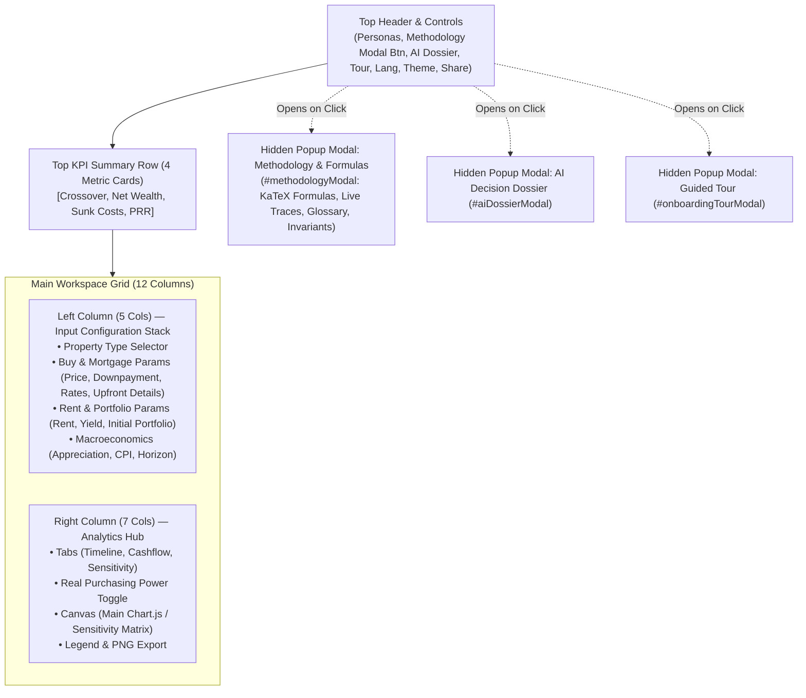
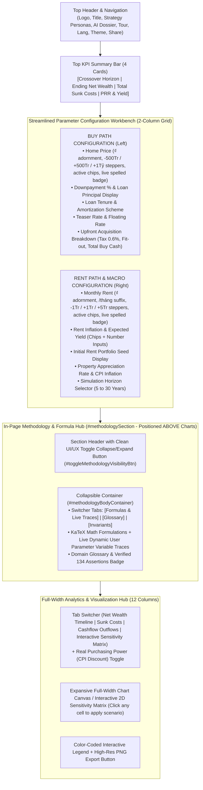

# UI/UX Research & Layout Architecture Review: Buy vs. Rent Home Comparison

> **Target Tool:** `buy-vs-rent-home-comparison/index.html`  
> **Review Date:** 2026-08-28  
> **Methodology:** Headless DOM & Layout Inspection via Lightpanda MCP, Component Hierarchy Audit, Human Factors & Financial Tool Usability Analysis.

---

## 🔍 1. Lightpanda MCP Inspection & Current Architecture Audit

### 1.1 Current Layout Hierarchy (As-Is)



<details>
<summary>ASCII Diagram (Text Fallback)</summary>

```text
+---------------------------------------------------------------------------------------------------+
| Top Header Bar: Title, Personas, [Methodology Modal Btn], [AI Dossier], Tour, Lang, Theme, Share  |
+---------------------------------------------------------------------------------------------------+
| KPI Cards: [1. Crossover Horizon] | [2. Net Wealth] | [3. Total Sunk Costs] | [4. Price-to-Rent] |
+---------------------------------------------------------------------------------------------------+
| MAIN WORKSPACE (lg:grid-cols-12):                                                                 |
|  LEFT (5 Cols):                                    | RIGHT (7 Cols):                              |
|  1. Property Type (Apartment / Landed)             | - Analytics Tabs (Timeline, Flow, Matrix)    |
|  2. Home Purchase & Mortgage Form                  | - Real Purchasing Power Toggle               |
|     - Price, Downpayment, Tenure, Rates, Fees      | - Chart Canvas / Sensitivity Heatmap         |
|  3. Renting & Investment Portfolio Form            | - Legend & Export Button                     |
|     - Rent, Inflation, Yield, Initial Seed         |                                              |
|  4. Macro & Horizon Form                           | (Leaves blank vertical dead space on right   |
|     - Appreciation, CPI, Horizon Years             |  due to tall 1200px input stack on left)     |
+---------------------------------------------------------------------------------------------------+
| MODAL POPUP (Hidden by default):                                                                  |
|  - Methodology & Mathematical Formulas (KaTeX Math, Live Substitution Traces, Glossary)           |
+---------------------------------------------------------------------------------------------------+
```

</details>

---

## ⚠️ 2. Core Usability & UI/UX Issues Identified

1. **Vertical Column Asymmetry & Dead Space**:
   - The parameter input stack on the left spans 4 rich cards with multiple sliders, chips, and accordions, measuring **~1250px in vertical height**.
   - The Analytics Hub on the right has a fixed minimum height of **~560px**.
   - _Result_: On desktop screens (1080p, 1440p, 4K), there is massive empty dead space below the chart, or when the user scrolls down to tweak Rent or Macro parameters, the chart scrolls completely out of viewport view.

2. **Hidden Methodological Transparency (Modal Trap)**:
   - Financial decision tools rely heavily on user trust. Mathematical formulations, formulas (EMI annuity, net equity with friction, opportunity cost sweep), and live numeric substitution traces are currently sealed inside a modal popup (`#methodologyModal`).
   - Modal popups block access to the underlying workbench, force extra clicks, and hide crucial proof points from users who want to review equations while adjusting assumptions.

3. **Restricted Horizontal Canvas Resolution for Long-Horizon Data**:
   - Compressing 30-year (360 monthly points) dual net-wealth curves, cashflow bars, and 6x6 sensitivity heatmaps into a 7-column width (~650px on standard laptops) cramps timeline legends, tooltips, and axis labels.
   - Moving the chart to a full-width bottom container expands the canvas width to **~1200px**, dramatically improving chart readability, milestone marker clarity, and sensitivity matrix tap targets.

---

## 🏛️ 3. Implemented Modern UI/UX Layout Architecture



<details>
<summary>ASCII Layout Diagram (Text Fallback)</summary>

```text
+---------------------------------------------------------------------------------------------------+
| HEADER: Title, Strategy Personas, [AI Dossier], Tour, Lang (VI/EN), Theme (Dark/Light), Share     |
+---------------------------------------------------------------------------------------------------+
| KPI SUMMARY ROW: [1. Crossover] | [2. Net Wealth] | [3. Total Sunk Costs] | [4. Price-to-Rent]    |
+---------------------------------------------------------------------------------------------------+
| CONFIGURATION WORKBENCH (Streamlined Dual Column Grid):                                           |
|  [LEFT: Buy Path Parameters]                   | [RIGHT: Rent Path & Macro Parameters]            |
|  • Home Purchase Price (₫, Steppers, Chips)    | • Monthly Rent (₫, /mo, Steppers, Chips)         |
|  • Downpayment % & Loan Principal Display      | • Rent Inflation & Investment Yield              |
|  • Loan Tenure & Amortization Mode             | • Initial Rent Portfolio Seed Summary            |
|  • Teaser & Floating Interest Rates            | • Property Growth Rate & CPI Inflation           |
|  • Upfront Acquisition Breakdown Card          | • Simulation Horizon Selector                    |
+---------------------------------------------------------------------------------------------------+
| IN-PAGE METHODOLOGY & MATHEMATICAL FORMULAS (Collapsible - Above Charts):                        |
|  [Header: Title + 4 Formulas Badge]                           [Toggle: Thu gọn / Mở rộng ▼]       |
|  -----------------------------------------------------------------------------------------------  |
|  [Tabs: Formulas & Live Traces | Financial Glossary | Simulation Invariants]                      |
|  • Formula 1: Mortgage Amortization (Fixed EMI vs Linear) + LIVE DYNAMIC NUMERIC TRACE           |
|  • Formula 2: Realizable Home Equity with Friction + LIVE DYNAMIC NUMERIC TRACE                 |
|  • Formula 3: Rent Opportunity Delta Sweep + LIVE DYNAMIC NUMERIC TRACE                         |
|  • Formula 4: Price-to-Rent Ratio & Gross Yield + LIVE DYNAMIC NUMERIC TRACE                    |
+---------------------------------------------------------------------------------------------------+
| FULL-WIDTH ANALYTICS & VISUALIZATION HUB:                                                         |
|  [Tabs: Net Wealth Timeline | Sunk Costs | Cashflow | Sensitivity Matrix] [Toggle: Real (CPI)]   |
|  ===============================================================================================  |
|  [ Expansive Full-Width Chart Canvas or Interactive 2D Sensitivity Heatmap Table               ]  |
|  [ (Clicking any cell in Sensitivity Matrix applies the scenario instantly with reactive toast) ]  |
|  ===============================================================================================  |
|  [Interactive Chart Legend & Breakdown Badges]                         [Export High-Res PNG]      |
+---------------------------------------------------------------------------------------------------+
```

</details>

---

## 📐 4. Implemented Enhancements Summary

1. **Removed Redundant `Property Type Profile`**:
   - Eliminated the separate 120px Property Type selector card from the input stack.
   - Streamlined the workbench directly into Home Purchase Price and core parameters.
2. **Upgraded `Home Purchase Price` and `Monthly Rent` UX**:
   - Added currency symbol adornment `₫`, `/tháng` suffix, prominent live spelled amount chips (e.g. `3.5 Tỷ VND`, `14 Triệu VND`), quick stepper buttons (`-500Tr`, `+500Tr`, `+1Tỷ` for buy; `-1Tr`, `+1Tr`, `+5Tr` for rent), and curated preset chips with active styling.
3. **Positioned `Methodology & Mathematical Formulas` Above Charts with Clean UI/UX Toggle**:
   - Swapped DOM ordering so `#methodologySection` sits directly above `#analyticsHubSection`.
   - Added `#toggleMethodologyVisibilityBtn` with collapse/expand state persistence (`localStorage`), smooth icon transitions, and auto-expand when invoked.
4. **Interactive Sensitivity Matrix (`applySensitivityScenario`)**:
   - Transformed the static sensitivity table into a fully interactive 2D scenario engine.
   - Clicking any matrix cell dynamically updates `propertyAppreciationRate` and `rentInvestmentYield`, triggers immediate re-simulation and chart re-rendering, highlights the active baseline cell with a gold star `★`, and displays feedback toast notifications.
