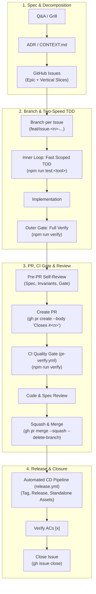

# Ways of Working (WoW) & GitHub Flow

This document defines the standard engineering workflow and delivery lifecycle for human engineers and autonomous coding agents working on this repository.

---

## 🔁 The Four-Phase Delivery Lifecycle



<details>
<summary>ASCII Diagram (Terminal / Plain-Text Fallback)</summary>

> **Note:** Mermaid is the authoritative diagram format. This ASCII diagram is maintained as a synchronized plain-text mirror for terminal and offline reading.

```text
[1. Spec & Decomposition]
       │
       ▼
  Q&A / Grill ──► ADR / CONTEXT.md ──► GitHub Issues (Epic + Vertical Slices)
                                              │
                                              ▼
[2. Branch & Two-Speed TDD]            Branch per Issue (`<type>/issue-<n>-<slug>`)
       │                                      │
       ▼                                      ▼
  Inner Loop (npm run test:<tool>) ──► Implementation ──► Outer Gate (`npm run verify`)
                                                              │
                                                              ▼
[3. PR, CI Gate & Merge]               Pre-PR Self-Review ──► Create PR (`Closes #<n>`)
       │                                                              │
       ▼                                                              ▼
  CI Quality Gate (pr-verify.yml) ◄── Code & Spec Review ◄── Automated CI Run
       │
       ▼
  Squash & Merge to main (`gh pr merge --squash --delete-branch`)
       │
       ▼
[4. Release & Closure]                 Automated CD Release (`release.yml`)
       │                                      │
       ▼                                      ▼
  GitHub Release & Assets Uploaded ──► Verify ACs [x] ──► Close Issue (`gh issue close`)
```

</details>

---

## Phase 1: Discovery, Architecture & Ticket Decomposition

1. **Clarify Requirements & Assumptions**:
   - Resolve underspecified behaviors and edge cases upfront through interactive Q&A or grilling.
   - Eliminate hidden assumptions before touching code.
2. **Domain Modeling & Architectural Decisions**:
   - Update `<tool-name>/CONTEXT.md` with ubiquitous vocabulary and explicitly avoided synonyms (see [`docs/agents/domain.md`](./domain.md)).
   - Record architectural trade-offs in root `docs/adr/` or `<tool-name>/docs/adr/`.
   - Maintain feature specifications in `<tool-name>/ITEMS_TO_IMPLEMENT.md` and test coverage in `<tool-name>/TEST_PLAN.md`.
3. **Vertical Slice Decomposition**:
   - Break large initiatives into small, independent, testable tickets (vertical slices).
   - Each ticket must have:
     - Clear problem statement and technical scope.
     - Checkable Acceptance Criteria checklist (`- [ ]`).
     - Explicit dependency graph (native GitHub dependencies or `Blocked by: #<n>` fallback per [`docs/agents/issue-tracker.md`](./issue-tracker.md)).
4. **Publish to GitHub Issue Tracker**:
   - Create parent tracking epic and child issues using `gh issue create`.

---

## Phase 2: Branching & Two-Speed Test-Driven Implementation

Every issue follows **GitHub Flow** with an isolated branch:

1. **Claim the Issue**:
   ```bash
   gh issue edit <issue-number> --add-assignee @me
   ```
2. **Create a Dedicated Branch from `main`**:
   ```bash
   git checkout -b <type>/issue-<number>-<short-slug>
   # Examples:
   # git checkout -b feat/issue-2-emergency-buffer
   # git checkout -b fix/issue-3-scenario-b-workbench
   ```
3. **⚡ The Two-Speed Verification Loop**:
   - **Inner Loop (Fast Scoped TDD)**: During active development, run targeted sub-second test suites for instant feedback:
     ```bash
     # Tool-scoped execution (runs all domain suites for a specific tool)
     npm run test:tracker     # All 7 Smart Buy-List domain suites
     npm run test:buy-rent    # Buy vs Rent comparison suites
     npm run test:sim         # Savings Predictor simulation tests
     node scripts/run-tests.js --tool <name>  # Targeted tool filter

     # Domain-scoped execution (Smart Buy-List inner loop)
     npm run test:tracker:math      # Core math, normalization & deal scoring
     npm run test:tracker:storage   # LocalStorage, IndexedDB & backup
     npm run test:tracker:cloud     # Cloud sync & concurrency
     npm run test:tracker:ui        # UI interactions & components
     npm run test:tracker:pwa       # PWA lifecycle & safe-area
     npm run test:tracker:i18n      # Bilingual key parity
     npm run test:tracker:security  # Strict CSP & sanitization
     ```
   - **Outer Loop (Pre-PR Quality Gate)**: When the slice is code-complete, execute the full unified verification suite:
     ```bash
     npm run verify
     ```
     Zero errors across formatting (`prettier --check`), standalone compaction builds (`scripts/build.js`), and all 2,200+ test assertions (`scripts/run-tests.js`).
4. **External Distribution Sync ([ADR-0006](../adr/0006-configurable-external-distribution-sync.md))**:
   - `npm run build` and `npm run verify` automatically detect `TOOLS_DEST_DIR` (configured in `.env.local` or via CLI) and sync compiled artifacts to external static repositories. If unconfigured (such as in CI), sync is cleanly bypassed without warning.

---

## Phase 3: Pull Request, CI Quality Gate & Review

1. **Conventional Commits & Semantic Tag Triggers**:
   - Commit using Conventional Commit messages (`feat(...)`, `fix(...)`, `test(...)`, `docs(...)`):
     ```bash
     git add .
     git commit -m "feat(tool): implement feature description (#<issue-number>)"
     git push -u origin <branch-name>
     ```
   - **Release Tag Rules:**
     - Standard commit / PR title → triggers **patch bump** by default (`v0.63.1`).
     - Adding `#minor` to the commit/PR title → triggers **minor bump** (`v0.64.0`).
     - Adding `#major` to the commit/PR title → triggers **major bump** (`v1.0.0`).
2. **Agent & Developer Pre-PR Self-Review Checklist**:
   Before opening a PR, ensure all 5 invariants are satisfied:
   - [ ] **Spec Conformance**: Every Acceptance Criteria checkbox in the issue is backed by an automated assertion.
   - [ ] **Zero Runtime Dependencies**: Source and compiled single-file HTML have zero external unbundled npm runtime imports.
   - [ ] **Data Migration Invariant**: Browser storage changes (IndexedDB / `localStorage`) include backwards-compatible silent auto-migration with dedicated test coverage (`tests/*storage*.test.js`).
   - [ ] **Bilingual Parity**: 100% dictionary key parity between Vietnamese (`vi`) and English (`en`) strings (`npm run test:i18n`).
   - [ ] **Dynamic SemVer & No Version-Named Test Files ([ADR-0028](../../smart-buy-list-price-tracker/docs/adr/0028-test-suite-domain-consolidation-and-zero-drift-harness.md))**:
     - Never create version-named test files (e.g. `tests/*-vX-Y.test.js`). Append tests to permanent domain suites.
     - Never hardcode SemVer strings in functional tests. Assert version synchronization dynamically against `manifest.webmanifest`.
3. **Open Pull Request Linked to Issue**:
   - Open a PR using GitHub auto-closing keywords:
   ```bash
   gh pr create --title "feat(tool): <Description> (#<issue-number>)" --body "Closes #<issue-number>

   ## Summary of Changes
   - <Key changes implemented>

   ## Acceptance Criteria Verified
   - [x] <AC 1>
   - [x] <AC 2>

   ## Test Verification
   - Verified with 100% green pass on \`npm run verify\`."
   ```
4. **Automated CI Quality Gate (`pr-verify.yml`)**:
   - Automatically executes `npm run verify` on GitHub Actions runners.
   - Renders interactive test summaries in `$GITHUB_STEP_SUMMARY`.
   - Uploads report artifacts (`test-reports/` with `index.html`, `results.json`, `junit.xml`) with `if: always()`.
   - **100% green check required before approval.**
5. **Review & Merge Gate**:
   - Conduct peer or automated agent review (standards + spec conformance).
   - **MANDATORY**: Merge the PR into `main` using **Squash and Merge**:
   ```bash
   gh pr merge <pr-number> --squash --delete-branch
   ```

---

## Phase 4: Automated Release, Verification & Closure

1. **Automated CD Pipeline (`release.yml`)**:
   - Merging to `main` triggers automated release packaging:
     - Runs full build and test validation.
     - Preserves report artifacts (`test-reports-release`).
     - Computes next Semantic Version tag (`v*.*.*`) and generates markdown release changelogs.
     - Packages standalone `.html` files, per-tool PWA bundles, and unified master `.zip` bundle via `node scripts/pack-release.js`.
     - Publishes annotated GitHub Release with downloadable assets.
2. **Verify Acceptance Criteria & Close Ticket**:
   - Verify that all issue Acceptance Criteria checklist items are satisfied (`[x]`).
   - Confirm issue closure with a verification summary comment:
   ```bash
   gh issue comment <issue-number> --body "Verified via PR #<pr-number>. All acceptance criteria checked and 100% test suites passing (\`npm run verify\`)."
   ```

---

## 💎 Standalone Tool Definition of Done (DoD)

Every standalone tool added to or maintained in this repository must satisfy the following 8-point checklist before completion:

1. **Directory Isolation**: Dedicated tool directory containing human-readable source `index.html` and compacted deliverable `dist/index.html`.
2. **Domain Glossary (`CONTEXT.md`)**: Comprehensive bilingual dictionary defining ubiquitous terms, avoided synonyms, and calculation rules.
3. **Context Map Registration**: Registered in root [`CONTEXT-MAP.md`](../../CONTEXT-MAP.md).
4. **Architectural Records (`docs/adr/`)**: Structural, mathematical, and UI/UX trade-offs documented under `<tool-name>/docs/adr/`.
5. **Specification & Test Plan**: Requirements in `ITEMS_TO_IMPLEMENT.md` and QA verification plan in `TEST_PLAN.md`.
6. **Bilingual Parity**: 100% Vietnamese (`vi`) and English (`en`) dictionary key parity with locale-aware formatters.
7. **Test Suite Integration**: Pure math unit tests, UI/DOM tests, and i18n tests authored in `tests/` and registered into `scripts/run-tests.js`.
8. **CI/CD Build & Release Ready**: Passes unified verification (`npm run verify`) and release packaging (`npm run pack:release`).

---

## 🛡️ Non-Negotiable Quality Guardrails

### How Quality Gates Are Enforced

- **Authoritative Gate:** Remote GitHub Branch Protection on `main` requires the `Lint, Build & Test` status check to pass before merging, enforces Pull Request submission, and requires Squash & Merge.
- **Local Developer Gate:** Zero-friction local commits without heavy pre-commit latency; developers and agents execute `npm run verify` prior to opening PRs.

### Core Invariants

- **PR-Per-Issue Standard**: Every issue must have a corresponding PR merged into `main` prior to ticket closure.
- **Squash and Merge Standard**: All PR merges to `main` must use `gh pr merge --squash --delete-branch` to ensure linear history and clean release notes.
- **CI Gate Must Be 100% Green**: No PR may be merged if the `pr-verify.yml` status check is failing or pending.
- **Automated Release on Merge**: Releases and standalone download assets are published automatically on `main` via `release.yml`.
- **Observable Behavior Over Implementation Details**: Tests must assert observable outputs (simulation logs, calculations, DOM state, URL payloads), not private variables.
- **Zero-Regression & Silent Migration Standard**: All existing tests must remain green. Any browser storage changes must preserve backwards compatibility with existing stored user data via automated silent migration.
- **Documentation Integrity**: ADRs, `CONTEXT.md`, `ITEMS_TO_IMPLEMENT.md`, `TEST_PLAN.md`, and translation dictionaries must remain synchronized with code changes.
- **Diagram Standard**: Mermaid is the primary diagram format. Maintain a plain-text ASCII fallback inside `<details>` blocks as a synchronized mirror.
