# Ways of Working (WoW) & GitHub Flow

This document defines the standard engineering workflow and delivery lifecycle for human engineers and autonomous coding agents working on this repository.

---

## 🔁 The Four-Phase Delivery Lifecycle & Subagent Quality Protocol

```mermaid
flowchart TD
    subgraph P1["1. Spec &amp; Decomposition"]
        QA["Q&amp;A / Grill (grill-wow)"] --> SpecAudit["Spec &amp; AC Auditor Subagent<br/>(Verifies AC testability &amp; domain terms)"]
        SpecAudit --> ADR["ADR / CONTEXT.md"]
        ADR --> Issues["GitHub Issues<br/>(Epic + Vertical Slices)"]
    end

    subgraph P2["2. Branch &amp; Two-Speed TDD"]
        Branch["Branch per Issue<br/>(feat/issue-&lt;n&gt;-...)"] --> BlindTests["Adversarial Test Hunter Subagent<br/>(Blind test generation at public seams)"]
        BlindTests --> InnerLoop["Inner Loop: Fast Scoped TDD<br/>(npm run test:&lt;tool&gt;)"]
        InnerLoop --> Impl["Implementation"]
        Impl --> OuterGate["Outer Gate: Full Verify<br/>(npm run verify)"]
    end

    subgraph P3["3. PR, CI Gate &amp; Review"]
        OuterGate --> ReviewAgents["Dual-Axis Parallel Review Subagents<br/>(Standards &amp; 5 Invariants + Spec Conformance)"]
        ReviewAgents --> PR["Create PR with AC-to-Test Matrix<br/>(gh pr create --body 'Closes #&lt;n&gt;')"]
        PR --> CIGate["CI Quality Gate (pr-verify.yml)<br/>(npm run verify)"]
        CIGate --> Merge["Squash &amp; Merge<br/>(gh pr merge --squash --delete-branch)"]
    end

    subgraph P4["4. Release &amp; Closure"]
        Merge --> CDRelease["Automated CD Pipeline (release.yml)<br/>(Tag, Release, Standalone Assets, Pages)"]
        CDRelease --> ACVerifier["AC Verification Subagent<br/>(Audits live deliverable &amp; test assertions)"]
        ACVerifier --> Close["Close Issue with Sign-off<br/>(gh issue close)"]
    end

    Issues --> Branch
```



<details>
<summary>ASCII Diagram (Terminal / Plain-Text Fallback)</summary>

> **Note:** Mermaid is the authoritative diagram format. This ASCII diagram is maintained as a synchronized plain-text mirror for terminal and offline reading.

```text
[1. Spec & Decomposition]
       │
       ▼
  Q&A / Grill (grill-wow) ──► Spec & AC Auditor Subagent ──► ADR / CONTEXT.md ──► GitHub Issues (Epic + Slices)
                                                                                         │
                                                                                         ▼
[2. Branch & Two-Speed TDD]                                                    Branch (`<type>/issue-<n>-<slug>`)
       │                                                                                 │
       ▼                                                                                 ▼
  Adversarial Test Hunter Subagent (Blind Seam Tests) ──► Inner Loop (test:<tool>) ──► Outer Gate (`npm run verify`)
                                                                                               │
                                                                                               ▼
[3. PR, CI Gate & Merge]                                                       Dual-Axis Review Subagents (5 Invariants + Spec)
       │                                                                                 │
       ▼                                                                                 ▼
  CI Quality Gate (pr-verify.yml) ◄── Create PR with Traceability Matrix ◄── Pre-PR Invariant Verification
       │
       ▼
  Squash & Merge to main (`gh pr merge --squash --delete-branch`)
       │
       ▼
[4. Release & Closure]                                                         Automated CD Release (`release.yml`)
       │                                                                                 │
       ▼                                                                                 ▼
  GitHub Release, Assets & Pages ──► AC Verification Subagent Sign-off ──► Close Issue (`gh issue close`)
```

</details>

---

## Phase 1: Discovery, Architecture & Ticket Decomposition

1. **Clarify Requirements & Assumptions**:
   - Resolve underspecified behaviors and edge cases upfront through interactive Q&A or grilling.
   - Eliminate hidden assumptions before touching code.
2. **Domain Modeling & Architectural Decisions**:
   - Update `<tool-name>/CONTEXT.md` with ubiquitous vocabulary and explicitly avoided synonyms (see [`docs/agents/domain.md`](./domain.md)).
   - Record architectural trade-offs in root `docs/adr/` or `<tool-name>/docs/adr/`.
   - Maintain feature specifications in `<tool-name>/ITEMS_TO_IMPLEMENT.md` and test coverage in `<tool-name>/TEST_PLAN.md`.
3. **Spec & Acceptance Criteria (AC) Audit**:
   - Prior to publishing issues, a **Spec & AC Auditor Subagent** evaluates the ticket decomposition to ensure every Acceptance Criteria item is testable, decoupled, and strictly bound to defined domain language.
4. **Vertical Slice Decomposition**:
   - Break large initiatives into small, independent, testable tickets (vertical slices).
   - Each ticket must have:
     - Clear problem statement and technical scope.
     - Checkable Acceptance Criteria checklist (`- [ ]`).
     - Explicit dependency graph (native GitHub dependencies or `Blocked by: #<n>` fallback per [`docs/agents/issue-tracker.md`](./issue-tracker.md)).
5. **Publish to GitHub Issue Tracker**:
   - Create parent tracking epic and child issues using `gh issue create`.

---

## Phase 2: Branching & Two-Speed Test-Driven Implementation

Every issue follows **GitHub Flow** with an isolated branch:

1. **Claim the Issue**:
   ```bash
   gh issue edit <issue-number> --add-assignee @me
   ```
2. **Create a Dedicated Branch from `main`**:
   ```bash
   git checkout -b <type>/issue-<number>-<short-slug>
   # Examples:
   # git checkout -b feat/issue-2-emergency-buffer
   # git checkout -b fix/issue-3-scenario-b-workbench
   ```
3. **Adversarial Blind Test Generation ([ADR-0010](../adr/0010-subagent-quality-guardrails-and-two-speed-tdd.md))**:
   - Before or alongside implementation, spawn the **Adversarial Test Hunter Subagent** (`.agents/skills/adversarial-tdd/SKILL.md`).
   - The subagent generates expected-behavior tests derived _only_ from the issue ACs and domain glossary, operating strictly at **pre-agreed public seams**:
     1. Pure state/calculation engines (`tests/<tool>.*.test.js`).
     2. Accessible semantic DOM elements (standard tags, ARIA roles, semantic data attributes, or bilingual dictionary text).
4. **⚡ The Two-Speed Verification Loop ([ADR-0007](../adr/0007-migrate-runtime-and-package-manager-to-bun.md))**:
   The repository features 100% **Dual-Runtime Compatibility (Bun + Node)**. Bun is recommended for high-speed local development and CI/CD, while Node/npm commands are supported identically side-by-side.

   - **Inner Loop (Fast Scoped TDD)**: During active development, run targeted sub-second test suites for instant feedback:
     ```bash
     # Tool-scoped execution (runs all domain suites for a specific tool)
     bun run test:tracker     # or: npm run test:tracker     (All 7 Smart Buy-List domain suites)
     bun run test:buy-rent    # or: npm run test:buy-rent    (Buy vs Rent comparison suites)
     bun run test:sim         # or: npm run test:sim         (Savings Predictor simulation tests)
     bun scripts/run-tests.js --tool <name>  # or: node scripts/run-tests.js --tool <name>

     # Domain-scoped execution (Smart Buy-List inner loop)
     bun run test:tracker:math      # or: npm run test:tracker:math
     bun run test:tracker:storage   # or: npm run test:tracker:storage
     bun run test:tracker:cloud     # or: npm run test:tracker:cloud
     bun run test:tracker:ui        # or: npm run test:tracker:ui
     bun run test:tracker:pwa       # or: npm run test:tracker:pwa
     bun run test:tracker:i18n      # or: npm run test:tracker:i18n
     bun run test:tracker:security  # or: npm run test:tracker:security
     ```
   - **Outer Loop (Pre-PR Quality Gate)**: When the slice is code-complete, execute the full unified verification suite:
     ```bash
     bun run verify    # or: npm run verify
     ```
     Zero errors across formatting (`prettier --check`), standalone compaction builds (`scripts/build.js`), and all 2,200+ test assertions (`scripts/run-tests.js`).

5. **External Distribution Sync ([ADR-0006](../adr/0006-configurable-external-distribution-sync.md))**:
   - `bun run build` (or `npm run build`) and `bun run verify` (or `npm run verify`) automatically detect `TOOLS_DEST_DIR` (configured in `.env.local` or via CLI) and sync compiled artifacts to external static repositories. If unconfigured (such as in CI), sync is cleanly bypassed without warning.

---

## Phase 3: Pull Request, CI Quality Gate & Review

1. **Conventional Commits & Semantic Tag Triggers**:
   - Commit using Conventional Commit messages (`feat(...)`, `fix(...)`, `test(...)`, `docs(...)`):
     ```bash
     git add .
     git commit -m "feat(tool): implement feature description (#<issue-number>)"
     git push -u origin <branch-name>
     ```
   - **Release Tag Rules:**
     - Standard commit / PR title → triggers **patch bump** by default (`v0.63.1`).
     - Adding `#minor` to the commit/PR title → triggers **minor bump** (`v0.64.0`).
     - Adding `#major` to the commit/PR title → triggers **major bump** (`v1.0.0`).
2. **Dual-Axis Subagent Review & 5 Core Invariants**:
   Before opening a PR, run the dual-axis review (`.agents/skills/code-review/SKILL.md`) to verify both axes in parallel:
   - **Standards & Invariants Axis**:
     - [ ] **Zero Runtime Dependencies**: Source and compiled single-file HTML have zero external unbundled npm runtime imports.
     - [ ] **Silent Data Migration**: Browser storage changes (IndexedDB / `localStorage`) include backwards-compatible silent auto-migration with dedicated test coverage (`tests/*storage*.test.js`).
     - [ ] **Bilingual Parity**: 100% dictionary key parity between Vietnamese (`vi`) and English (`en`) strings (`npm run test:<tool>:i18n`).
     - [ ] **Dynamic SemVer**: Version synchronized dynamically against `manifest.webmanifest` (no version-named test files).
     - [ ] **Zero Regression**: 100% green pass across all repository test suites (`bun run verify`).
   - **Spec Conformance Axis**:
     - [ ] Every requirement from the issue is faithfully implemented without scope creep.
3. **Open Pull Request with AC-to-Test Traceability Matrix**:
   - Open a PR using GitHub auto-closing keywords and the standardized traceability checklist:
   ```bash
   gh pr create --title "feat(tool): <Description> (#<issue-number>)" --body "Closes #<issue-number>

   ## Summary of Changes
   - <Key changes implemented>

   ## Acceptance Criteria & Test Traceability Matrix
   - [x] **AC-1 (<Description>)**: Verified by \`tests/<tool>.<domain>.test.js: '<Test Name>'\`
   - [x] **AC-2 (<Description>)**: Verified by \`tests/<tool>.<domain>.test.js: '<Test Name>'\`

   ## Invariant Verification
   - [x] Zero runtime dependencies verified
   - [x] Silent data migration verified
   - [x] Bilingual parity verified (\`bun run test:i18n\`)
   - [x] Dynamic SemVer verified
   - [x] 100% test suites passing (\`bun run verify\`)"
   ```
4. **Automated CI Quality Gate (`pr-verify.yml`)**:
   - Automatically executes `bun run verify` on GitHub Actions runners.
   - Renders interactive test summaries in `$GITHUB_STEP_SUMMARY`.
   - Uploads report artifacts (`test-reports/` with `index.html`, `results.json`, `junit.xml`) with `if: always()`.
   - **100% green check required before approval.**
5. **Review & Merge Gate**:
   - **MANDATORY**: Merge the PR into `main` using **Squash and Merge**:
   ```bash
   gh pr merge <pr-number> --squash --delete-branch
   ```

---

## Phase 4: Automated Release, Verification & Closure

1. **Automated CD Pipeline (`release.yml`)**:
   - Merging to `main` triggers automated release packaging and web deployment:
     - Runs full build and test validation via `bun run verify`.
     - Preserves report artifacts (`test-reports-release`).
     - Computes next Semantic Version tag (`v*.*.*`) and generates markdown release changelogs.
     - Packages standalone `.html` files, per-tool PWA bundles, and unified master `.zip` bundle via `bun scripts/pack-release.js`.
     - Publishes annotated GitHub Release with downloadable assets.
     - Uploads compacted `dist/` containing the central Portal Hub (`index.html`) and all tool applications to GitHub Pages (`actions/upload-pages-artifact@v3`).
     - Deploys live web versions to GitHub Pages environment (`actions/deploy-pages@v4`).
     - Live catalog endpoint: `https://thanhtrixx.github.io/html-standalone-tools/`.
2. **AC Verification Subagent Sign-off & Ticket Closure**:
   - The **AC Verification Subagent** (`.agents/skills/verify-ac/SKILL.md`) audits the live build and test logs to confirm all issue Acceptance Criteria checklist items are satisfied (`[x]`).
   - Confirm issue closure with a formal sign-off comment:
   ```bash
   gh issue comment <issue-number> --body "Verified via PR #<pr-number>. All acceptance criteria checked and 100% test suites passing (\`bun run verify\` / \`npm run verify\`)."
   gh issue close <issue-number>
   ```

---

## 💰 Token Economics & Subagent Efficiency Guardrails ([ADR-0012](../adr/0012-optimal-token-strategy-and-subagent-economics.md))

Autonomous coding agent productivity is constrained by context window limits and quadratic transcript re-ingestion ($O(N^2)$). All human engineers and AI agents must adhere to the following token governance protocols:

### 1. Two-Tier Delegation Threshold Rule

- **Tier 1 — Inline Orchestrator Execution (Micro-Fixes)**:
  - _Scope_: Single-file cosmetic fixes, documentation typo fixes, translation string tweaks, or trivial hotfixes touching `< 5` lines.
  - _Action_: Orchestrator performs edits inline and verifies with local scoped unit checks without spawning subagents. (Avoids ~15k–25k token subagent bootstrap tax on micro-tasks).
- **Tier 2 — Mandatory Subagent Delegation (Features, Logic & Reviews)**:
  - _Scope_: Multi-file features, calculation engines, UI gesture/interaction logic, Phase 2 blind seam test generation, and Phase 3 dual-axis reviews.
  - _Action_: Spawn dedicated subagents (`Adversarial Test Hunter`, `Standards & Invariants Reviewer`, `Spec Conformance Reviewer`). The ~15k token bootstrap cost prevents 60k–150k tokens of circular debugging loops.

### 2. Fan-Out / Fan-In Context Decoupling

- **Fan-Out (Pruned Inputs)**: Subagents receive only the specific issue ACs, target domain files (`CONTEXT.md`), and diff hunks—never whole-repo context dumps.
- **Fan-In (High-Density Structured Digests ≤ 300–400 Words)**: Subagents return concise tabular or bulleted summaries citing exact files, line numbers, and boolean test outcomes. Raw terminal dumps and whole-file diffs are strictly forbidden from return payloads.

### 3. Scoped Inner-Loop Test Runner Gate

- **Subagent Inner Loop Scope**: Subagents in Phase 2/3 are restricted to fast scoped unit/domain test runners (`npm test` / `npm run test:<tool>`) using compact 1-line reporters.
- **Phase 4 Orchestrator Gate**: Full multi-browser Playwright E2E sweeps (`npm run verify`) are executed centrally by the primary orchestrator before release sign-off. This prevents local preview server port collisions on `localhost:4173` and saves ~30k–50k tokens of log noise per subagent.

---

## 🚦 Dual-Phase Tool Lifecycle & Scoped Quality Governance ([ADR-0013](../adr/0013-dual-phase-tool-lifecycle-and-scoped-quality-governance.md))

Each standalone tool in this repository operates in one of two distinct lifecycle phases:

```text
┌────────────────────────────────────────────────────────┐
│             Active Feature Development                 │
│  • Primary Focus: Fast Feature Delivery (feat: ...)    │
│  • Work Backlog: ITEMS_TO_IMPLEMENT.md (P0 / P1 items) │
│  • Verification: Fast Scoped Inner-Loop (test:<tool>)  │
└──────────────────────────┬─────────────────────────────┘
                           │  Graduation DoD Passed
                           ▼
┌────────────────────────────────────────────────────────┐
│                   Hardened Stable                      │
│  • Primary Focus: Quality, Resilience & Zero Regression│
│  • Permitted: fix:, refactor:, perf:, a11y, silent mig │
│  • Feature Changes: Require RFC / spec alignment       │
│  • Verification: Scoped tool checks + Invariant audit  │
└────────────────────────────────────────────────────────┘
```

### 1. Phase Rules & Engineering Focus

- **`Active Feature Development` Mode**:
  - **Focus**: Shipping new user-facing capabilities, calculation models, and views from `<tool>/ITEMS_TO_IMPLEMENT.md`.
  - **Workflow**: Conventional `feat(<tool>): ...` commits, rapid iterative domain modeling in `CONTEXT.md`, and authoring baseline test suites.
- **`Hardened Stable` Mode**:
  - **Focus**: Rock-solid reliability, preserving existing behavior, performance optimization, and accessibility audits (WCAG AA).
  - **Workflow**: Bug fixes (`fix(<tool>): ...`), internal code refactoring (`refactor(<tool>): ...`), and performance improvements (`perf(<tool>): ...`).
  - **Feature Gate**: New feature requests for a stable tool must resolve domain specifications and maintain backwards compatibility before implementation.

### 2. Tool-Scoped Quality Verification

- **Scoped Checks**: When working on an issue or PR targeting `<tool>`, test execution and subagent reviews must focus on the test suites related to the change (`npm run test:<tool>` / `bun run test:<tool>`).
- **Shared Infrastructure**: Full repository verification (`npm run verify`) is reserved for shared build scripts, portal updates, CI workflows, and release gate sign-offs.

### 3. Formal Graduation Definition of Done (DoD)

To graduate a tool from `Active Feature Development` to `Hardened Stable`, the following 5-point checklist must be completed:

1. **Backlog Completion**: All P0/P1 items in `<tool>/ITEMS_TO_IMPLEMENT.md` marked complete (`[x]`).
2. **Comprehensive Test Suite**: 100% test coverage across math, silent storage migration, DOM UI, and bilingual dictionaries (`npm run test:<tool>`).
3. **Multi-Device E2E Verification**: Passing Playwright multi-viewport checks on desktop and mobile viewports.
4. **Zero Open Defects**: Zero unresolved functional bugs or regressions.
5. **Graduation Sign-Off**: PR updating tool status in `CONTEXT-MAP.md`, `portal/index.html`, and `<tool>/CONTEXT.md`.

---

## 💎 Standalone Tool Definition of Done (DoD)

Every standalone tool added to or maintained in this repository must satisfy the following 11-point checklist before completion:

1. **Directory Isolation**: Dedicated tool directory containing human-readable source `index.html` and compacted deliverable `dist/index.html`.
2. **Domain Glossary (`CONTEXT.md`)**: Comprehensive bilingual dictionary defining ubiquitous terms, avoided synonyms, and calculation rules.
3. **Context Map Registration**: Registered in root [`CONTEXT-MAP.md`](../../CONTEXT-MAP.md) with active lifecycle phase.
4. **Architectural Records (`docs/adr/`)**: Structural, mathematical, and UI/UX trade-offs documented under `<tool-name>/docs/adr/`.
5. **Specification & Test Plan**: Requirements in `ITEMS_TO_IMPLEMENT.md` and QA verification plan in `TEST_PLAN.md`.
6. **Bilingual Parity**: 100% Vietnamese (`vi`) and English (`en`) dictionary key parity with locale-aware formatters.
7. **Test Suite Integration**: Pure math unit tests, UI/DOM tests, and i18n tests authored in `tests/` and registered into `scripts/run-tests.js`.
8. **Subagent Quality Audit ([ADR-0010](../adr/0010-subagent-quality-guardrails-and-two-speed-tdd.md))**: Blind adversarial tests verified at public seams, and PR includes verified AC-to-Test Traceability Matrix.
9. **Token Strategy & Efficiency Compliance ([ADR-0012](../adr/0012-optimal-token-strategy-and-subagent-economics.md))**: Two-tier delegation threshold respected, fan-in subagent digests ≤ 400 words, and scoped test gates observed.
10. **Lifecycle & Quality Governance Compliance ([ADR-0013](../adr/0013-dual-phase-tool-lifecycle-and-scoped-quality-governance.md))**: Tool phase declared in metadata, scoped quality verification applied, and graduation checklist satisfied for stable tools.
11. **CI/CD Build & Release Ready**: Passes unified verification (`bun run verify` / `npm run verify`) and release packaging (`bun run pack:release` / `npm run pack:release`).

---

## 🛡️ Non-Negotiable Quality Guardrails

### How Quality Gates Are Enforced

- **Authoritative Gate:** Remote GitHub Branch Protection on `main` requires the `Lint, Build & Test` status check to pass before merging, enforces Pull Request submission, and requires Squash & Merge.
- **Local Developer Gate:** Zero-friction local commits without heavy pre-commit latency; developers and agents execute `npm run verify` prior to opening PRs.

### Core Invariants

- **PR-Per-Issue Standard**: Every issue must have a corresponding PR merged into `main` prior to ticket closure.
- **Squash and Merge Standard**: All PR merges to `main` must use `gh pr merge --squash --delete-branch` to ensure linear history and clean release notes.
- **CI Gate Must Be 100% Green**: No PR may be merged if the `pr-verify.yml` status check is failing or pending.
- **Automated Release on Merge**: Releases and standalone download assets are published automatically on `main` via `release.yml`.
- **Observable Behavior Over Implementation Details**: Tests must assert observable outputs (simulation logs, calculations, DOM state, URL payloads), not private variables.
- **Zero-Regression & Silent Migration Standard**: All existing tests must remain green. Any browser storage changes must preserve backwards compatibility with existing stored user data via automated silent migration.
- **Documentation Integrity**: ADRs, `CONTEXT.md`, `ITEMS_TO_IMPLEMENT.md`, `TEST_PLAN.md`, and translation dictionaries must remain synchronized with code changes.
- **Diagram Standard**: Mermaid is the primary diagram format. Maintain a plain-text ASCII fallback inside `<details>` blocks as a synchronized mirror.
