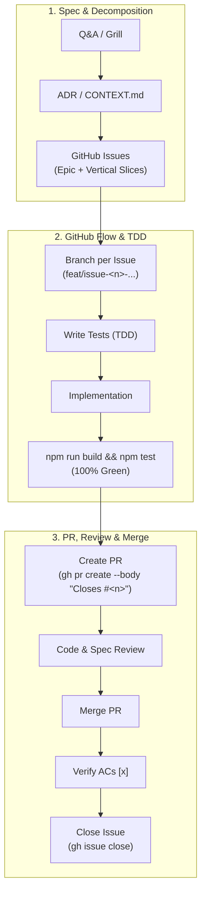

# Ways of Working (WoW) & GitHub Flow

This document defines the standard engineering workflow and delivery lifecycle for both human engineers and autonomous coding agents working on this repository.

---

## 🔁 The Three-Phase Delivery Lifecycle



<details>
<summary>ASCII Diagram (Backout Plan / Text Fallback)</summary>

```text
[1. Spec & Decomposition]
       │
       ▼
  Q&A / Grill ──► ADR / CONTEXT.md ──► GitHub Issues (Epic + Vertical Slices)
                                              │
                                              ▼
[2. GitHub Flow & TDD]                 Branch per Issue (`feat/issue-<n>-...`)
       │                                      │
       ▼                                      ▼
  Write Tests (TDD) ──► Implementation ──► npm run build && npm test (100% Green)
                                              │
                                              ▼
[3. PR, Review & Merge]                Create PR (`gh pr create --body "Closes #<n>"`)
       │                                      │
       ▼                                      ▼
  Code & Spec Review ──► Merge PR ──► Verify ACs `[x]` ──► Close Issue (`gh issue close`)
```

</details>

---

## Phase 1: Discovery, Architecture & Ticket Decomposition

1. **Clarify Requirements & Stress-Test Intent**:
   - Resolve underspecified behaviors and edge cases upfront through interactive Q&A or grilling.
   - Eliminate hidden assumptions before touching code.
2. **Domain Modeling & Architectural Decisions**:
   - Update `<tool-name>/CONTEXT.md` with ubiquitous vocabulary and explicitly avoided synonyms.
   - Record architectural trade-offs and structural changes in `docs/adr/` or `<tool-name>/docs/adr/`.
3. **Vertical Slice Decomposition**:
   - Break large initiatives into small, independent, testable tickets (vertical slices).
   - Each ticket must have:
     - Clear problem statement and technical scope.
     - Checkable Acceptance Criteria checklist (`- [ ]`).
     - Explicit dependency graph (`Blocked by: #<n>`).
4. **Publish to GitHub Issue Tracker**:
   - Create parent tracking epic and child issues using `gh issue create`.

---

## Phase 2: GitHub Flow & Test-Driven Implementation

Every issue must follow **GitHub Flow** with an isolated branch and Pull Request:

1. **Claim the Issue**:
   ```bash
   gh issue edit <issue-number> --add-assignee @me
   ```
2. **Create a Dedicated Branch from `main`**:
   ```bash
   git checkout -b <type>/issue-<number>-<short-slug>
   # Examples:
   # git checkout -b feat/issue-2-emergency-buffer
   # git checkout -b fix/issue-3-scenario-b-workbench
   ```
3. **Test-First Implementation (TDD)**:
   - Add/update unit test cases in `tests/*.test.js` asserting observable behaviors and acceptance criteria.
   - Implement the feature/fix cleanly adhering to repository constraints (zero-runtime build dependencies, isolated tool directory).
4. **100% Automated Verification**:
   - Execute the entire verification suite:
     ```bash
     npm run build && npm test
     ```
   - Build checks, pure simulation unit tests, helper tests, UI/UX requirement tests, and i18n parity tests must pass with zero failures.

---

## Phase 3: Pull Request, Review, Merge & Closure

1. **Commit & Push**:
   - Commit with conventional commit messages (`feat(...)`, `fix(...)`, `test(...)`, `docs(...)`).
   ```bash
   git add .
   git commit -m "feat(predictor): implement emergency buffer reserve (#2)"
   git push -u origin <branch-name>
   ```
2. **Create Pull Request Linked to Issue**:
   - Open a PR that explicitly links to the originating issue using GitHub closing keywords:
   ```bash
   gh pr create --title "feat(predictor): <Description> (#<issue-number>)" --body "Closes #<issue-number>

   ## Summary of Changes
   - <Key changes implemented>

   ## Acceptance Criteria Verified
   - [x] <AC 1>
   - [x] <AC 2>

   ## Test Verification
   - Verified with automated test suites (\`npm test\`)."
   ```
3. **Review & Merge Gate**:
   - Conduct peer review or automated agent review (standards + spec conformance).
   - **MANDATORY**: Merge the PR into `main` before closing the issue:
   ```bash
   gh pr merge <pr-number> --merge --delete-branch
   # Or squash: gh pr merge <pr-number> --squash --delete-branch
   ```
4. **Verify Acceptance Criteria & Close Issue**:
   - Switch back to `main` and pull latest changes (`git checkout main && git pull`).
   - Double-check all Acceptance Criteria against the merged code and test suite.
   - Update all issue checkboxes to completed (`[x]`).
   - Close the issue with a verification summary comment:
   ```bash
   gh issue close <issue-number> --comment "Implemented and verified via PR #<pr-number>. All acceptance criteria checked and 100% tests passing."
   ```

---

## 🛡️ Non-Negotiable Quality Guardrails

- **No Issue Closed Without Merged PR**: Every issue must have a corresponding PR merged into `main` prior to issue closure.
- **Observable Behavior Over Implementation Details**: Tests must assert observable outputs (simulation logs, calculations, DOM state, URL payloads), not private variables.
- **Zero-Regression Standard**: All existing tests must pass on every commit and PR.
- **Documentation Integrity**: ADRs, `CONTEXT.md`, and translation key parity (`TRANSLATIONS.en` vs `TRANSLATIONS.vi`) must be maintained in sync with code changes.
- **Diagram Standard**: Use Mermaid as the default format for rendering diagrams in documentation. Maintain an ASCII diagram inside a collapsible backout block (`<details>`) as a fallback for plain-text viewing and rendering recovery.
