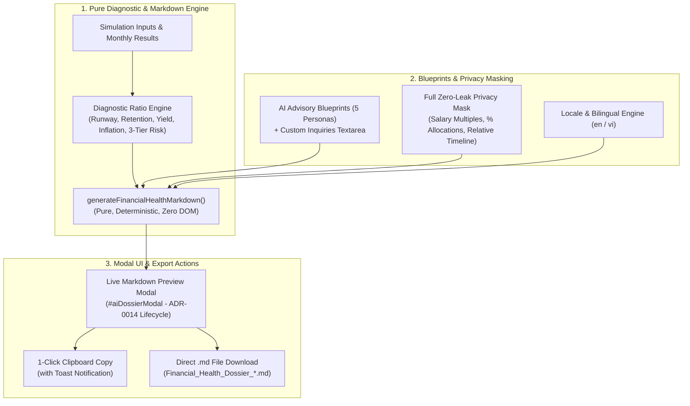

# ADR-0017: AI-Ready Financial Health Dossier & Markdown Summary Engine

## Status

Accepted

## Context

While [`personal-finance-savings-predictor`](../../CONTEXT.md) provides rich multi-year simulation curves, continuous heatmap matrices, and tabbed analytics, users seeking personalized financial guidance frequently export their parameters and results into modern Large Language Models (e.g. ChatGPT, Claude, Gemini).

Previously, this workflow suffered from significant user friction:

1. **Fragmented Data Ingestion**: Users had to manually transcribe or copy disparate table figures, leading to incomplete context and hallucinations by external AI models.
2. **Missing Holistic Diagnostics**: The tool lacked automated synthesis of key diagnostic ratios such as **Liquidity Runway Ratio**, **Savings Retention Rate**, **Capital Efficiency / Yield Multiple**, **Inflation Drag**, and **3-Tier Deficit Risk Scoring**.
3. **Prompt Framing Friction**: Non-expert users struggled to formulate structured prompts that effectively instructed LLMs to analyze risk, optimize ladder durations, or audit goal feasibility.
4. **Privacy & Data Shielding**: Privacy-conscious users were hesitant to paste absolute monetary figures (e.g. 5,000,000,000 VND) into cloud LLM interfaces.
5. **Bilingual Parity**: Both English (`en`) and Vietnamese (`vi`) users required localized dossiers and prompt blueprints matching their primary language.

## Decision



<details>
<summary>ASCII Diagram (Backout Plan / Text Fallback)</summary>

```text
[1. Pure Diagnostic & Markdown Engine]
  │
  ├── Simulation Inputs, Initial Portfolio & Monthly Snapshots
  ├── Diagnostic Ratio Calculations:
  │     ├── Hybrid Liquidity Runway Ratio (Outflows vs Monthly Living Salary Cushion)
  │     ├── Savings Retention Rate (Total Injected Capital Baseline)
  │     ├── Capital Efficiency / Yield Multiple (Interest vs Deposited Salary)
  │     ├── Real Wealth Preservation & Inflation Drag Drag
  │     └── 3-Tier Deficit Risk Scoring (Safe / Moderate Stress / Critical Insolvency)
  └── generateFinancialHealthMarkdown(params, simResult, options) -> GFM String
  │
[2. Blueprints & Privacy Masking]
  │
  ├── 5 Goal-Specific AI Advisory Blueprints (General, FIRE, Real Estate, Ladder, Compare)
  ├── Collapsible Custom Inquiries Textarea (Appends custom client notes/questions)
  ├── Full Zero-Leak Privacy Mask (Multiples of Salary, % Shares, Relative Month Offsets, Generic Bank Tiers)
  └── Bilingual Translation Parity (en / vi)
  │
[3. Modal UI & Export Actions]
  │
  ├── #aiDossierModal with Styled Monospaced Markdown Preview (ADR-0014 Single-Active Dialog)
  ├── 1-Click Clipboard Copy with Toast Feedback
  └── Direct .md File Download (Blob Export)
```

</details>

### 1. Standardized Financial Health Diagnostic Formulas

1. **Liquidity Runway Ratio (Hybrid Approach)**:
   - _When scheduled outflows (withdrawals) exist_:
     $$\text{Runway (Months)} = \frac{\text{Flexible Pool Balance} + \text{Emergency Buffer Reserve}}{\text{Average Monthly Scheduled Outflows}}$$
   - _When zero withdrawals exist_:
     $$\text{Salary Cushion Runway} = \frac{\text{Flexible Pool Balance} + \text{Emergency Buffer Reserve}}{\text{Monthly Salary}}\text{ months of living salary}$$
   - _When salary and withdrawals are both zero_: Expressed as unconstrained positive cushion if pool $> 0$, or $0.0$ months if pool $\le 0$.

2. **Savings Retention Rate (Total Injected Capital Baseline)**:
   $$\text{Retention Rate} = \frac{\text{Ending Net Wealth}}{\text{Initial Starting Principal} + \text{Cumulative Salary} + \text{Cumulative Bonuses}} \times 100\%$$
   - Reflects the exact proportion of all gross capital ever introduced into the client's financial universe that was preserved and compounded into ending net wealth.

3. **Capital Efficiency / Yield Multiple**:
   $$\text{Yield Multiple} = \frac{\text{Total Cumulative Passive Interest Earned}}{\text{Cumulative Salary Deposited}}$$
   - Expressed as a multiple (e.g. `0.18x`) and percentage representing passive interest generated per unit of career salary deposited.

4. **Real Wealth Preservation & Inflation Drag**:
   - Nominal Ending Wealth vs Real Purchasing Power Equivalent:
     $$\text{Inflation Drag} = \text{Nominal Ending Wealth} - \text{Real Wealth (Discounted)}$$
     $$\text{Purchasing Power Retention} = \frac{\text{Real Wealth}}{\text{Nominal Wealth}} \times 100\%$$

5. **Goal Feasibility & Gap Velocity**:
   - If `Savings Goal > 0`:
     - If Achieved: Identifies exact `Milestone Date` and months ahead of target horizon.
     - If Unreached: Computes remaining `Shortfall Gap` and required `Monthly Surplus Adjustment` ($\frac{\text{Gap}}{\text{Duration Months}}$).
   - If `Savings Goal == 0`: Explicitly notes `"No target savings goal configured"`.

6. **3-Tier Deficit Risk Scoring**:
   - `🟢 SAFE`: 0 liquid deficit days throughout the projection horizon.
   - `🟡 MODERATE STRESS`: Temporary liquid deficits occurring during heavy withdrawal periods, but Flexible Pool recovers to a positive balance prior to simulation completion. Identifies maximum deficit depth and total deficit days.
   - `🔴 CRITICAL INSOLVENCY`: Simulation concludes with a negative liquid pool balance. Computes the immediate required liquidity injection to restore solvency.

---

### 2. Goal-Specific AI Advisory Blueprints & Custom Inquiries

The dossier engine supports 5 tailored prompt blueprints, structured with persona framing, context boundaries, and actionable diagnostic questions:

1. **General Financial Health & Portfolio Review (`general`)**: Holistic audit of liquidity, emergency buffer sizing, yield capture, and inflation drag.
2. **FIRE (Financial Independence, Retire Early) Acceleration (`fire`)**: Safe Withdrawal Rate (SWR 3.5%–4.0%) stress-testing, milestone date acceleration, and sequence-of-returns liquidity buffers.
3. **Real Estate Downpayment & Milestone Sizing (`real_estate`)**: Downpayment accumulation timeline, post-purchase liquidity runway, and cash release alignment.
4. **Deposit Ladder & Emergency Buffer Optimization (`ladder`)**: Sweep duration (3M/6M/12M) optimization, rate capture, and cash cushion sizing.
5. **Dual-Pass Scenario A vs B Comparative Audit (`compare`)**: Side-by-side comparative delta matrix contrasting baseline vs projected scenario trade-offs (Wealth Delta, Real Value Delta, Milestone Acceleration, Yield Delta).

**Custom Inquiries Integration**:

- `#aiDossierModal` provides an optional collapsible textarea where users can enter custom questions or life context.
- When populated, user input is automatically appended under `### 📝 Custom Inquiries from Client:` in the generated Markdown dossier before copying or downloading.

---

### 3. Full Zero-Leak Privacy Anonymization Mask

When the **Privacy Anonymization Mask** is toggled on (`anonymized: true`):

1. **Monetary Values**:
   - If `Monthly Salary > 0`: Converted into normalized salary multiples (e.g. `1.0x Monthly Salary`, `20.0x Savings Goal`, `0.18x Interest Yield`) and portfolio percentage shares (`25.0% Liquid Pool`, `75.0% Term Deposits`).
   - If `Monthly Salary == 0`: Converted into percentage distributions of Ending Total Wealth (`XX.X% of Total Wealth`).
2. **Timeline Offsets**:
   - Absolute calendar dates are transformed into relative simulation intervals (`Start (Month 0)`, `Month +6`, `Month +18`, `Horizon (Year 3.0)`).
3. **Institutions**:
   - Bank names are sanitized into generic tiers (`Bank Tier-1`, `Institution A`, `Liquid Pool`).

---

### 4. Compliant Modal UI & Export Surface

1. **Trigger**: Dedicated `#btnAIDossier` action button in the header toolbar.
2. **Modal Lifecycle Controller (ADR-0014)**:
   - Single-active dialog invariant enforced via `dismissAllModals()`.
   - Body scroll locking on modal display.
   - Backdrop click dismissal and unified Escape key interception.
3. **Live Preview & Actions**:
   - High-contrast, styled monospaced pre-container (`#dossierMarkdownPreview`) displaying the exact Markdown source.
   - 1-click **Copy to Clipboard** with non-blocking feedback toast (`toast_dossier_copied`).
   - **Download Markdown File** (`#btnDownloadDossier`) initiating a `Financial_Health_Dossier_YYYY-MM-DD.md` blob export.
4. **Bilingual Parity**:
   - Full translation key parity in `TRANSLATIONS.en` and `TRANSLATIONS.vi` for all modal components, prompt blueprints, and generated Markdown section headers.

## Consequences

- Users obtain a standardized, portable, and mathematically robust financial summary ready for instant consultation with any modern LLM.
- Complete client-side execution guarantees zero leakage of financial data over the network.
- Pure calculation engine architecture enables comprehensive unit test coverage with 100% determinism.
