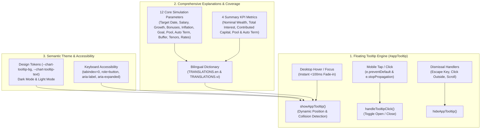

# ADR-0018: Interactive Floating Tooltip Engine & Comprehensive Parameter/KPI Explanations

## Status

Accepted

## Context

Users of [`personal-finance-savings-predictor`](../../CONTEXT.md) reported a significant usability bug: hovering over the `i` (info) icons failed to display explanations reliably.

A thorough investigation revealed several root causes:

1. **Native Browser `title` Attribute Latency**: The existing icons relied exclusively on HTML `title="..."` attributes. Modern browsers enforce an OS-level display delay of **1.5 to 3.0 seconds** before rendering native tooltips, causing desktop users to perceive the feature as non-functional.
2. **Total Incompatibility with Mobile & Touch Devices**: Mobile operating systems do not support hover states. Tapping `i` icons produced no tooltip.
3. **`<label>` Focus Hijacking & Event Bubbling**: Because `<i>` elements were nested directly inside `<label for="...">` elements, clicking or tapping them triggered the label's default behavior, shifting keyboard focus into form `<input>` fields instead of presenting help context.
4. **Accessibility Deficiencies**: Native `<i>` icons lacked `tabindex="0"`, `role="button"`, and ARIA attributes (`aria-label`, `aria-expanded`), making them inaccessible for keyboard navigation and screen readers.
5. **Incomplete System-Wide Coverage**: 10 out of 12 core simulation parameters and all summary KPI metric cards lacked explanatory info icons entirely.

## Decision



<details>
<summary>ASCII Diagram (Backout Plan / Text Fallback)</summary>

```text
[1. Floating Tooltip Engine (#appTooltip)]
  │
  ├── Desktop Hover & Focus (Instant <100ms fade-in, scale animation)
  ├── Mobile Tap / Click (handleTooltipClick: e.preventDefault() + e.stopPropagation() isolates <label>)
  ├── Viewport Boundary & Collision Detection (Smart flipping above/below & horizontal clamping)
  └── Dismissal Handlers (Escape key, outside click, viewport scrolling)
  │
[2. Comprehensive Explanations & Coverage]
  │
  ├── All 12 Simulation Parameters:
  │     ├── Target Date, Monthly Salary, Salary Growth, Annual Bonus, Secondary Bonus
  │     └── Inflation Rate, Savings Goal, Pool Rate, Auto Term Threshold, Emergency Buffer, Auto Term Months, Auto Term Rate
  ├── Top Summary KPI Metric Cards (Nominal Wealth, Real Purchasing Power, Net Invested, Total Interest, Liquid Deficit)
  └── 100% Bilingual Parity (TRANSLATIONS.en & TRANSLATIONS.vi)
  │
[3. Semantic Theme & Accessibility]
  │
  ├── Semantic Tokens: --chart-tooltip-bg, --chart-tooltip-text, --border-subtle, --border-strong
  └── WCAG 2.1 AA Accessibility: tabindex="0", role="button", aria-label, aria-expanded="true/false"
```

</details>

### Key Implementation Specifications

1. **Lightweight, Zero-Dependency Floating Tooltip (`#appTooltip`)**:
   - A single top-level floating tooltip container positioned dynamically via `getBoundingClientRect()`.
   - Includes smart viewport collision detection, automatically flipping above or below the target element and clamping horizontally.
   - Smooth CSS transitions (`opacity`, `transform: scale()`) for instant visual feedback.

2. **Isolated Touch and Click Event Handlers**:
   - All triggers use semantic `<button type="button" class="tooltip-trigger" ...>` elements with `tabindex="0"`.
   - `handleTooltipClick(e, triggerEl)` explicitly executes `e.preventDefault()` and `e.stopPropagation()` to prevent accidental parent `<label>` activation.

3. **Complete Parameter & Metric Coverage**:
   - Every input parameter and primary KPI metric is equipped with dedicated `data-tooltip-key` attributes mapping to localized dictionary entries in both English and Vietnamese.

## Consequences

- **Instant Help Feedback**: Tooltip displays in `<100ms` rather than suffering multi-second browser delays.
- **Flawless Mobile Touch Usability**: Mobile users can comfortably tap any `i` icon without form focus jumping.
- **Total Accessibility**: Keyboard users can Tab across parameters, press Enter/Space to view explanations, and hit Escape to dismiss.
- **Zero Regressions**: 100% test coverage across unit, DOM, and bilingual parity test suites.
