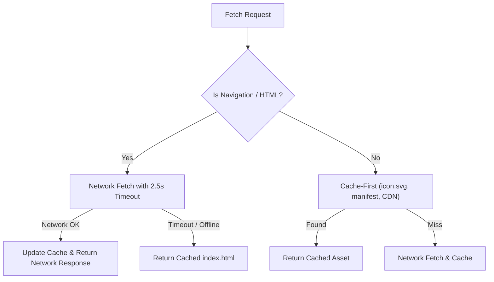

# ADR-0007: PWA Service Worker Lifecycle, Network-First Navigation & Update Notification Strategy

## Status

Accepted (Amends and supersedes the fetch strategy in [`ADR-0003`](./0003-url-payload-compression-and-pwa-offline-architecture.md))

## Context

The Smart Buy-List & Unit Price Tracker is distributed as a standalone Progressive Web Application (PWA) that must work 100% offline in supermarket basements and spotty cellular areas.

In the initial implementation ([`ADR-0003`](./0003-url-payload-compression-and-pwa-offline-architecture.md)), a strict **Cache-First** strategy was used for all requests, including the main HTML document (`index.html`). This caused a major usability and QA issue:

1. When new application updates are deployed, browsers continue serving the stale cached `index.html` indefinitely from `caches.match()`.
2. Even when `CACHE_NAME` is bumped (e.g. `v2` to `v3`), the active page does not receive notification and does not reload until all existing instances are closed or manually purged.
3. Users and QA testers on mobile devices have no visible indication that a newer app version is available and cannot force-refresh without browser DevTools.

## Decision

We establish a resilient **Network-First Navigation + Cache-First Static Asset + Non-Blocking Material 3 Update Notification** architecture:



<details>
<summary>ASCII Diagram (Fallback)</summary>

```text
[Fetch Request]
       │
  Is Navigation / HTML?
    ├── YES ──► Fetch with 2.5s Timeout ──► [Success] ──► Update Cache & Return Network Response
    │                                  └──► [Timeout/Offline] ──► Return Cached index.html
    │
    └── NO  ──► Cache-First Match ──► [Hit]  ──► Return Cached Asset
                                  └──► [Miss] ──► Fetch from Network, Cache & Return
```

</details>

1. **Network-First Strategy for HTML Navigation**:
   - For all navigation / HTML requests (`event.request.mode === 'navigate'` or requests accepting `text/html`), the Service Worker attempts `fetch(event.request)` with a **2.5-second timeout** (`AbortController` / `Promise.race`).
   - If the network succeeds, the cache is populated with the fresh response.
   - If the network times out or fails (offline/spotty cellular), the Service Worker serves the cached `index.html` immediately.

2. **Cache-First Strategy for Static Immutable Assets**:
   - Static assets (`./icon.svg`, `./manifest.webmanifest`, Tailwind CDN) continue using **Cache-First** for instantaneous loading and bandwidth preservation.

3. **Two-Way Service Worker Update Lifecycle (`SKIP_WAITING` & `controllerchange`)**:
   - When a new Service Worker is discovered and enters the `installed` / `waiting` state, `index.html` displays a non-blocking **Material 3 Update Toast** (`"New Version Available"` with an `"Update Now"` button).
   - Clicking `"Update Now"` sends a `{ type: 'SKIP_WAITING' }` message to the waiting worker.
   - The Service Worker receives this message and invokes `self.skipWaiting()`.
   - The client listens for `navigator.serviceWorker.addEventListener('controllerchange', ...)` and executes `window.location.reload()` cleanly.

4. **Multi-Trigger Update Polling**:
   - The client invokes `registration.update()`:
     1. On application startup (`initApp`).
     2. When the user returns to the tab/app (`document.addEventListener('visibilitychange')`).
     3. On a 60-minute recurring interval.

5. **Option Hub QA & Power-User Controls**:
   - Inside the Option Hub (`⚙️` settings modal), provide a dedicated **App Version & Updates** section with:
     - **Check for Updates**: Manually calls `registration.update()` and displays a toast confirming if the app is up to date or an update was found.
     - **Purge Cache & Reload**: Clears all Service Worker caches and unregisters workers, followed by a hard page reload.

6. **100% Bilingual Parity**:
   - All update notifications, Option Hub buttons, and status toasts provide complete English (`en`) and Vietnamese (`vi`) translations.

7. **Mandatory PWA Version Bumping & Cache Invalidation Rule**:
   - Every code modification affecting runtime assets (`index.html`, JavaScript logic, styles) MUST increment the version in both:
     1. `sw.js`: `const CACHE_NAME = "smart-buy-list-v<semver>";`
     2. `index.html`: `<span id="pwaVersionBadge">v<semver></span>`
   - Bumping `CACHE_NAME` ensures browser Service Worker registration triggers `updatefound` / `installed` states immediately, allowing `checkForUpdates()` to discover the pending worker and prompt the user with the non-blocking update toast.
   - Automated zero-regression test gates in `tests/smart-buy-list-sharing-pwa.test.js` enforce version synchronization between `sw.js` and `index.html`.

## Consequences

- **Deterministic Update Discovery**: Bumping `CACHE_NAME` on every release guarantees `Check for Updates` reliably discovers new code and triggers cache replacement.
- **Instant Freshness**: Online users automatically receive the latest code on reload without clearing browser data.
- **Reliable Offline Operation**: Offline users continue enjoying instant startup from cache even without an internet connection.
- **Non-Destructive UX**: In-flight shopping sessions are never unexpectedly interrupted by silent reloads; the user explicitly decides when to update.
- **QA Testability**: QA can easily test new releases and force cache purges on physical mobile test devices directly from the UI.
