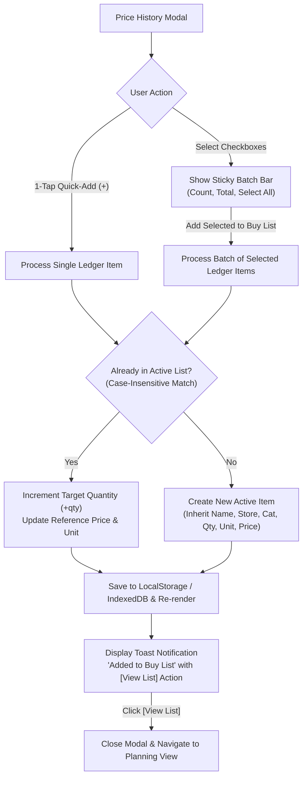

# ADR-0008: Price History Purchase Ledger Re-order Workflow & Snapshot Item Creation

## Status

Accepted

## Context

In the Smart Buy-List & Unit Price Tracker application, shoppers accumulate a chronological record of historical grocery purchases in the **Historical Purchase Ledger** (`memoryState.purchaseLedger`). Each entry captures the item name, retail store, purchase date, quantity, measurement unit, package price, and calculated normalized unit price.

While shoppers frequently re-buy the same household staples (e.g. whole milk, rice, olive oil, coffee beans) on subsequent shopping trips, the Price History modal previously functioned solely as a read-only table with text filtering. Shoppers had to manually close the modal, switch to Planning mode, and manually re-type each item's name, store, quantity, unit, and expected price.

A streamlined restocking mechanism is needed to allow shoppers to quickly select previous purchases from Price History and add or increment them directly on their active Buy List.

## Decision

We implement a **Hybrid Multi-Select + 1-Tap Quick-Add Ledger Restocking Workflow** with snapshot attribute inheritance, case-insensitive deduplication, and non-blocking actionable toast feedback:



<details>
<summary>ASCII Diagram (Fallback)</summary>

```text
[Price History Modal]
       │
       ├─► 1-Tap Quick-Add (+) ────────┐
       │                               ▼
       └─► Checkbox Multi-Select ──► [Sticky Batch Bar] ──► [Process Selected]
                                                               │
                                                               ▼
                                                  Already in Active List?
                                                    ├── YES ──► Increment Quantity (+qty) & Update Price
                                                    └── NO  ──► Create New Item (Inherit Snapshot Attributes)
                                                               │
                                                               ▼
                                                  [Save State & Re-render]
                                                               │
                                                               ▼
                                                  [Toast Feedback with [View List] Action]
```

</details>

### 1. Hybrid Interaction Model (Single 1-Tap + Multi-Select Batch)

- **1-Tap Quick Add Button**: Every row in the historical ledger table provides a thumb-friendly `+ Add` button enabling instant 1-tap item restocking.
- **Multi-Select Checkboxes**: Each ledger row includes an independent selection checkbox.
- **Sticky Batch Action Bar**: When $\ge 1$ items are selected, a sticky footer bar appears inside the modal displaying:
  - `[Select All]` / `[Deselect All]` toggle.
  - Active selection counter (e.g. _"3 items selected"_).
  - Estimated total expenditure preview (e.g. _"Est. $14.50"_).
  - Primary Material 3 action button: `Add Selected to Buy List`.

### 2. Snapshot Attribute Inheritance & Category Resolution

When generating active list items from historical ledger records:

- `name`: Inherited directly from `ledgerEntry.itemName`.
- `store`: Inherited from `ledgerEntry.store` (falls back to default store if blank).
- `quantity`: Inherited from `ledgerEntry.quantity` (e.g. `2`, `500`).
- `unit`: Inherited from `ledgerEntry.unit` (e.g. `l`, `kg`, `g`).
- `price`: Inherited from `ledgerEntry.price` (historical package shelf price).
- `category`: Resolved by looking up matching product in persistent catalog (`memoryState.catalog`), matching active items, or falling back to `"other"`.
- `checked`: Initialized to `false`.

### 3. Smart Deduplication & Quantity Consolidation

If an item being added from the ledger already exists on the active Buy List (case-insensitive name match):

- The existing item's `quantity` is incremented by the ledger entry's quantity (`existing.quantity += ledger.quantity`).
- The item's estimated `price` and `unit` are refreshed to the latest historical reference.
- Prevents duplicate fragment rows from cluttering the in-aisle checklist.

### 4. Non-Blocking In-Modal Feedback & Navigation Shortcut

- Adding items does not abruptly dismiss the Price History modal, allowing users to continue reviewing historical receipts.
- A non-blocking Material 3 toast appears: _"Added N items to Buy List"_ or _"Increased 'Whole Milk' quantity on Buy List (+2)"_.
- The toast includes a 1-tap **`[View List]`** action button. Clicking it closes the modal, sets the shopping lifecycle phase to `PLANNING`, and smoothly scrolls to the top of the list.

### 5. PWA Minor Version Bump (`v3.1.0`)

- In accordance with the project's PWA Version Invalidation Rule ([`ADR-0007`](./0007-pwa-service-worker-lifecycle-and-update-strategy.md)), introducing this ledger re-ordering feature increments the application version from `v3.0.1` to **`v3.1.0`** across:
  1. `smart-buy-list-price-tracker/sw.js` (`CACHE_NAME = "smart-buy-list-v3.1.0"`)
  2. `smart-buy-list-price-tracker/index.html` (`#pwaVersionBadge`)

## Consequences

- **Streamlined Restocking**: Re-ordering pantry and household staples takes 1 tap instead of manual form inputs.
- **Accurate Budget Estimates**: Re-ordered items immediately carry over historical shelf prices into trip budget estimates.
- **Clean List Hygiene**: Case-insensitive deduplication avoids duplicate card clutter.
- **Reliable Offline PWA Updates**: SemVer `v3.1.0` bump triggers Service Worker cache invalidation and in-app update notifications cleanly.
