# ADR-0010: Ledger Item Deletion, Comparator Unit Normalization & Form Pre-fill Enhancements

## Status

Accepted

## Context

In the Smart Buy-List & Unit Price Tracker PWA (`v3.1.0`), users and testers identified three usability bottlenecks and bug risks:

1. **Lack of Price History Deletion Capabilities**:
   - The Historical Purchase Ledger (`#priceLedgerModal`) supported reviewing, searching, and re-ordering past purchases onto the active buy list, but provided no mechanism to delete individual records or clean up outdated/mistyped historical entries in bulk.
   - Deleting bad records was only possible by wiping the entire database via Settings.

2. **Comparator Unit Option & Casing Mismatch**:
   - The In-Aisle Package Comparator (`#comparatorModal`) select elements (`compUnitA`, `compUnitB`) were hardcoded with only 6 units (`g`, `kg`, `ml`, `l`, `ea`, `can`), whereas the Add Item Form (`inputItemUnit`) supports 13 units (`kg`, `g`, `lb`, `oz`, `L`, `ml`, `gal`, `fl oz`, `ea`, `pk`, `box`, `can`, `bunch`).
   - Casing mismatch: The comparator used lowercase `l` for Litre while the rest of the application used uppercase `L`. When comparing an item with unit `L`, `item.unit` failed to match `compUnitA.value`, falling back to `g`.
   - Items measured in imperial units (`lb`, `oz`, `gal`, `fl oz`) or discrete packaging (`pk`, `box`, `bunch`) failed to populate `compUnitA` entirely.
   - `compUnitB` was statically set to `kg`, causing immediate dimension mismatch errors when comparing liquid or discrete items.

3. **Incomplete Context Transfer on "Apply Winner to Form"**:
   - The "Apply Winner to Form" action (`applyComparatorWinner()`) only populated `price`, `quantity`, and `unit` into the form, leaving `inputItemName`, `inputItemCategory` (Aisle), and `inputItemStore` blank.
   - Shoppers had to manually re-enter the item name, store, and aisle department.

---

## Decision

We implement:

### 1. Historical Purchase Ledger Record Deletion

- **Row-Level Delete Action (`deleteLedgerItem(id)`)**:
  - Add a dedicated delete button (`🗑️`) inside each row's action column in `#priceLedgerModal`.
  - Removes the specific record from `memoryState.purchaseLedger` and IndexedDB storage.
- **Multi-Select Batch Delete Action (`deleteSelectedLedgerItems()`)**:
  - Add a `🗑️ Delete Selected` button to `#ledgerBatchBar` alongside `Add Selected to Buy List`.
  - Removes all checked ledger entries in a single batch.
- **Dynamic Re-calculation & UI Refresh**:
  - Automatically re-renders the ledger table and refreshes active buy list cards so that All-Time Low (ATL) and Deal scoring (`GREAT_DEAL`, `FAIR_PRICE`, `PRICE_SPIKE`) instantly recalculate without requiring a page reload.

### 2. Universal Unit Synchronization & Casing Normalization

- **13-Unit Complete Dropdowns**:
  - Populate both `compUnitA` and `compUnitB` with all 13 supported units grouped by measurement dimension (`Weight`: `kg`, `g`, `lb`, `oz`; `Volume`: `L`, `ml`, `gal`, `fl oz`; `Count`: `ea`, `pk`, `box`, `can`, `bunch`).
  - Standardize `L` (uppercase) across all unit dropdowns.
- **Intelligent Dimension Matching on Open (`openItemComparator(itemId)`)**:
  - Sets `compUnitA` to `item.unit`.
  - Automatically initializes `compUnitB` to the default base unit for `item.unit`'s dimension (`kg` for mass, `L` for volume, `ea` for count), ensuring valid comparisons on load.

### 3. Full Domain Context Pre-filling on "Apply Winner to Form"

- When `applyComparatorWinner()` executes:
  - Transfers winning `price`, `quantity`, and `unit` into `#inputItemPrice`, `#inputItemQty`, `#inputItemUnit`.
  - When comparing an active item (`activeComparingItemId`), pre-fills `#inputItemName`, `#inputItemCategory` (Aisle), and `#inputItemStore` from the active item context.
  - Automatically switches view to `PLANNING` mode, smoothly scrolls and focuses `#addItemForm`, triggers `updateLiveUnitPreview()`, and closes `#comparatorModal`.

### 4. PWA Minor Version Bump (`v3.2.0`)

- Increment application version from `v3.1.0` to **`v3.2.0`** across:
  1. `smart-buy-list-price-tracker/sw.js` (`CACHE_NAME = "smart-buy-list-v3.2.0"`)
  2. `smart-buy-list-price-tracker/index.html` (Version badge `v3.2.0`)
  3. `smart-buy-list-price-tracker/CONTEXT.md`

```mermaid
flowchart TD
    subgraph Ledger["Historical Purchase Ledger"]
        RowDel["Row 🗑️ Delete Button"] --> DeleteSingle["deleteLedgerItem(id)"]
        BatchDel["Batch 🗑️ Delete Selected"] --> DeleteBatch["deleteSelectedLedgerItems()"]
        DeleteSingle --> SyncDB["Update memoryState & IndexedDB"]
        DeleteBatch --> SyncDB
        SyncDB --> ReCalc["Recalculate ATL & Deal Scores"]
        ReCalc --> LiveRender["Re-render Active Cards & Ledger Table"]
    end

    subgraph Comparator["Package Comparator & Form Pre-fill"]
        OpenComp["openItemComparator(itemId)"] --> UnitSync["Set compUnitA = item.unit<br/>Set compUnitB = Dimension Base Unit"]
        UnitSync --> Calc["runComparatorCalc() (13 Units Supported)"]
        Calc --> ApplyWinner["Apply Winner to Form<br/>(applyComparatorWinner)"]
        ApplyWinner --> PreFill["Pre-fill Name, Aisle, Store, Unit, Qty, Price"]
        PreFill --> SwitchPlan["Switch to Planning & Focus Form"]
    end
```



<details>
<summary>ASCII Diagram (Fallback)</summary>

```text
[Historical Purchase Ledger]
  ├── Row Delete (🗑️)          ──► deleteLedgerItem(id)          ──┐
  └── Batch Delete Selected (🗑️) ──► deleteSelectedLedgerItems() ──┴─► [Update Storage & Recalculate ATL]
                                                                        └──► Re-render Cards & Table

[In-Aisle Package Comparator]
  ├── openItemComparator(itemId) ──► Pre-select compUnitA & align compUnitB dimension
  └── Apply Winner to Form       ──► Pre-fill Name, Aisle, Store, Qty, Unit, Price into #addItemForm
                                       └──► Switch to Planning & Focus Form
```

</details>

---

## Consequences

- Full control over historical price ledger records with instant deal scoring adjustments.
- Flawless unit compatibility for all imperial, metric, and discrete packaging sizes in comparator calculations.
- Streamlined 1-tap in-aisle workflow from comparing deals to adding items onto the buy list.
- Guaranteed offline PWA Service Worker cache renewal via `v3.2.0` cache naming.
