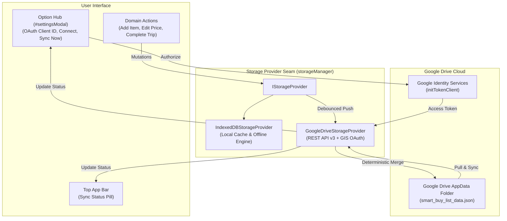

# ADR-0011: Google Drive Cloud Sync Storage Seam & GIS OAuth Integration

## Status

Partially Superseded by [ADR-0014](./0014-calm-cloud-sync-adaptive-ledger-and-vietnamese-flag-polish.md) and [ADR-0016](./0016-deterministic-3way-cloud-merge-tombstones-and-concurrency.md) (Extends [ADR-0001](./0001-indexeddb-storage-engine-and-google-drive-sync-seam.md))

> [!NOTE]
> **Active vs Superseded Decisions**: Google Drive AppData REST v3 sync, ephemeral GIS token handling, and the `IStorageProvider` seam remain active. The top-bar live status pill was relocated to Option Hub with a relaxed 15s calm debounce in [ADR-0014](./0014-calm-cloud-sync-adaptive-ledger-and-vietnamese-flag-polish.md), and the conflict resolution engine was upgraded to deterministic 3-way differential merge with deletion tombstones in [ADR-0016](./0016-deterministic-3way-cloud-merge-tombstones-and-concurrency.md).

## Context

The Smart Buy-List & Unit Price Tracker is an offline-first, client-side PWA designed to operate without a costly proprietary backend (ADR-0001). Users frequently access their shopping lists and historical purchase ledgers across multiple devices (e.g. planning items on desktop and checking off items or logging store shelf prices on mobile).

Previous versions (`v3.0.0` – `v3.2.0`) relied on manual QR code scanning, compressed URL deep links, and JSON backup exports for data portability. However, users require seamless, automatic multi-device cloud synchronization without compromising:

1. **Zero-Backend Architecture**: No intermediate servers storing or handling user data.
2. **Offline-First Resilience**: Uninterrupted offline execution when network connectivity is absent or Google Identity Services are unreachable.
3. **Data Security & Privacy**: User data must remain strictly user-owned in Google Drive, avoiding persistent storage of OAuth bearer tokens.

---

## Decision

We implement a decoupled cloud storage architecture comprising five core layers:

### 1. Unified Storage Provider Seam (`IStorageProvider`)

We formalize the storage abstraction hierarchy:

- **`StorageProvider` (Base Interface)**: Defines common asynchronous contracts (`init`, `getState`, `saveState`, `sync`, `getStatus`, `exportBackup`, `importBackup`).
- **`IndexedDBStorageProvider`**: Encapsulates all offline local persistence with automatic fallback to `localStorage` / memory state.
- **`GoogleDriveStorageProvider`**: Composite cloud provider wrapping `IndexedDBStorageProvider` as its local cache and orchestrating bidirectional sync against Google Drive's REST API v3.
- **Global `storageManager`**: Manages provider activation and routes application mutations without coupling domain logic to transport details.

### 2. Google Identity Services (GIS) & In-Memory Token Lifecycle

- **Dynamic Asynchronous GIS Loader**: Injects `https://accounts.google.com/gsi/client` asynchronously on startup or on-demand with graceful degradation if offline.
- **OAuth 2.0 Token Client**: Uses `google.accounts.oauth2.initTokenClient` with `drive.appdata` scope (hidden Application Data folder).
- **Ephemeral Token Storage**: Keeps the bearer access token strictly in runtime memory (`googleAuthState.accessToken`); persists only the user's `google_client_id` in `localStorage`.
- **Silent Renewal**: Attempts non-interactive token renewal on page reload when a configured Client ID is present.

### 3. Remote Storage Location & Structured Envelope

- **Isolated AppData Target**: Stores `smart_buy_list_data.json` inside Google Drive's hidden `appDataFolder` (`spaces=appDataFolder`).
- **Payload Envelope**:
  ```json
  {
    "schemaVersion": 2,
    "app": "smart-buy-list-price-tracker",
    "updatedAt": "2026-08-30T16:50:00.000Z",
    "deviceId": "client-uuid",
    "activeList": { "id": "default", "title": "Weekly Groceries", "items": [...] },
    "catalog": [...],
    "purchaseLedger": [...],
    "stores": [...],
    "settings": { ... }
  }
  ```

### 4. Deterministic Multi-Device Smart Merge Engine

When local and remote states diverge, the engine resolves conflicts deterministically:

1. **Historical Purchase Ledger**: Union of all records keyed by unique transaction ID / timestamp, preserving all price history across devices and recalculating All-Time Lows (ATL) dynamically.
2. **Active Buy-List Items**: Merges items by unique ID / normalized name, taking the entry with the most recent `updatedAt` timestamp and preserving checked states.
3. **Custom Stores**: Mathematical union of store profiles.
4. **Settings**: Adopts the latest updated preferences while preserving local device theme if specified.
5. **Bidirectional Write-back**: Automatically commits merged state to local IndexedDB and updates remote Google Drive AppData.

### 5. UI/UX & Option Hub Integration

- **Option Hub (Settings `#settingsModal`)**: Adds a dedicated "Google Drive Cloud Sync" card with Google Client ID input, "Sign in with Google" / "Disconnect" button, Last Synced timestamp, "Sync Now" button, and "Force Upload Local" / "Force Download Cloud" manual overrides.
- **Top App Bar Status Pill**: Compact sync indicator (🟢 Synced / 🟡 Syncing / ⚪ Offline / 🔴 Sync Error) next to Settings `⚙️`.
- **Synchronization Triggers**:
  - App startup pull on authentication.
  - 3-second debounced push on local mutations (item creation, edit, trip completion, store modifications).
  - Tab focus pull (>60s inactivity).
  - Manual 1-tap "Sync Now".

### 6. PWA Version Bump (`v3.3.0`)

- Increments Service Worker cache to `smart-buy-list-v3.3.0` and application version badge to `v3.3.0`.



<details>
<summary>ASCII Diagram (Fallback)</summary>

```text
[User Interface]
  ├── Top App Bar (Sync Status Pill)
  ├── Option Hub (OAuth Config, Connect, Sync Now)
  └── Domain Actions (Add Item, Check Item, Complete Trip)
        │
        ▼
[Storage Provider Seam (storageManager)]
  ├── IndexedDBStorageProvider (Offline Persistence Engine)
  └── GoogleDriveStorageProvider (Remote Cloud Adapter)
        │
        ├──► GIS OAuth 2.0 (In-Memory Access Token)
        ├──► Deterministic Multi-Device Smart Merge
        └──► Google Drive AppData (smart_buy_list_data.json)
```

</details>

---

## Consequences

- Full multi-device cloud synchronization without any server infrastructure or subscription costs.
- Complete offline capability with automatic background sync when reconnected.
- Zero credential exposure: bearer tokens remain in ephemeral memory, and user data is stored exclusively in user-owned Google Drive storage.
- Clean architectural seam enabling future cloud providers (e.g. iCloud, Dropbox, Nextcloud) with zero modifications to application domain logic.
