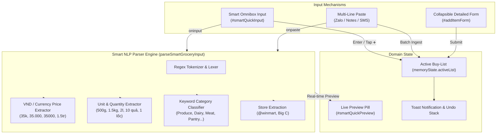

# ADR-0013: Vietnamese-First Defaults, Smart Quick-Entry Omnibox & Currency-Aware Ergonomics

## Status

Accepted (Extends [ADR-0002](./0002-measurement-normalization-and-deal-scoring-intelligence.md), [ADR-0004](./0004-material-you-navigation-and-item-comparator.md), and [ADR-0006](./0006-differentiated-planning-and-buy-mode-card-ux.md))

## Context

Following field research and Product Owner (PO) discoveries on real-world grocery shopping patterns in Vietnam, the Smart Buy-List & Unit Price Tracker required key structural, localization, and ergonomic enhancements:

1. **Vietnam-First Market Defaults**: The application was historically initialized with US-centric defaults (`USD`, US store chains `Costco`, `Trader Joe's`, `Target`, and English onboarding samples). Vietnamese shoppers require out-of-the-box defaults tuned for Vietnam: default language `vi`, default currency `VND (₫)`, Vietnam retail stores (`WinMart`, `Bách Hoá Xanh`, `Co.opmart`, `Big C / GO!`, `Lotte Mart`, `Chợ truyền thống`, `Cửa hàng tiện lợi`), and clean initial state without intrusive sample banners.
2. **Bilingual Parity Invariant**: Under repository standards (DoD #6), 100% key parity between English (`en`) and Vietnamese (`vi`) must be preserved. A compact flag emoji switcher (`🇻🇳` / `🇺🇸`) provides instant 1-tap toggling without cluttering the mobile header.
3. **Currency-Aware Quick Price Update Chips**: The Quick Price modal step chips were previously fixed to fractional cents (`±0.25`, `±0.50`, `±1.00`). In Vietnam, standard denominations range in thousands/tens of thousands of VND. Step chips must dynamically adapt to the active currency (`-50k`, `-10k`, `-5k`, `+5k`, `+10k`, `+50k` when VND).
4. **Frictionless Fast Entry (Smart Omnibox NLP Parser)**: Entering items via multi-field dropdown forms while walking or preparing a list is slow. Shoppers need a single-line smart input box that parses shorthand like `Sữa tươi 35k/l`, `Thịt ba chỉ 120k 500g WinMart`, or `Trứng gà 30k 10 quả` into structured items (Name, Quantity, Unit, Price, Store, Category) with real-time preview and instant 1-tap ingestion.
5. **Multi-Line Clipboard Batch Ingest**: Shoppers frequently copy grocery lists from messaging apps (Zalo, SMS, Apple Notes). Pasting multi-line text into the Smart Omnibox should batch-parse and stage all items in 1 action with an Undo toast.
6. **Icon-First Touch Ergonomics**: Streamlining verbose text buttons (`+ Add` -> `➕`) across ledger tables, modals, and headers for mobile thumb-reachability.
7. **Expanded Vietnamese Packaging Units**: Incorporating culturally ubiquitous packaging units (`lốc`, `thùng`, `khay`, `túi`, `hũ/lọ`, `bó`, `nải`) with dimension normalization.

---

## Decision

We implement a comprehensive Vietnam-first localization architecture, the Smart Quick-Entry Omnibox NLP parser, currency-aware adjustment chips, and expanded packaging units:

### 1. Vietnam-First Baseline Configuration

- **Default State Initialization**:
  - `settings.language`: `"vi"` (Vietnamese default).
  - `settings.currency`: `"VND"` (Vietnamese Đồng default).
  - `settings.unitSystem`: `"metric"`.
  - `stores`: `["WinMart", "Bách Hoá Xanh", "Co.opmart", "Big C / GO!", "Lotte Mart", "Chợ truyền thống", "Cửa hàng tiện lợi"]`.
  - `activeList.items`: `[]` (clean empty list on launch).
  - `purchaseLedger`: `[]` (clean empty history).
- **Banner Decommissioning**: The `#sampleDataBanner` element and onboarding banner logic are completely removed from the primary view.
- **Localized Sample Dataset in Option Hub**: The "Load Sample Data" action in Settings is updated to populate realistic Vietnamese grocery staples in VND (_Sữa tươi Vinamilk 1L_, _Gạo ST25 5kg_, _Trứng gà Ba Huân 10 quả_, _Thịt heo ba chỉ 500g_, _Rau muống 1 bó_, _Dầu ăn Simply 1L_, _Nước mắm Nam Ngư 750ml_).

### 2. Flag-Based Language Switcher (`🇻🇳` / `🇺🇸`)

- The header language button renders the active flag emoji:
  - `🇻🇳` when `language === 'vi'` (title: "Ngôn ngữ: Tiếng Việt (Bấm để đổi sang English)").
  - `🇺🇸` when `language === 'en'` (title: "Language: English (Click to switch to Tiếng Việt)").
- Clicking instantly toggles the language and updates all DOM elements and placeholders.

### 3. Currency-Aware Quick Price Adjustment Chips

- In `quickPriceModal`, step chips dynamically render based on `currentCurrency`:
  - **`VND`**: `[-50000, -10000, -5000, +5000, +10000, +50000]` displayed as `[-50k, -10k, -5k, +5k, +10k, +50k]`.
  - **Other (`USD`, `EUR`, etc.)**: `[-1.00, -0.50, -0.25, +0.25, +0.50, +1.00]`.
- `stepQuickPrice(delta)` increments/decrements the current value and clamps safely at $\ge 0$.

### 4. Smart Quick-Entry Omnibox & NLP Parser Engine

A high-performance client-side natural language parser (`parseSmartGroceryInput(text)`) interprets natural language grocery shorthand:

1. **Price Extraction**:
   - `35k`, `35.000`, `35000`, `35 ngàn`, `35 nghìn` -> `35000`.
   - `1.5tr`, `1.5 triệu` -> `1500000`.
   - Unit-fraction notation: `/kg`, `/l`, `/hộp`, `/gói`, `/bó`, `/lốc`, `/thùng`.
2. **Quantity & Unit Extraction**:
   - Quantities: `500g` (0.5kg), `1.5kg`, `2l`, `750ml`, `10 quả`, `1 lốc`, `2 bó`, `1 thùng`, `2 hộp`, `3 lon`, `1 khay`, `1 túi`, `1 hũ`.
   - Unit normalization mapping to base dimensions (`kg`, `l`, `ea`).
3. **Department / Category Auto-Classification**:
   - Built-in bilingual keyword matcher classifying items into departments:
     - `produce`: _rau, củ, quả, cà chua, khoai tây, táo, chuối, cam, xà lách, hành, tỏi, ớt..._
     - `dairy_eggs`: _sữa, trứng, bơ, phô mai, sữa chua, yaourt, cheese, milk, egg..._
     - `meat_seafood`: _thịt, bò, heo, gà, cá, tôm, mực, sườn, ba chỉ, beef, pork, chicken, fish..._
     - `bakery`: _bánh mì, sandwich, bánh ngọt, toast, bread, croissant..._
     - `pantry`: _gạo, dầu ăn, nước mắm, nước tương, gia vị, muối, đường, mì tôm, hạt nêm, tiêu..._
     - `beverages`: _nước ngọt, bia, trà, cà phê, nước suối, pepsi, coca, beer, coffee..._
     - `frozen`: _đông lạnh, kem, chả giò đông lạnh, frozen, ice cream..._
     - `household`: _nước rửa chén, bột giặt, nước xả, khăn giấy, túi rác, xà bông, tẩy rửa..._
     - `personal_care`: _dầu gội, sữa tắm, kem đánh răng, bàn chải, shampoo, soap..._
4. **Store Extraction**:
   - Detects store tags (e.g. `@winmart`, `@coop`, `@bachhoaxanh`, `WinMart`, `Bách Hoá Xanh`, `Big C`, `Chợ`).
5. **Real-Time Live Preview Pill**:
   - Renders instant feedback below the Omnibox as user types: `[🥩 Thịt bò • 500g • 120.000 ₫ • WinMart • Đơn giá: 240.000 ₫/kg]`.
6. **1-Tap Direct Add & Batch Paste Mode**:
   - Pressing **Enter** or tapping **`➕`** adds the item immediately, resets the input, and shows a confirmation toast with 1-tap **Undo**.
   - Multi-line text paste triggers batch parsing: parses all rows in parallel, stages items to the active list, and emits a toast: _"Đã thêm N món vào danh sách! [Hoàn tác / Undo]"_.

### 5. Expanded Packaging Units

- New unit types integrated into normalization tables:
  - `loc` (Lốc - Pack of 4/6, Discrete dimension, base = 1 unit).
  - `thung` (Thùng / Két - Carton/Case, Discrete dimension, base = 1 unit).
  - `khay` (Khay - Tray, Discrete dimension, base = 1 unit).
  - `tui` (Túi - Bag, Discrete dimension, base = 1 unit).
  - `hu` (Hũ / Lọ - Jar, Discrete dimension, base = 1 unit).

### 6. PWA Version Bump (`v3.4.0`)

- Increments Service Worker cache to `smart-buy-list-v3.4.0` in `sw.js` and application version badge to `v3.4.0` in `index.html`.



<details>
<summary>ASCII Diagram (Fallback)</summary>

```text
[Smart Omnibox Input] ────► [NLP Parser Engine (parseSmartGroceryInput)]
        │                                  │
        ├── Shorthand: `Sữa tươi 35k/l`    ├──► Price: 35.000 ₫ (35k -> 35000)
        ├── Store: `Thịt bò 120k @winmart` ├──► Qty & Unit: 1 L (Base: L)
        └── Batch: Paste 4 lines           ├──► Category: dairy_eggs (Auto-tag)
                                           └──► Store: WinMart
                                                   │
                                                   ▼
                                       [Live Preview Pill & Direct Ingest]
                                                   │
                                                   ▼
                                       [Active Buy-List + Undo Toast]
```

</details>

---

## Consequences

- Delivers a native, effortless shopping experience for Vietnamese users with familiar stores, denominations, and units.
- Drastically reduces item creation time from ~15 seconds of tapping form dropdowns down to ~2 seconds of natural typing.
- Preserves 100% bilingual parity and backward compatibility with all existing storage seams (IndexedDB, Google Drive, GitHub Gist).
- Maintains standalone, zero-runtime-dependency architecture (100% pure client-side JavaScript regex and string processing).
