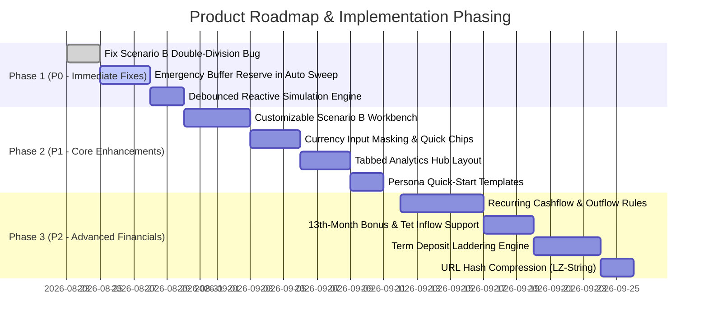
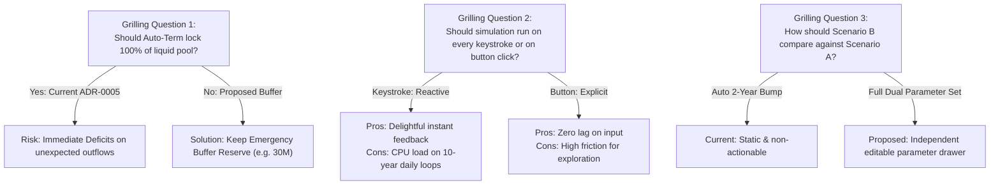

# 🧭 Product Owner Review & Feature Suggestions: Personal Finance Savings Predictor

> **Document Type:** Product Review, UI/UX Audit & Requirements Grilling Blueprint  
> **Target Application:** [`personal-finance-savings-predictor/index.html`](./index.html)  
> **Source Documents:** [`CONTEXT.md`](./CONTEXT.md), [`ITEMS_TO_IMPLEMENT.md`](./ITEMS_TO_IMPLEMENT.md), [`ACTION_PLAN.md`](./ACTION_PLAN.md), [`docs/adr/`](./docs/adr/)  
> **Date:** August 2026  
> **Author:** Product Owner (PO) Perspective

---

## 1. Executive Summary & Product Vision

### 1.1 Product Vision

The **Personal Finance Savings Predictor** is a standalone, client-side, privacy-preserving wealth simulation platform. It bridges the gap between basic savings calculators and complex personal finance software by modeling real-life multi-tier cash flows: liquid flexible pools, salary growth curves, scheduled withdrawals, time-locked deposits, automated lump-sum reinvestment sweeps, and continuous inflation purchasing power adjustments.

### 1.2 Core Strengths & Value Proposition

1. **Zero Server Dependency & 100% Privacy**: All financial data (salaries, bank balances, goals) lives exclusively in the user's browser `localStorage` or URL hash.
2. **High-Resolution Simulation**: Daily resolution simulation engine accounts for daily compounding demand interest, exact anniversary salary step-ups, and calendar maturity dates.
3. **Bilingual Vietnamese/English Support**: Native localized formatting (`₫` vs `VND`, dot vs comma decimal separators, localized date conventions).
4. **Instant Portability**: Frictionless sharing via state-encoded URL hashes without backend databases.

### 1.3 Key PO Findings & Assessment

While the core simulation engine and requirements baseline (R1–R21) are solidly built, several critical **usability hurdles**, **mathematical edge cases**, and **financial modeling blindspots** prevent the product from achieving its full potential. This document provides a thorough audit and an actionable backlog for requirement grilling and specification refinement.

---

## 2. Requirements & ADR Audit Matrix (R1 – R21)

The table below audits the 21 specified core requirements against actual product implementation, user expectations, and edge case resilience.

| ID      | Feature                        | Status         | Functional Maturity | PO Review & Edge Case Vulnerability                                                                                                                                      |
| :------ | :----------------------------- | :------------- | :------------------ | :----------------------------------------------------------------------------------------------------------------------------------------------------------------------- |
| **R1**  | CSV Persistence                | ✅ Implemented | High                | Persists to `workingCSVData`. _Gap:_ No auto-backup or version history if user overwrites data accidentally.                                                             |
| **R2**  | Parameter Persistence          | ✅ Implemented | High                | Schema migration handles version 1 to 2. Works as expected.                                                                                                              |
| **R3**  | Reset Defaults                 | ✅ Implemented | Medium              | Resets parameters and sample CSV. _Gap:_ No non-blocking undo action (toast undo) if clicked accidentally.                                                               |
| **R4**  | Salary Escalation              | ✅ Implemented | High                | Implements [ADR-0002](./docs/adr/0002-anniversary-based-salary-escalation.md) with anniversary step-ups on the 1st of anniversary months.                                |
| **R5**  | Purchasing Power (Real Value)  | ✅ Implemented | High                | Continuous compounding discount curve rendered as dashed line on growth chart.                                                                                           |
| **R6**  | Scheduled Withdrawals          | ✅ Implemented | High                | Deducts from pool, allows deficit, logs `DEFICIT_WARNING` ([ADR-0001](./docs/adr/0001-flexible-pool-deficit-handling.md)).                                               |
| **R7**  | Goal Tracking & Milestone Date | ✅ Implemented | High                | Milestone date calculated and highlighted. _Gap:_ Duplicate canvas render between top bar and sidebar.                                                                   |
| **R8**  | Shareable Link                 | ✅ Implemented | High                | URL-safe Base64 encoded hash. _Gap:_ Long CSVs result in extremely lengthy URLs that may break on messaging apps.                                                        |
| **R9**  | Theme Toggle                   | ✅ Implemented | High                | Smooth dark/light transition with persistent preference.                                                                                                                 |
| **R10** | Onboarding Tour                | ✅ Implemented | Medium              | 5-step tour. _Gap:_ Shows simultaneously with Dark Mode modal on very first load (modal clutter).                                                                        |
| **R11** | Keyboard Shortcuts             | ✅ Implemented | Medium              | `Enter`, `Ctrl+S`, `Esc`. _Gap:_ No shortcut cheat sheet overlay or tooltip hints on buttons.                                                                            |
| **R12** | Toast Notifications            | ✅ Implemented | High                | 3s auto-dismissing feedback messages.                                                                                                                                    |
| **R13** | Growth Chart Analytics         | ✅ Implemented | High                | Date filters (All, 3M, 6M, 1Y) with dataset preservation.                                                                                                                |
| **R14** | Heatmap Calendar               | ✅ Implemented | Medium              | Renders year grid. _Gap:_ Hidden by default; visual intensity is based on gross total wealth rather than monthly net delta.                                              |
| **R15** | YoY Comparison Table           | ✅ Implemented | High                | Accurate annual breakdown with growth percentages and monthly averages.                                                                                                  |
| **R16** | CSV Portfolio Editor           | ✅ Implemented | Medium              | Full table CRUD. _Gap:_ Lacks date ordering validation (allows end date < start date) and amount input formatting.                                                       |
| **R17** | Scenario Comparison Engine     | ⚠️ Partial     | Low                 | Dual-pass engine runs, but **Scenario B has a double-division rate bug** and hardcodes a 2-year salary bump without allowing custom user parameters.                     |
| **R18** | Chart Image Export             | ✅ Implemented | High                | High-res PNG export with solid `#0f172a` canvas background.                                                                                                              |
| **R19** | Printable Summary              | ✅ Implemented | High                | Clean `@media print` layout excluding buttons and controls.                                                                                                              |
| **R20** | Auto Term Allocation Rule      | ✅ Implemented | High                | Implements [ADR-0005](./docs/adr/0005-unified-threshold-auto-term-allocation.md) single-sweep rule. _PO Concern: Sweeping entire pool to 0 is unrealistic in real life._ |
| **R21** | Bilingual Localization (i18n)  | ✅ Implemented | High                | English and Vietnamese translation dictionaries and locale formatting ([ADR-0003](./docs/adr/0003-locale-aware-number-and-date-formatting.md)).                          |

---

## 3. UI/UX Deep-Dive & Heuristic Evaluation

```
+-----------------------------------------------------------------------------------------+
| [LOGO] Savings & Wealth Simulator            [EN|VI] [Import] [Share] [Manage] [🌙] [?] |
+-----------------------------------------------------------------------------------------+
| SIMULATION PARAMETERS                                                                   |
| [Target Date]   [Monthly Salary]   [Salary Growth]   [Inflation]   [Savings Goal]       |
| [Pool Rate]     [Auto-Threshold]   [Auto-Duration]   [Auto-Rate]                        |
| [ >>> Run Simulation <<< ]   [Preset: 1Y] [Preset: 2Y] [Reset]                         |
+-----------------------------------------------------------------------------------------+
| GOAL PROGRESS: [==========================>            ] 68% (Milestone: 15/10/2028)    |
+-----------------------------------------------------------------------------------------+
| [ Total Balance ]      [ Total Interest ]      [ Total Salary ]      [ Pool & Auto ]    |
|   2,450,000,000 ₫         380,500,000 ₫          1,800,000,000 ₫       Pool: 45,000,000 |
+---------------------------------------------------+-------------------------------------+
| WEALTH GROWTH CHART (Daily Timeline)              | ASSET ALLOCATION & BREAKDOWN        |
| [Total] [Fixed] [Pool] [Real] | [All|3M|6M|1Y]    | [ Donut Chart: 85% Fixed / 15% Pool ]|
| ~~~~~~~~~~~~~~~~~~~~~~~~~~~~~~~~~~~~~~~~~~~~~~~~~ | CSV Interest:         120,000,000 ₫ |
| ~~~~~~~~~~~~~~~~~~~~~~~~~~~~~~~~~~~~~~~~~~~~~~~~~ | Pool Interest:         15,500,000 ₫ |
| ~~~~~~~~~~~~~~~~~~~~~~~~~~~~~~~~~~~~~~~~~~~~~~~~~ | Auto Term Interest:   245,000,000 ₫ |
+---------------------------------------------------+-------------------------------------+
| MONTHLY INCOME & INTEREST FLOW (Bar Chart)                                              |
| [Salary Inflow vs Paid Term Interest per Month]                                         |
+---------------------------------------------------+-------------------------------------+
| SAVINGS PORTFOLIO TABLE (CSV + Auto Term)         | SIMULATION LOGS (Milestone Events)  |
| Bank | Principal | Rate | End Date | Status       | 01/01/2026: Salary +25M (Escalated) |
| VCB  | 500,000,000| 5.8%| 15/06/26 | ACTIVE       | 15/06/2026: Maturity Payout +514.5M |
+-----------------------------------------------------------------------------------------+
```

### 3.1 First Impression & Onboarding Flow

- **Issue**: On a fresh browser visit, two overlapping modals trigger simultaneously: the Onboarding Tour modal and the Dark Mode notification modal. This creates visual noise and cognitive overload.
- **Recommendation**:
  - Suppress the standalone Dark Mode modal on first visit.
  - Introduce an inline, non-modal banner or subtle spotlight walkthrough with step indicators that highlights inputs on the actual page rather than a centered generic card.

### 3.2 Form Inputs & Parameter Ergonomics

- **Issue 1: Raw Large Number Inputs**: Users must type raw numbers like `200000000` or `25000000`. It is easy to miss a zero (`20,000,000` vs `200,000,000`), completely altering simulation output.
- **Issue 2: Lack of Currency Suffix/Masking**: Inputs lack live formatting (e.g., showing `25,000,000 ₫` as the user types or providing helper labels like `25 Triệu VND`).
- **Issue 3: Duration & Term Selection**: Auto Term Duration is a raw numeric input instead of bank-standard term selector chips (`1M`, `3M`, `6M`, `12M`, `24M`, `36M`).
- **Recommendation**:
  - Add quick multiplier chips below currency inputs: `+5M`, `+10M`, `+50M`, `+100M`, `+500M`.
  - Add dynamic spelled-out helper text under large inputs (e.g., _"Hai trăm triệu đồng"_ in VI or _"200 Million VND"_ in EN).

### 3.3 Information Hierarchy & Dashboard Layout

- **Issue 1: Duplicate Goal Progress Canvases**: The app renders `#chartGoalRing` in the top horizontal goal banner and `#chartGoalRing2` in the right sidebar. This is redundant and wastes valuable vertical screen estate.
- **Issue 2: Hidden Discovery Features**: High-value analytical tools like the **Monthly Heatmap** and **YoY Table** are hidden behind toggle buttons by default. Many users never discover them.
- **Issue 3: Static "Run Simulation" Requirement**: In modern SPAs, users expect reactive live updates. Changing the inflation rate or salary does not update charts until the user clicks "Run Simulation".
- **Recommendation**:
  - Implement debounced reactive simulation (re-runs automatically ~150ms after any parameter change).
  - Unify the Goal Tracking widget into a cohesive single hero card with Milestone projection, progress bar, and completion ETA.
  - Make YoY table visible by default in a tabbed analytics container (e.g., `[Growth Chart] | [Monthly Flow] | [YoY Breakdown] | [Heatmap]`).

### 3.4 Data Management & Portfolio Editor (CSV Modal)

- **Issue 1: Date Validation**: The CSV row editor allows users to input an End Date that is earlier than the Start Date, which generates negative interest calculation anomalies.
- **Issue 2: Mobile Table Responsiveness**: The modal table overflows horizontally on mobile devices without clear scroll affordance or sticky action columns (Delete/Edit buttons get pushed offscreen).
- **Issue 3: Withdrawal Creation Friction**: Scheduled withdrawals require adding a row with Type = `Withdrawal`, which is counterintuitive for non-technical users.
- **Recommendation**:
  - Add a dedicated "+ Add Withdrawal" quick button that pre-configures a withdrawal outflow with negative balance visual indicators (rose badges).
  - Add strict date validation: `EndDate >= StartDate`.
  - Support direct clipboard paste from Excel / Google Sheets directly into the portfolio grid.

---

## 4. PO Feature Suggestions & Improvement Backlog

### Theme 1: Financial Modeling & Simulation Engine Deepening

#### 💡 Suggestion 1.1: Configurable Liquid Emergency Buffer in Auto Term Sweep (High Priority)

- **Problem**: Under current [ADR-0005](./docs/adr/0005-unified-threshold-auto-term-allocation.md), when Flexible Pool balance $\ge$ Auto Term Threshold (e.g. 200M), the engine locks **100%** of the pool balance into a fixed term deposit, reducing liquid cash to **0 VND**. In real personal financial management, no rational individual locks 100% of their liquid funds without keeping an emergency reserve for daily living expenses. If a scheduled withdrawal hits the following day, the pool immediately goes into deficit.
- **Proposed Feature**: Introduce an **Emergency Buffer Reserve** parameter (default: `30,000,000 VND` or `3 months of living expenses`).
- **Formula**: $\text{Locked Amount} = \text{Flexible Pool} - \text{Emergency Buffer}$. If $\text{Locked Amount} \ge \text{Auto Term Threshold}$, lock $\text{Locked Amount}$ and retain $\text{Emergency Buffer}$ in the liquid pool.

#### 💡 Suggestion 1.2: Interactive & Customizable Scenario Comparison (Fixing R17)

- **Problem**: Currently, Scenario B is hardcoded to a static 2-year salary growth bump. The user cannot compare custom hypotheses like:
  - _"What if I save 35M/month instead of 25M/month?"_
  - _"What if interest rates drop from 5.8% to 4.2%?"_
  - _"What if inflation spikes to 6%?"_
  - _"What if I buy a car (500M withdrawal) in June 2027?"_
- **Proposed Feature**: Provide a side-by-side editable Scenario B parameter drawer. Display a comparative Growth Chart with dual lines (Scenario A in indigo, Scenario B in emerald), showing exact Milestone Date differences and net wealth delta (`+145,000,000 ₫`).

#### 💡 Suggestion 1.3: Recurring Scheduled Outflows & Cashflow Rules

- **Problem**: Currently, users must manually insert a separate CSV row for every single withdrawal. Recurring expenses (e.g. rent/mortgage of 10M/month, quarterly insurance premium of 15M, annual vacation of 30M) cannot be modeled without creating dozens of manual rows.
- **Proposed Feature**: Support Recurring Outflow rules:
  - Frequency: `Monthly`, `Quarterly`, `Annually`
  - Start Date & End Date (or ongoing)
  - Escalation rate (optional inflation adjustment for expenses)

#### 💡 Suggestion 1.4: Irregular Inflows & Tet / 13th Month Salary Modeling

- **Problem**: In Vietnam and many Asian economies, employees receive a 13th-month salary and performance bonuses in January/February (Lunar New Year / Tet). Currently, salary is strictly flat across all 12 months.
- **Proposed Feature**: Add a toggle for **"13th Month Bonus"** (paid in January or February) or an Annual Bonus % (e.g., 1.5x monthly salary deposited every 12th month).

#### 💡 Suggestion 1.5: Deposit Laddering Strategy Engine

- **Problem**: The current auto-term sweeps all excess cash into a single fixed term (e.g. 6M). If interest rates fluctuate or liquidity is needed periodically, users employ a **CD / Term Ladder** strategy (e.g., splitting into 3M, 6M, and 12M buckets).
- **Proposed Feature**: Add an optional allocation rule: "Tranche Split Ladder" (e.g. 50% in 6-month term, 50% in 12-month term).

---

### Theme 2: UI/UX, Data Visualization & Interaction Polish

#### 💡 Suggestion 2.1: Live Reactive Simulation (Zero-Click Updates)

- Replace manual "Run Simulation" button clicks with reactive auto-execution using a 150ms debounce on input change. Keep the "Run" button as an explicit trigger for accessibility and touch devices.

#### 💡 Suggestion 2.2: Financial Persona & Strategy Quick-Start Presets

Provide 1-click preset templates for instant exploration:

1. **Fresh Graduate / First Job**: Salary 12M, 10% annual raise, 50M goal, 0 starting portfolio.
2. **Aggressive FIRE (Financial Independence)**: Salary 60M, 40M savings rate, 5B goal, 6.5% term ladder.
3. **Home Downpayment Target**: Salary 35M, 500M CSV portfolio, 1.5B goal in 3 years with 200M withdrawal for wedding.
4. **Conservative Bank Ladder**: Multiple fixed deposits across Big 4 banks (VCB, BIDV, Agribank, Vietinbank).

#### 💡 Suggestion 2.3: Currency Input Formatter & Quick Increment Chips

```
+--------------------------------------------------------------+
| Monthly Salary                                               |
| [ 25,000,000                                           ₫ ]   |
| Helper: Hai mươi lăm triệu đồng (25 Million VND)             |
| [ +1M ]  [ +5M ]  [ +10M ]  [ +50M ]  [ +100M ]              |
+--------------------------------------------------------------+
```

#### 💡 Suggestion 2.4: Consolidated Tabbed Analytics Hub

Replace lengthy vertical scrolling with a cohesive, tabbed visualization card:

- 📈 **Tab 1: Wealth Timeline** (Main chart with Total, Fixed, Pool, Real curves)
- 📊 **Tab 2: Cashflow & Interest** (Monthly salary vs paid interest flow)
- 📅 **Tab 3: Heatmap Calendar** (Monthly wealth density grid)
- 📋 **Tab 4: YoY Summary** (Annual tabular growth & average monthly balance)

#### 💡 Suggestion 2.5: High-Performance URL Hash Compression

- **Problem**: Large portfolios with 20+ rows create massive URL hashes that can exceed URL length limits when shared on chat apps (Telegram, Zalo, Slack).
- **Solution**: Implement lightweight LZ-string compression for the URL hash payload to reduce URL length by 70%.

---

## 5. Prioritized Product Roadmap



### Prioritization Matrix

| Phase  | Item                                      | Impact   | Complexity | Target Audience                       |
| :----- | :---------------------------------------- | :------- | :--------- | :------------------------------------ |
| **P0** | **Fix Scenario B Interest Bug**           | High     | Low        | All users running comparisons         |
| **P0** | **Emergency Buffer Reserve in Auto Term** | Critical | Low        | All users using Auto Term             |
| **P0** | **Reactive Debounced Simulation**         | High     | Low        | All users tweaking parameters         |
| **P1** | **Interactive Scenario B Customizer**     | High     | Medium     | Power planners, what-if analysts      |
| **P1** | **Input Currency Masking & Quick Chips**  | High     | Low        | General users entering large VND sums |
| **P1** | **Tabbed Analytics Hub**                  | Medium   | Low        | Desktop & mobile users                |
| **P1** | **Financial Persona Templates**           | High     | Low        | New / onboarding users                |
| **P2** | **Recurring Outflow Engine**              | High     | Medium     | Family budgets, mortgage payers       |
| **P2** | **13th Month Bonus Inflows**              | Medium   | Low        | Salaried workers in Vietnam           |
| **P2** | **Deposit Ladder Allocation**             | Medium   | Medium     | Wealth preservation planners          |
| **P2** | **URL Hash Compression**                  | Medium   | Low        | Users sharing portfolios              |

---

## 6. PO Grilling Matrix: Tough Questions & Stakeholder Trade-Offs

Use this section to stress-test product decisions, challenge assumptions, and establish future Architecture Decision Records (ADRs).



### 🥊 Grilling Topic 1: The "Zero-Liquid-Cash" Auto-Sweep Fallacy

- **Grill Question**: _"Why does our system force the user to have 0 VND liquid cash after triggering an auto-deposit? If a user has 201M VND and threshold is 200M, locking the entire 201M leaves them with 0 VND for lunch tomorrow! Is this how real people save?"_
- **Target Resolution**: Modify ADR-0005 to adopt a **Configurable Minimum Buffer** (e.g. retain $X$ amount in the Flexible Pool, or lock in standard chunks such as increments of 50M VND).

### 🥊 Grilling Topic 2: Scenario Comparison Actionability

- **Grill Question**: _"What value does Scenario Comparison provide right now if the user cannot choose what Scenario B changes? Why should Scenario B only assume a 2-year salary growth?"_
- **Target Resolution**: Convert Scenario Comparison into a true **What-If Workbench** where users can change any single variable (Salary, Savings Goal, Auto Term Duration, Inflation) and instantly see the Milestone Date delta.

### 🥊 Grilling Topic 3: Deficit Policy in Liquid Pool

- **Grill Question**: _"ADR-0001 allows the Flexible Pool to go into negative balance with a warning. But in a real bank account, can you spend money you don't have without an overdraft fee or loan interest?"_
- **Target Resolution**: Debate whether deficit balances should accrue an **Overdraft Interest Penalty** (e.g. 12%/yr) or trigger an automatic emergency early liquidation of fixed-term deposits with forfeit of interest.

### 🥊 Grilling Topic 4: Client-Side Scalability vs Simulation Granularity

- **Grill Question**: _"If a user selects a 30-year retirement horizon (10,950 daily steps) with 50 portfolio items, does daily simulation cause UI stuttering on mobile phones? Should we support monthly stepping for long timelines?"_
- **Target Resolution**: Benchmark pure engine performance across 10,000 steps (currently ~2–4ms in V8), confirming daily granularity remains blazing fast without needing Web Workers or coarser stepping.

### 🥊 Grilling Topic 5: Privacy vs Feature Richness

- **Grill Question**: _"If we add recurring expenses, tax rates, and multiple goals, does our URL share hash become 4KB long and fail to open on mobile browsers?"_
- **Target Resolution**: Commit to client-side compression (LZ-String) and establish a strict schema migration contract for URL-shared states.

---

## 7. Next Steps & Action Checklist

1. **Conduct Grilling Session**: Review Section 6 questions with engineering and financial advisors.
2. **Draft New ADRs**:
   - `ADR-0006`: Liquid Emergency Buffer Reserve in Auto Term Allocation.
   - `ADR-0007`: Interactive Dual-Pass Scenario Comparison Workbench.
3. **Execute Phase 1 Sprints**:
   - Fix Scenario B double-division interest calculation.
   - Introduce Emergency Buffer Reserve input field.
   - Implement debounced live reactive simulation.
4. **Update Test Suite**: Add console verification tests for Emergency Buffer reserve and Scenario B parameter independence to [`TEST_PLAN.md`](./TEST_PLAN.md).

---

_Document generated for Product Owner requirements grilling and product refinement._
