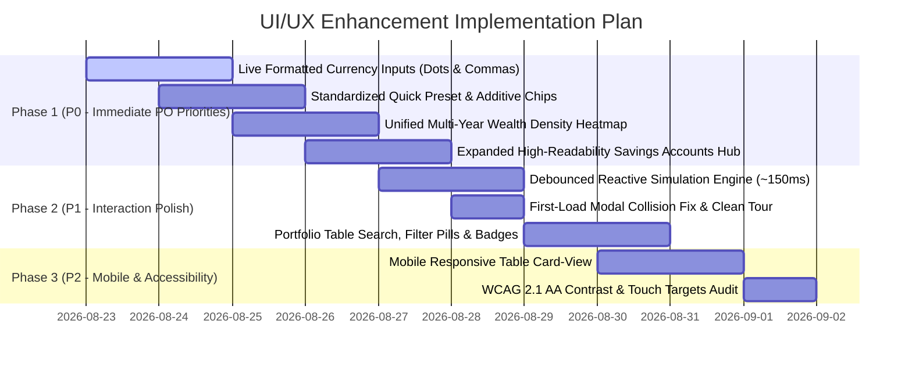

# 🧭 Product Owner & UI/UX Audit Specification: Personal Finance Savings Predictor

> **Target Application:** [`personal-finance-savings-predictor/index.html`](./index.html)  
> **Inspection Engine:** Lightpanda MCP (Headless Browser DOM, Semantics & Interactive Elements Analysis)  
> **Author:** Product Owner (PO) & Senior UI/UX Specialist  
> **Date:** August 2026  
> **Status:** Final Audit & Actionable Blueprint

---

## 1. Executive Summary & Review Scope

Following a hands-on review of the **Personal Finance Savings Predictor** using Lightpanda MCP inspection and heuristic evaluation, this document synthesizes key usability issues, ergonomic friction points, and actionable design specifications to elevate the application's user experience.

### 1.1 Four Core PO Requirements Addressed

| #     | PO Requirement                                              | Current Pain Point                                                                                                                                                        | Proposed Solution                                                                                                                                                                           |
| :---- | :---------------------------------------------------------- | :------------------------------------------------------------------------------------------------------------------------------------------------------------------------ | :------------------------------------------------------------------------------------------------------------------------------------------------------------------------------------------ |
| **1** | **Number Input Formatting** (`25,000,000` / `25.000.000`)   | Standard `<input type="number">` shows unformatted raw digits (`25000000`, `200000000`), leading to accidental zero omissions.                                            | Dedicated live currency input formatter with locale-aware thousand separators (dots for VI `25.000.000`, commas for EN `25,000,000`) and spelled-out amount helper text.                    |
| **2** | **Quick Sample / Preset Buttons** (`0`, `10M`, `30M`, etc.) | Users must manually type 8–10 digits for each currency field.                                                                                                             | Standardized ergonomic preset chip bars (`0`, `10M`, `25M`, `50M`, `100M`, `500M`, `1B`) and additive delta buttons (`+5M`, `+10M`, `+50M`) under all key inputs.                           |
| **3** | **Unified Multi-Year Heatmap** (All Years Continuous)       | Heatmap is hidden behind a single-year dropdown selector with a broken 7-column layout, hiding multi-year compounding trends.                                             | Redesign into a **Multi-Year Wealth Density Matrix** (Rows = Years, Columns = Jan–Dec + Annual Delta) showing the complete simulation timeline at a single glance.                          |
| **4** | **Expanded Savings Accounts Table** (High Readability)      | Savings Accounts table is crammed into a 2-column grid (`lg:grid-cols-2`) sharing space with Milestones Log, squishing 6 columns into tight cells with nested scrollbars. | Re-architect into a **Full-Width High-Readability Portfolio Hub** (or 8/4 split) with summary metric pills, account type filter tabs, status badges, and right-aligned currency formatting. |

---

## 2. Lightpanda Inspection & Heuristic Findings

Using Lightpanda MCP to inspect the live DOM tree, interactive elements, and layout hierarchy at `http://localhost:8089/index.html`:

```
┌─────────────────────────────────────────────────────────────────────────────┐
│                             LIGHTPANDA DOM SNAPSHOT                         │
├─────────────────────────────────────────────────────────────────────────────┤
│ 277 RootWebArea 'Savings & Wealth Simulator — Enhanced'                     │
│  255 [i] button 'Close onboarding'                                          │
│  288 heading '🌙 Dark Mode' (Simultaneous Modal Collision)                  │
│  260 [i] combobox 'Select Language' value='en'                              │
│  295 main 'Main content'                                                    │
│   296 region 'Simulation Parameters'                                        │
│    269 [i] spinbutton 'Monthly Salary' value='25000000' (Unformatted)       │
│    275 [i] spinbutton 'Annual Bonus' value='1.0'                            │
│    270 [i] spinbutton 'Salary Growth' value='0'                             │
│   ├── Tab Panel 'tabPanel_heatmap' (hidden, single-year dropdown)           │
│   └── Section 'grid-cols-1 lg:grid-cols-2' (Savings Accounts vs Logs)       │
└─────────────────────────────────────────────────────────────────────────────┘
```

### Key Heuristic Discoveries:

1. **First-Load Modal Collision**: The Onboarding Tour modal and the Dark Mode notification modal render simultaneously on first load, causing visual conflict.
2. **Input Type Limitations**: `<input type="number">` strictly disallows commas or dots in HTML5 browsers, making formatted inputs impossible without custom text/numeric masking.
3. **Heatmap Cell Sizing Disconnect**: `.heatmap-cell` CSS is set to `width: calc(14.28% - 4px)` (7 days/week layout), but JavaScript injects monthly values, causing inconsistent alignment.
4. **Table Column Squeeze**: At 1024px–1440px viewport widths, the 2-column layout forces 6 table columns into ~480px width, causing truncation of long account names like `VCB_AutoSweep_2026-07-01`.

---

## 3. Deep Dive & Detailed Specifications

---

### 3.1 Feature 1: Live Formatted Currency Inputs (`25.000.000` / `25,000,000`)

#### Problem Analysis

Entering raw numbers like `200000000` (200 Million VND) without separators creates high cognitive friction. Users frequently make 10x order-of-magnitude errors (typing `20000000` instead of `200000000`), which drastically skews the simulation output.

```
[ Current Raw Input ]
Monthly Salary (VND): [ 25000000             ] ❌ Hard to read (Is it 2.5M, 25M, or 250M?)

[ Proposed Formatted Input with Dynamic Helper ]
Monthly Salary:
┌───────────────────────────────────────────────────┐
│ 25,000,000                                      ₫ │
└───────────────────────────────────────────────────┘
💬 Hai mươi lăm triệu đồng (25 Million VND)
```

#### Technical Design & Behavior

1. **Input Representation**: Use `<input type="text" inputmode="numeric">` with custom parsing logic.
2. **Locale-Aware Separation**:
   - **Vietnamese (`vi`)**: Uses dot `.` as thousand separator: `25.000.000 ₫`
   - **English (`en`)**: Uses comma `,` as thousand separator: `25,000,000 VND`
3. **Cursor Preservation Algorithm**: Stripping and re-inserting separators must maintain accurate cursor position during intermediate typing.
4. **Dynamic Spelled-Out Helper**: As the user types, render the verbal currency amount in real time below the input (e.g., `25 Triệu VND` / `25 Million VND`, `1.5 Tỷ VND` / `1.5 Billion VND`).

#### JavaScript Implementation Recipe

```javascript
// Pure currency formatting and parsing utility
function formatNumberWithSeparators(val, lang = "en") {
  if (val === null || val === undefined || isNaN(val) || val === "") return "";
  const num =
    typeof val === "string" ? parseFloat(val.replace(/[^0-9.-]/g, "")) : val;
  if (isNaN(num)) return "";
  const separator = lang === "vi" ? "." : ",";
  return num.toString().replace(/\B(?=(\d{3})+(?!\d))/g, separator);
}

function parseFormattedNumber(str, lang = "en") {
  if (!str) return 0;
  // Strip all non-digit characters except negative sign
  const clean = str.toString().replace(/[^0-9-]/g, "");
  const parsed = parseInt(clean, 10);
  return isNaN(parsed) ? 0 : parsed;
}

function getSpelledOutAmount(amount, lang = "en") {
  if (!amount || amount <= 0) return "";
  if (amount >= 1e9) {
    const b = (amount / 1e9).toFixed(2).replace(/\.00$/, "");
    return lang === "vi" ? `${b} Tỷ đồng` : `${b} Billion VND`;
  }
  if (amount >= 1e6) {
    const m = (amount / 1e6).toFixed(1).replace(/\.0$/, "");
    return lang === "vi" ? `${m} Triệu đồng` : `${m} Million VND`;
  }
  if (amount >= 1e3) {
    const k = (amount / 1e3).toFixed(0);
    return lang === "vi" ? `${k} Nghìn đồng` : `${k} Thousand VND`;
  }
  return `${amount} VND`;
}

// Live Input Event Handler
function attachCurrencyInputMask(inputEl, helperEl, onChangeCallback) {
  inputEl.addEventListener("input", (e) => {
    const currentLang = currentLanguage || "en";
    const cursor = inputEl.selectionStart;
    const rawVal = parseFormattedNumber(inputEl.value, currentLang);
    const formatted = formatNumberWithSeparators(rawVal, currentLang);

    // Calculate cursor shift
    const diff = formatted.length - inputEl.value.length;
    inputEl.value = formatted;
    inputEl.setSelectionRange(cursor + diff, cursor + diff);

    // Update helper text
    if (helperEl) {
      helperEl.textContent = getSpelledOutAmount(rawVal, currentLang);
    }

    if (onChangeCallback) onChangeCallback(rawVal);
  });
}
```

---

### 3.2 Feature 2: Quick Sample / Preset Buttons (`0`, `10M`, `30M`, etc.)

#### Problem Analysis

Setting up personal finance parameters is an iterative "what-if" workflow. Users want to quickly test different salary tiers (e.g. 15M vs 30M vs 50M) or savings goals (500M vs 1B vs 2B) without manually typing strings of zeros.

#### UI Component Specification

Add compact, touch-friendly preset pill groups below all major parameters:

```
+-------------------------------------------------------------------------------+
| PARAMETER PRESET BAR LAYOUT                                                  |
+-------------------------------------------------------------------------------+
| Monthly Salary (VND)                                                          |
| [ 25,000,000                                                            ₫ ]   |
| Helper: 25 Triệu VND (Hai mươi lăm triệu đồng)                                |
| Presets: [ 10M ] [ 20M ] [ 25M ] [ 35M ] [ 50M ] [ 100M ]                     |
| Additive: [ +1M ] [ +5M ] [ +10M ]                                            |
+-------------------------------------------------------------------------------+
| Savings Goal (VND)                                                            |
| [ 1,500,000,000                                                         ₫ ]   |
| Helper: 1.5 Tỷ VND (Một tỷ năm trăm triệu đồng)                               |
| Presets: [ 0 ] [ 300M ] [ 500M ] [ 1B ] [ 2B ] [ 5B ] [ 10B ]                 |
| Additive: [ +50M ] [ +100M ] [ +500M ]                                        |
+-------------------------------------------------------------------------------+
| Auto Term Threshold (VND)                                                     |
| [ 200,000,000                                                           ₫ ]   |
| Presets: [ 50M ] [ 100M ] [ 150M ] [ 200M ] [ 300M ] [ 500M ]                 |
+-------------------------------------------------------------------------------+
| Emergency Buffer Reserve (VND)                                                |
| [ 30,000,000                                                            ₫ ]   |
| Presets: [ 0 ] [ 10M ] [ 20M ] [ 30M ] [ 50M ] [ 100M ]                       |
+-------------------------------------------------------------------------------+
```

#### Preset Mapping Table

| Parameter Input           | Preset Values                                  | Additive Quick Chips     | Default       |
| :------------------------ | :--------------------------------------------- | :----------------------- | :------------ |
| **Monthly Salary**        | `10M`, `20M`, `25M`, `35M`, `50M`, `100M`      | `+1M`, `+5M`, `+10M`     | `25,000,000`  |
| **Savings Goal**          | `0`, `300M`, `500M`, `1B`, `2B`, `5B`, `10B`   | `+50M`, `+100M`, `+500M` | `0`           |
| **Auto Term Threshold**   | `50M`, `100M`, `150M`, `200M`, `300M`, `500M`  | `+50M`, `+100M`          | `200,000,000` |
| **Emergency Buffer**      | `0`, `10M`, `20M`, `30M`, `50M`, `100M`        | `+5M`, `+10M`            | `30,000,000`  |
| **Auto Term Rate (%/yr)** | `4.5%`, `5.0%`, `5.5%`, `5.8%`, `6.5%`, `7.2%` | `+0.1%`, `+0.5%`         | `5.8%`        |
| **Auto Term Duration**    | `1M`, `3M`, `6M`, `12M`, `24M`, `36M`          | —                        | `6M`          |

---

### 3.3 Feature 3: Unified Multi-Year Continuous Calendar Heatmap

#### Problem Analysis

Currently, the Calendar Heatmap requires users to select a single year from a dropdown. It only renders 12 cells for that selected year and uses a 7-column CSS rule (`width: calc(14.28% - 4px)`). This makes comparing long-term wealth progression across years impossible.

```
[ Current Flawed Heatmap ]
Dropdown: [ 2026 ▼ ]
Grid: [ Jan ] [ Feb ] [ Mar ] [ Apr ] [ May ] [ Jun ] [ Jul ] [ Aug ] [ Sep ] [ Oct ] [ Nov ] [ Dec ]
❌ Only shows 1 year at a time; user cannot see 5-year wealth compounding trajectory.

[ Proposed Multi-Year Wealth Density Matrix ]
┌──────────┬──────┬──────┬──────┬──────┬──────┬──────┬──────┬──────┬──────┬──────┬──────┬──────┬───────────────┐
│   YEAR   │ JAN  │ FEB  │ MAR  │ APR  │ MAY  │ JUN  │ JUL  │ AUG  │ SEP  │ OCT  │ NOV  │ DEC  │ ANNUAL DELTA  │
├──────────┼──────┼──────┼──────┼──────┼──────┼──────┼──────┼──────┼──────┼──────┼──────┼──────┼───────────────┤
│ **2026** │  25M │  50M │  75M │ 101M │ 126M │ 152M │ 178M │ 204M │ 231M │ 258M │ 285M │ 312M │ +312.5M (+100%)│
│ **2027** │ 340M │ 368M │ 396M │ 425M │ 454M │ 484M │ 515M │ 546M │ 578M │ 610M │ 643M │ 676M │ +364.2M (+116%)│
│ **2028** │ 710M │ 745M │ 780M │ 816M │ 853M │ 890M │ 928M │ 967M │ 1.0B │ 1.0B │ 1.1B │ 1.1B │ +472.8M (+138%)│
│ **2029** │ 1.2B │ 1.2B │ 1.3B │ 1.3B │ 1.4B │ 1.4B │ 1.5B │ 1.5B │ 1.6B │ 1.6B │ 1.7B │ 1.8B │ +620.1M (+152%)│
└──────────┴──────┴──────┴──────┴──────┴──────┴──────┴──────┴──────┴──────┴──────┴──────┴──────┴───────────────┘
Intensity Legend: [ Low ░░ ▒▒ ▓▓ ██ High ]  Mode Toggle: (•) Total Wealth  ( ) Monthly Net Inflow
```

#### Heatmap Specification Details:

1. **Continuous Multi-Year Grid**:
   - Every year in the simulation timeline is rendered as an explicit table row.
   - Months (Jan to Dec) form 12 columns with standard 3-letter abbreviations.
   - 13th Summary Column: Shows Total Wealth gained during that year (`+Δ VND`) and Year-over-Year Growth Rate (`%`).
2. **Global Relative Color Scaling**:
   - Color intensity is computed relative to the maximum wealth across the entire simulation duration.
   - Palette (Tailwind Emerald tones):
     - `bg-emerald-950/40` (0%–15%)
     - `bg-emerald-900/60` (15%–30%)
     - `bg-emerald-800/70` (30%–50%)
     - `bg-emerald-700/80` (50%–70%)
     - `bg-emerald-600/90` (70%–85%)
     - `bg-emerald-500 text-slate-950 font-bold` (85%–100%)
3. **Interactive Cell Popover / Tooltip**:
   - Hovering over any cell reveals a rich financial tooltip:
     - **Month & Year**: `June 2027`
     - **Total Wealth**: `484,250,000 ₫`
     - **Liquid Pool Balance**: `45,000,000 ₫`
     - **Fixed Deposits**: `439,250,000 ₫`
     - **Salary Inflow**: `25,000,000 ₫`
     - **Term Interest Paid This Month**: `14,250,000 ₫`
4. **View Toggle**:
   - **Mode 1 (Total Wealth)**: Visualizes absolute balance accumulation over time.
   - **Mode 2 (Net Inflow Flow)**: Visualizes monthly cash velocity (highlighting bonus months and maturity lump-sum payouts).

---

### 3.4 Feature 4: Expanded, High-Readability Savings Accounts Hub

#### Problem Analysis

In the current layout:

```html
<section class="grid grid-cols-1 lg:grid-cols-2 gap-6">
  <!-- Savings Accounts (50% width) -->
  <!-- Simulation Milestones Log (50% width) -->
</section>
```

Placing Savings Accounts inside a 50% split causes:

1. Severe horizontal crowding on screens < 1440px.
2. Truncation of account descriptions, start/end dates, and estimated interest.
3. Awkward simultaneous horizontal and vertical scrolling.

```
[ Current Cramped 2-Column Split ]
+------------------------------------+------------------------------------+
| 📋 Savings Accounts (50% Width)    | ⏱️ Simulation Milestones (50%)     |
| [Account|Princ|Rate|End|Est|Stat]  | • 01/01/26: Salary +25M            |
| (Scrolls horizontally in 480px)    | • 01/07/26: Auto 6M +200M          |
+------------------------------------+------------------------------------+

[ Proposed Full-Width High-Readability Portfolio Hub ]
+-----------------------------------------------------------------------------------------------------------------+
| 📋 SAVINGS PORTFOLIO & FIXED DEPOSITS                                                  [ Search / Filter 🔍 ]   |
| Metric Pills: [ Total Principal: 1,250,000,000 ₫ ]  [ Total Accounts: 8 ]  [ Weighted Avg Rate: 5.82% ]         |
| Filter Tabs:  [ All (8) ]  [ Active (5) ]  [ Matured (3) ]  [ Auto Sweeps (4) ]  [ Withdrawals (1) ]            |
+-----------------------------------------------------------------------------------------------------------------+
| Account Name & Bank     | Principal Amount  | Rate (%/yr) | Start Date   | Maturity Date | Est. Interest | Status   |
+-------------------------+-------------------+-------------+--------------+---------------+---------------+----------+
| 🏦 VCB 12M Locked       |   500,000,000 ₫   |    5.80%    | 01/01/2026   | 01/01/2027    |  29,000,000 ₫ | ACTIVE   |
| ⚡ AutoSweep_2026_07    |   200,000,000 ₫   |    5.80%    | 01/07/2026   | 01/01/2027    |   5,800,000 ₫ | MATURED  |
| ⚡ AutoSweep_2027_01    |   420,000,000 ₫   |    5.80%    | 01/01/2027   | 01/07/2027    |  12,180,000 ₫ | ACTIVE   |
| 🔻 Car Downpayment (W/D)|  (200,000,000 ₫)  |     N/A     | 15/06/2027   |  15/06/2027   |           0 ₫ | OUTFLOW  |
+-------------------------+-------------------+-------------+--------------+---------------+---------------+----------+
| ⏱️ SIMULATION MILESTONES & TIMELINE (Collapsible Stream or 2/3 + 1/3 layout)                                    |
+-----------------------------------------------------------------------------------------------------------------+
```

#### Detailed Re-architecting Specifications:

1. **Container Layout**:
   - Allocate full width (`col-span-12` or separate stacked card) to the Savings Accounts table.
   - Place Simulation Milestones either directly below in an activity timeline or in an 8-col / 4-col responsive layout on ultra-wide screens.
2. **Summary Header KPI Bar**:
   - **Total Fixed Principal**: Sum of all active fixed-term deposits.
   - **Weighted Average Interest Rate**: Sum(Principal * Rate) / Sum(Principal).
   - **Next Upcoming Maturity**: Date and amount of the next liquid payout.
3. **Filter & Search Controls**:
   - Search box for bank name or account label.
   - Type filter pills: `All`, `Active Fixed`, `Auto Term 6M`, `Matured`, `Scheduled Outflows`.
4. **Visual Indicators & Typography**:
   - Monospace font (`font-mono`) and right-alignment for all monetary columns.
   - Badge icons:
     - `🏦 Fixed Deposit`: Indigo badge
     - `⚡ Auto Sweep`: Amber badge
     - `🔻 Withdrawal`: Rose badge
   - Status indicators:
     - `● Active`: Glowing Emerald pill
     - `✓ Matured`: Muted Slate pill
     - `▲ Scheduled`: Blue pill

---

## 4. Additional Holistic UI/UX Recommendations

Beyond the 4 immediate PO issues, Lightpanda inspection highlighted several systemic improvements:

### 4.1 Debounced Reactive Auto-Simulation

- **Current Behavior**: Modifying any slider or number input requires the user to click the "Run Simulation" button.
- **Improvement**: Add a 150ms debounce on input change so charts and tables update reactively and instantaneously as users tweak parameters. Keep the "Run Simulation" button as an explicit trigger for mobile accessibility.

### 4.2 Single-Pass Onboarding Tour Flow

- **Current Behavior**: Dark Mode alert modal and Onboarding modal overlap on first load.
- **Improvement**: Suppress the standalone Dark Mode modal on initial load. Integrate theme selection directly into the top bar and provide an interactive spotlight onboarding tour.

### 4.3 Mobile Form & Table Ergonomics (WCAG 2.1 AA)

- Ensure all touch targets (`button`, `input`, `select`) meet the >= 48px touch target minimum.
- On screens < 640px, switch the Savings Accounts table into a clean card-list view with stacked key-value pairs to prevent horizontal scroll fatigue.

---

## 5. UI/UX Architecture & Layout Wireframe

```
+---------------------------------------------------------------------------------------------------------------+
| [💰 LOGO] Personal Finance Savings Predictor                   [EN | VI]  [Import]  [Share]  [Manage]  [🌙] [?] |
+---------------------------------------------------------------------------------------------------------------+
| HERO MILESTONE & GOAL TRACKER                                                                                 |
| Target Goal: 2,000,000,000 ₫ | Current Pace: 68% | Milestone Projected Date: 15/10/2028 (2Y 2M remaining)       |
| [===============================================================>                                 ] 68.4%     |
+---------------------------------------------------------------------------------------------------------------+
| [ Total Wealth ]               [ Total Interest ]              [ Total Salary Inflow ]    [ Liquid Pool Ratio]|
|   2,450,000,000 ₫                 380,500,000 ₫                   1,800,000,000 ₫            Pool: 50,000,000 |
|   Real: 2,120,000,000 ₫           +18.4% yield                    (Escalating 5%/yr)         Fixed: 2.40 B    |
+---------------------------------------------------------------------------------------------------------------+
| ⚙️ SIMULATION PARAMETERS (With Masked Inputs & Quick Preset Chips)                                             |
| ┌───────────────────────────┐ ┌───────────────────────────┐ ┌───────────────────────────┐                    |
| │ Target End Date           │ │ Monthly Salary (VND)      │ │ Salary Growth (%/yr)      │                    |
| │ [ 2030-12-31            ] │ │ [ 25,000,000            ₫]│ │ [ 5.0                   %]│                    |
| │ Presets: [1Y][2Y][3Y][5Y] │ │ Presets: [10M][25M][50M]  │ │ Presets: [0%][3%][5%][10%]│                    |
| └───────────────────────────┘ └───────────────────────────┘ └───────────────────────────┘                    |
| ┌───────────────────────────┐ ┌───────────────────────────┐ ┌───────────────────────────┐                    |
| │ Annual Bonus (13th Month) │ │ Inflation Rate (%/yr)     │ │ Savings Goal (VND)        │                    |
| │ [ 1.0x ] in [ Jan (Tháng1)│ │ [ 3.5                   %]│ │ [ 2,000,000,000           │                    |
| │ Presets: [0x][1x][1.5x][2x│ │ Presets: [0%][2%][3.5%][5%│ │ Presets: [500M][1B][2B][5B]│                    |
| └───────────────────────────┘ └───────────────────────────┘ └───────────────────────────┘                    |
| ┌───────────────────────────┐ ┌───────────────────────────┐ ┌───────────────────────────┐                    |
| │ Flexible Pool Rate (%/yr) │ │ Auto Term Threshold (VND) │ │ Emergency Buffer (VND)    │                    |
| │ [ 0.5                   %]│ │ [ 200,000,000           ₫]│ │ [ 30,000,000            ₫]│                    |
| │ Presets: [0.2%][0.5%][1%] │ │ Presets: [100M][200M][300M│ │ Presets: [0][10M][30M][50M]│                    |
| └───────────────────────────┘ └───────────────────────────┘ └───────────────────────────┘                    |
| [ ▶ Run Simulation ] [ ↺ Reset Defaults ] [ 💾 Save Portfolio CSV ]                                           |
+---------------------------------------------------------------------------------------------------------------+
| 📊 ANALYTICS HUB (Tabbed View)                                                                                |
| [ 📈 Wealth Timeline ]  [ 📊 Cashflow & Interest ]  [ 📅 Multi-Year Heatmap ]  [ 📋 YoY Summary Table ]       |
| ------------------------------------------------------------------------------------------------------------- |
| MULTI-YEAR WEALTH DENSITY MATRIX (Continuous All-Years Grid)                                                  |
| 2026: [Jan 25M][Feb 50M][Mar 75M][Apr 100M][May 125M][Jun 150M][Jul 175M][Aug 200M][Sep 225M]... +312.5M    |
| 2027: [Jan 340M][Feb 368M][Mar 396M][Apr 425M][May 454M][Jun 484M][Jul 515M][Aug 546M]...         +364.2M    |
| 2028: [Jan 710M][Feb 745M][Mar 780M][Apr 816M][May 853M][Jun 890M][Jul 928M][Aug 967M]...         +472.8M    |
| [ Low ░░ ▒▒ ▓▓ ██ High ]  Mode: (•) Total Wealth  ( ) Monthly Cash Inflow                                     |
+---------------------------------------------------------------------------------------------------------------+
| 📋 EXPANDED SAVINGS ACCOUNTS & FIXED DEPOSITS (Full Width)                                                    |
| Stats: Total Locked: 1,850,000,000 ₫ | Active: 6 | Matured: 2 | Weighted Rate: 5.84%                         |
| Filters: [ All (8) ] [ Active (6) ] [ Matured (2) ] [ Auto Swept 6M (4) ] [ Withdrawals (1) ]                 |
| +-----------------------------------------------------------------------------------------------------------+ |
| | Account Name        | Principal       | Rate   | Start Date | End Date   | Est. Interest | Status         | |
| | VCB 12M Term        |   500,000,000 ₫ | 5.80%  | 01/01/2026 | 01/01/2027 |  29,000,000 ₫ | ● ACTIVE       | |
| | AutoSweep_2026_07   |   200,000,000 ₫ | 5.80%  | 01/07/2026 | 01/01/2027 |   5,800,000 ₫ | ✓ MATURED      | |
| | AutoSweep_2027_01   |   450,000,000 ₫ | 5.80%  | 01/01/2027 | 01/07/2027 |  13,050,000 ₫ | ● ACTIVE       | |
| +-----------------------------------------------------------------------------------------------------------+ |
+---------------------------------------------------------------------------------------------------------------+
| ⏱️ SIMULATION EVENT LOGS & MILESTONES (Collapsible Stream)                                                    |
| 01/01/2026: Simulation Start | 01/07/2026: AutoSweep 200M locked at 5.8% | 01/01/2027: Maturity Payout +205.8M  |
+---------------------------------------------------------------------------------------------------------------+
```

---

## 6. Prioritized Implementation Roadmap



### Action Items & Deliverables Checklist

- [ ] **P0.1**: Convert all currency inputs (`inputSalary`, `inputSavingsGoal`, `inputAutoTermThreshold`, `inputEmergencyBuffer`, CSV editor principals, scenario inputs) to formatted inputs with thousand separators and real-time verbal helpers.
- [ ] **P0.2**: Deploy quick sample preset chip bars (`10M`, `25M`, `50M`, `100M`, `500M`, `1B`) and additive delta buttons (`+1M`, `+5M`, `+10M`, `+50M`) across all simulation inputs.
- [ ] **P0.3**: Rewrite `renderHeatmapChart()` into a multi-year matrix (Rows = Years, Columns = Jan–Dec + Annual Delta) displaying all years continuously with dynamic emerald density gradients.
- [ ] **P0.4**: Upgrade the Savings Accounts card layout from a squished 2-column grid into a full-width, highly readable portfolio manager with summary metric chips, type filters, and right-aligned currency columns.
- [ ] **P1.1**: Connect debounced reactive auto-simulation on parameter input.
- [ ] **P1.2**: Remove simultaneous Dark Mode modal popups on first visit.

---

_End of Product Owner & UI/UX Audit Specification._
