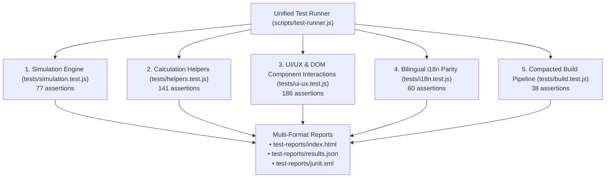

# 🧪 Personal Finance Savings Predictor — Requirements & Test Plan

> **Target:** `personal-finance-savings-predictor/index.html` & `dist/personal-finance-savings-predictor/index.html`  
> **Goal:** Deterministically validate all 40 feature requirements (R1–R40) across financial simulation mathematics, utility helpers, UI/UX DOM components, bilingual i18n parity, and compacted build packaging.  
> **Method:** Automated Node.js test runner (`npm test`) + Comprehensive manual QA checklist.

```bash
# Automated Test Suites (502 assertions passing across 5 suites)
npm test              # Run all 5 suites with unified multi-format reporting (502 assertions)
npm run test:sim      # Pure simulation engine unit tests & mathematical edge cases (77 assertions)
npm run test:helpers  # Currency masking, formatters, LZ-String & CSV editor tests (141 assertions)
npm run test:ui       # UI/UX component & DOM integration tests for R1-R40 (186 assertions)
npm run test:i18n     # Bilingual translation dictionary parity & verbal localization (60 assertions)
npm run test:build    # Compacted build pipeline & release packaging verification (38 assertions)
```

---

## 📋 Feature Requirements Matrix (R1–R40)

| ID      | Feature                          | Requirement                                                                                                                                 | ADR Reference                                                                                                                                                                     | Priority |
| :------ | :------------------------------- | :------------------------------------------------------------------------------------------------------------------------------------------ | :-------------------------------------------------------------------------------------------------------------------------------------------------------------------------------- | :------- |
| **R1**  | CSV Persistence                  | Auto-save active portfolio CSV data to `localStorage`; auto-load on page reload                                                             | —                                                                                                                                                                                 | P0       |
| **R2**  | Parameter Persistence            | Save/load monthly salary, growth, inflation, goal, and rate inputs to `localStorage` with versioned schema upgrades                         | —                                                                                                                                                                                 | P0       |
| **R3**  | Reset All                        | Clear `localStorage` and restore default financial parameters and portfolio accounts                                                        | —                                                                                                                                                                                 | P1       |
| **R4**  | Salary Growth                    | Apply annual compound escalation to monthly salary on exact 12-month simulation anniversaries                                               | [`ADR-0002`](./docs/adr/0002-anniversary-based-salary-escalation.md)                                                                                                              | P0       |
| **R5**  | Inflation Adjustment             | Calculate real purchasing power discounted continuously from start date; toggle nominal vs real value display                               | —                                                                                                                                                                                 | P0       |
| **R6**  | Withdrawals                      | Deduct scheduled one-time outflows from Flexible Pool with deficit logging and salary replenishment                                         | [`ADR-0001`](./docs/adr/0001-flexible-pool-deficit-handling.md)                                                                                                                   | P1       |
| **R7**  | Goal Milestone Tracking          | Render goal progress bar, milestone achievement date badge, and animated ring chart                                                         | —                                                                                                                                                                                 | P1       |
| **R8**  | Resilient Shareable Link         | Encode state into URL hash using LZ-String compression with automatic decompression fallback                                                | [`ADR-0010`](./docs/adr/0010-lz-string-url-compression-and-strategy-persona-presets.md), [`ADR-0015`](./docs/adr/0015-resilient-url-state-sharing-and-dual-mode-decompression.md) | P1       |
| **R9**  | Theme Toggle                     | Seamless Light/Dark theme switching with class persistence on `<html>` and CSS color transitions                                            | —                                                                                                                                                                                 | P2       |
| **R10** | Onboarding Walkthrough           | 5-step interactive onboarding tour for first-time visitors with skip and re-launch capabilities                                             | —                                                                                                                                                                                 | P2       |
| **R11** | Keyboard Shortcuts               | Accessibility shortcuts (`Enter` to simulate, `Ctrl+S`/`Cmd+S` to save, `Escape` to close active modal)                                     | —                                                                                                                                                                                 | P2       |
| **R12** | Toast Notification Queue         | Stacking slide-in toasts auto-dismissing after 3 seconds with colored success, warning, and error states                                    | —                                                                                                                                                                                 | P2       |
| **R13** | Growth Timeline Chart            | Interactive Chart.js timeline with preset date filters (`All`, `3M`, `6M`, `1Y`) and Real vs Nominal curves                                 | —                                                                                                                                                                                 | P2       |
| **R14** | Monthly Heatmap Grid             | 12-column color-intensity calendar grid mapping monthly liquidity density and net wealth shifts                                             | [`ADR-0012`](./docs/adr/0012-continuous-multi-year-calendar-heatmap-and-tooltips.md)                                                                                              | P2       |
| **R15** | Tabbed Analytics Hub             | Consolidated tab switcher integrating Wealth Timeline, Heatmap Matrix, and Year-over-Year (YoY) breakdown                                   | [`ADR-0009`](./docs/adr/0009-consolidated-tabbed-analytics-hub.md)                                                                                                                | P2       |
| **R16** | CSV Editor Modal                 | Full in-browser CRUD editor for portfolio accounts with date validation (`End Date >= Start Date`)                                          | —                                                                                                                                                                                 | P1       |
| **R17** | Scenario Comparison              | Dual-pass comparison workbench evaluating Scenario A baseline vs Scenario B with dynamic delta badges                                       | [`ADR-0007`](./docs/adr/0007-interactive-dual-pass-scenario-comparison-workbench.md)                                                                                              | P2       |
| **R18** | Export Chart Image               | Client-side PNG export of the Growth Timeline chart with solid dark background fill                                                         | —                                                                                                                                                                                 | P3       |
| **R19** | Print Summary                    | Dedicated CSS `@media print` layout formatting key metrics and charts for PDF export or paper printing                                      | —                                                                                                                                                                                 | P3       |
| **R20** | Auto Term Allocation Rule        | Sweep excess pool liquidity into a consolidated $N$-month term deposit above threshold and emergency buffer                                 | [`ADR-0005`](./docs/adr/0005-unified-threshold-auto-term-allocation.md), [`ADR-0006`](./docs/adr/0006-liquid-emergency-buffer-reserve-in-auto-term-allocation.md)                 | P0       |
| **R21** | Bilingual Language Support       | Full Vietnamese & English localization (`TRANSLATIONS.en`/`vi`) with locale-standard numbers and dates                                      | [`ADR-0003`](./docs/adr/0003-locale-aware-number-and-date-formatting.md)                                                                                                          | P1       |
| **R22** | Annual Bonus & Cashflows         | Configurable annual bonus multiplier (e.g. 13th month salary) and recurring withdrawal schedule generator                                   | [`ADR-0008`](./docs/adr/0008-annual-bonus-inflow-and-recurring-cashflow-generator.md)                                                                                             | P1       |
| **R23** | Strategy Persona Presets         | One-click financial strategies (Fresh Grad, FIRE, Home Downpayment, Bank Ladder) with 5s undo safeguard                                     | [`ADR-0010`](./docs/adr/0010-lz-string-url-compression-and-strategy-persona-presets.md)                                                                                           | P1       |
| **R24** | Currency Masking & Verbal Labels | Live thousand-separator input masking (`.` in `vi`, `,` in `en`) and dynamic verbal quantity helpers                                        | [`ADR-0011`](./docs/adr/0011-locale-aware-currency-input-masking-and-verbal-helpers.md)                                                                                           | P1       |
| **R25** | Quick Presets & Live Recalc      | Target value chips and additive delta modifiers (`+5M`, `+10M`, `+500M`) with reactive debounced execution                                  | —                                                                                                                                                                                 | P1       |
| **R26** | Continuous Multi-Year Heatmap    | Matrix rendering all simulation years with Net Inflow vs Total Wealth modes and popover breakdown tooltips                                  | [`ADR-0012`](./docs/adr/0012-continuous-multi-year-calendar-heatmap-and-tooltips.md)                                                                                              | P1       |
| **R27** | Full-Width Savings Accounts Hub  | Dedicated portfolio table with aggregated KPI pills and category filter tabs (`All`, `Active Fixed`, `Auto Term`, `Matured`, `Withdrawals`) | [`ADR-0013`](./docs/adr/0013-full-width-savings-hub-and-category-filtering.md)                                                                                                    | P1       |
| **R28** | Modal Layering & Safeguards      | Centralized modal lifecycle controller (`dismissAllModals()`), single-active-dialog invariant, and backdrop dismissals                      | [`ADR-0014`](./docs/adr/0014-modal-lifecycle-and-dialog-layering-safeguards.md)                                                                                                   | P1       |
| **R29** | Extreme & Boundary Numbers       | Graceful handling of empty target dates and extreme numerical inputs (100B+ VND) without overflow or NaN                                    | —                                                                                                                                                                                 | P1       |
| **R30** | Comparative Negative Delta Badge | Dynamic badge styling for negative Scenario B performance and state-isolated toggle reset                                                   | [`ADR-0007`](./docs/adr/0007-interactive-dual-pass-scenario-comparison-workbench.md)                                                                                              | P1       |
| **R31** | Synchronized Verbal Helpers      | Real-time bilingual verbal quantity sync across typing, preset chips, and language switching                                                | [`ADR-0011`](./docs/adr/0011-locale-aware-currency-input-masking-and-verbal-helpers.md)                                                                                           | P1       |
| **R32** | Resilient URL State Sharing      | Percent-encoded character sanitation, dual-mode LZ-String/Base64 decompression, dynamic hashchange reactivity, and cross-context clipboard  | [`ADR-0015`](./docs/adr/0015-resilient-url-state-sharing-and-dual-mode-decompression.md)                                                                                          | P1       |
| **R33** | Semantic Token Theme System      | Centralized CSS custom properties in `:root` and `:root.light` with WCAG 2.1 AA/AAA contrast adherence                                      | [`ADR-0016`](./docs/adr/0016-semantic-token-light-theme-and-responsive-mobile-ergonomics.md)                                                                                      | P1       |
| **R34** | Dynamic Chart Theme Sync Hook    | Real-time synchronization of Chart.js gridlines, ticks, legends, and tooltips upon switching theme                                          | [`ADR-0016`](./docs/adr/0016-semantic-token-light-theme-and-responsive-mobile-ergonomics.md)                                                                                      | P1       |
| **R35** | Responsive Mobile Action Sheet   | Condensed overflow action menu for secondary actions on viewports $< 768\text{px}$                                                          | [`ADR-0016`](./docs/adr/0016-semantic-token-light-theme-and-responsive-mobile-ergonomics.md)                                                                                      | P1       |
| **R36** | Mobile Metric Grid & Carousels   | 2x2 compact metric cards and horizontally scrollable touch preset carousels ($\ge 36\text{px}$ touch targets)                               | [`ADR-0016`](./docs/adr/0016-semantic-token-light-theme-and-responsive-mobile-ergonomics.md)                                                                                      | P1       |
| **R37** | Adaptive Mobile Card View        | Viewport-triggered transformation of wide portfolio table into structured mobile touch cards on $< 640\text{px}$                            | [`ADR-0016`](./docs/adr/0016-semantic-token-light-theme-and-responsive-mobile-ergonomics.md)                                                                                      | P1       |
| **R38** | Light Theme Contrast Overrides   | Explicit high-contrast CSS overrides for slate surfaces, timeframe buttons, and badge chips in Light mode                                   | [`ADR-0016`](./docs/adr/0016-semantic-token-light-theme-and-responsive-mobile-ergonomics.md)                                                                                      | P1       |
| **R39** | AI Financial Health Dossier      | Standalone client-side Markdown dossier generator modal with monospaced preview, 1-click clipboard copy, and `.md` file download            | [`ADR-0017`](./docs/adr/0017-ai-advisor-markdown-summary-engine.md)                                                                                                               | P1       |
| **R40** | AI Blueprints & Privacy Mask     | 5 tailored advisory prompt blueprints, custom inquiry notes, and zero-leak privacy mask (salary multiples & % shares)                       | [`ADR-0017`](./docs/adr/0017-ai-advisor-markdown-summary-engine.md)                                                                                                               | P1       |

---

## 🏗️ Automated Test Suites

The repository features a high-performance, zero-dependency Node.js test framework with a unified test runner (`scripts/test-runner.js`) generating interactive HTML, structured JSON, and standard JUnit XML reports in `test-reports/`.



### Suite 1: Pure Simulation Engine Math & Sweep Logic (`tests/simulation.test.js`)

- **Scope**: Core mathematical invariants of `simulate()`, day-by-day cashflow evaluation, interest compounding, and milestone detection.
- **Key Assertions (77 tests)**:
  - Total wealth invariant on every simulation day: `totalWealth === poolBalance + fixedSavingsBalance`.
  - Zero/empty parameter handling without division by zero or NaN.
  - Concurrent same-day deposit maturities and lump-sum pool replenishment.
  - Exact boundary evaluation for Auto Term sweeps (`pool == threshold + buffer` vs `pool == threshold + buffer - 1`).
  - Multi-year compound salary escalation on exact 12-month anniversaries.
  - Large withdrawal deficit handling with negative pool balance and monthly salary replenishment.
  - Day-0 and final-day boundary goal milestone detection.
  - Day-precise multi-year continuous inflation discounting.
  - Annual bonus multiplier calculation and custom deposit month execution.
  - Complex diversified multi-asset portfolios.
  - AI Financial Health Dossier diagnostic ratios (Runway, Retention, Capital Yield Multiple, Inflation Drag, 3-Tier Deficit Scoring).
  - Anonymized zero-leak privacy masking transforming absolute sums into normalized salary multiples and percentage shares.

### Suite 2: Calculation & Utility Helpers (`tests/helpers.test.js`)

- **Scope**: Number parsing, formatting, verbal tier scaling, currency masking, LZ-String compression, and CSV table logic.
- **Key Assertions (141 tests)**:
  - Trillion and negative number formatting and parsing.
  - Robust stripping of noisy prefix/suffix strings and currency tokens.
  - Verbal tier scaling across Billions (`Tỷ`), Millions (`Triệu`), Thousands (`Nghìn`), and sub-thousands in EN and VI.
  - Currency input masking typing simulations and caret position preservation.
  - Resilient recovery from corrupted or malformed LZ-String URL hashes.
  - Persona presets configuration validation across all 4 predefined profiles.
  - Recurring cashflow generator for Monthly, Quarterly, and Annual schedules.
  - Aggregated portfolio KPI calculations for empty, active, and matured-only portfolios.
  - CSV Editor date range validation rejecting `End Date < Start Date`.
  - Safe no-op executions for dialog controllers when 0 modals are open.

### Suite 3: UI/UX & DOM Component Interactions (`tests/ui-ux.test.js`)

- **Scope**: Complete DOM integration test suite across all user interface requirements (R1–R40).
- **Key Assertions (186 tests)**:
  - `localStorage` persistence and versioned schema migration.
  - Goal progress bar, ring chart canvas, and milestone achievement status badge.
  - URL hash generation, resilient percent-decoding, and dynamic hash change hydration without page reload.
  - Semantic token CSS design system (`:root` / `:root.light`) and theme persistence.
  - Real-time Chart.js theme synchronization hook (`getChartThemeConfig()`, `applyThemeToAllCharts()`).
  - Onboarding tour walkthrough navigation and skip completion.
  - Keyboard navigation (`Enter` to simulate, `Ctrl+S` to save, `Escape` to close active modal).
  - Toast notification queue rendering and dismissals.
  - Tabbed Analytics Hub switching (`timeline`, `heatmap`, `yoy`).
  - Continuous multi-year heatmap matrix rendering, net inflow velocity mode, and popover tooltip breakdown.
  - Scenario B comparison workbench, side-by-side metrics, and negative delta badge styling.
  - Full-width Savings Accounts Hub KPI pills and instant category filtering tabs.
  - Responsive mobile action sheet (`#mobileActionSheet`) on screens $< 768\text{px}$.
  - Mobile 2x2 metric card grid and horizontal touch preset carousel (`.no-scrollbar`, $\ge 36\text{px}$ touch targets).
  - Adaptive mobile card-view for Savings Accounts Hub on viewports $< 640\text{px}$.
  - WCAG 2.1 AA/AAA Light theme high-contrast styling overrides.
  - AI Financial Health Dossier modal, 5 persona blueprints, custom inquiry textarea notes, and zero-leak privacy toggle.
  - Centralized modal lifecycle controller (`dismissAllModals()`) enforcing single-active-dialog invariants.

### Suite 4: Bilingual i18n Parity & Verbal Localization (`tests/i18n.test.js`)

- **Scope**: 1-to-1 dictionary parity, verbal helpers, and template interpolation safety.
- **Key Assertions (60 tests)**:
  - 100% 1-to-1 key parity between `TRANSLATIONS.en` and `TRANSLATIONS.vi`.
  - Zero Vietnamese diacritics in English dictionary.
  - Locale-standard currency formatting (`250,000,000 VND` in EN vs `250.000.000 ₫` in VI).
  - Locale-standard date formatting (`YYYY-MM-DD` in EN vs `DD/MM/YYYY` in VI).
  - Dynamic log placeholder interpolation (zero unreplaced `{months}`, `{amount}`, `{count}`, `{rate}` tokens).
  - 100% resolution coverage for all 169 `data-i18n` and 12 `data-i18n-title` HTML DOM attributes.

### Suite 5: Compacted Build Pipeline & Packaging Verification (`tests/build.test.js`)

- **Scope**: Automated tool discovery, HTML asset inlining, minification savings, and production deliverable execution.
- **Key Assertions (38 tests)**:
  - Automatic tool discovery across repository directories.
  - Inlining of local CSS and JS files into self-contained HTML.
  - Minification compaction achieving > 30% file size reduction.
  - Deliverable verification ensuring standalone `dist/` files exist and start with valid `<!doctype html>`.
  - Preservation of all 15 critical interactive DOM element IDs in compacted deliverables.
  - Successful sandbox execution of `simulate()` from compacted production scripts.
  - Release packager creating standalone deliverable HTML files and unified release ZIP bundles.

---

## 📝 Manual Testing Checklist (M1–M40)

| #       | Test Scenario                    | Steps to Execute                                                         | Expected Result                                                                               | Verified |
| :------ | :------------------------------- | :----------------------------------------------------------------------- | :-------------------------------------------------------------------------------------------- | :------: |
| **M1**  | Initial Page Load                | Open `personal-finance-savings-predictor/index.html` in browser          | Page renders in dark theme with default parameters and initial starting accounts              |   [ ]    |
| **M2**  | Run Simulation                   | Click **"Run Simulation"** button                                        | Metrics update, Growth Timeline chart renders, and simulation logs populate                   |   [ ]    |
| **M3**  | Timeline Date Range Filters      | Click `3M`, `6M`, `1Y`, `All` buttons above Growth Chart                 | Timeline x-axis zooms dynamically to selected time window                                     |   [ ]    |
| **M4**  | Compound Salary Escalation       | Set monthly salary to 20M and growth to 10% over a 3-year projection     | Monthly deposit increases on each 12-month anniversary (20M → 22M → 24.2M)                    |   [ ]    |
| **M5**  | Inflation Real vs Nominal        | Set inflation to 4.5% and click the **"Real Value"** toggle button       | Metric displays discounted purchasing power; chart plots real vs nominal curves               |   [ ]    |
| **M6**  | Goal Milestone Tracking          | Set savings goal to 1 Billion VND                                        | Progress bar fills, percentage text updates, and milestone date badge appears                 |   [ ]    |
| **M7**  | Scheduled Outflows & Deficit     | Add a scheduled withdrawal larger than pool balance                      | Negative pool balance logs deficit warning and recovers as future salary deposits arrive      |   [ ]    |
| **M8**  | CSV Modal File Import / Export   | Open CSV Editor, export CSV file, and re-import via file picker          | Accounts parse cleanly with Bank fields and update table state                                |   [ ]    |
| **M9**  | CSV Editor Table CRUD            | Add new row, edit principal, set End Date < Start Date                   | System displays error toast and blocks saving until date range is corrected                   |   [ ]    |
| **M10** | URL State Sharing                | Click **"Share"** button in header                                       | URL hash updates with LZ-String payload and link is copied to clipboard                       |   [ ]    |
| **M11** | Theme Switching                  | Click theme toggle button                                                | Application transitions between Dark and Light themes; preference persists on reload          |   [ ]    |
| **M12** | Onboarding Walkthrough           | Click **"?"** button to open tour; step through 5 screens                | Step highlights focus on target UI components; completing tour sets storage flag              |   [ ]    |
| **M13** | Keyboard Shortcuts               | Press `Enter` in salary input; press `Ctrl+S` / `Cmd+S`; press `Escape`  | `Enter` triggers simulation; `Ctrl+S` saves data; `Escape` closes active modal                |   [ ]    |
| **M14** | Toast Notification Alerts        | Trigger actions (save parameters, copy link, switch preset)              | Colored slide-in toasts appear in top-right corner and auto-dismiss after 3s                  |   [ ]    |
| **M15** | Tabbed Analytics Hub             | Click `Timeline`, `Heatmap`, and `YoY Comparison` tab headers            | Active panel switches with smooth transition and accessible `aria-selected` state             |   [ ]    |
| **M16** | Continuous Multi-Year Heatmap    | Switch to Heatmap tab; toggle `Total Wealth` vs `Net Inflow`             | Multi-year matrix renders all years in rows; hovering over cells reveals breakdown popover    |   [ ]    |
| **M17** | Year-over-Year Breakdown         | Switch to YoY tab                                                        | Annual financial table displays Starting Wealth, Annual Inflow, Interest, and Ending Wealth   |   [ ]    |
| **M18** | Scenario Comparison Workbench    | Click **"Compare Scenarios"** toggle button; clone A to B and edit B     | Side-by-side comparison table highlights delta total wealth and milestone difference          |   [ ]    |
| **M19** | Export Chart Image               | Click **"Export PNG"** button on growth chart                            | Chart image downloads with clean solid dark background and crisp canvas curves                |   [ ]    |
| **M20** | Print Summary Layout             | Press `Cmd+P` / `Ctrl+P` or click Print button                           | Page formats into a clean, printer-friendly summary omitting navigation controls              |   [ ]    |
| **M21** | Auto Term Allocation Sweep       | Set pool balance ≥ 200M with 30M buffer                                  | Liquid pool balance sweeps into a 6-month term deposit, retaining 30M liquid buffer           |   [ ]    |
| **M22** | Bilingual Language Switcher      | Select `Tiếng Việt` from language dropdown                               | All UI labels, verbal helpers, logs, dates (`DD/MM/YYYY`), and currencies (`₫`) localize      |   [ ]    |
| **M23** | Annual Bonus & Cashflows         | Set Annual Bonus to 1.5x in Month 12; open recurring generator           | 1.5x salary bonus credits in December; recurring generator adds scheduled outflows            |   [ ]    |
| **M24** | Strategy Persona Presets         | Open Presets modal; select **"FIRE Aspirant"** preset                    | Predefined salary, goal, and 3-account portfolio load; 5s undo toast restores prior inputs    |   [ ]    |
| **M25** | Currency Masking & Verbal Labels | Type `50000000` into salary input                                        | Input automatically masks with thousand separators and verbal helper shows `50 Million VND`   |   [ ]    |
| **M26** | Quick Preset Chips               | Click `+5M` delta chip under salary input                                | Salary increments by 5M VND, active chip highlights, and simulation updates reactively        |   [ ]    |
| **M27** | Full-Width Savings Accounts Hub  | Scroll to Savings Hub; click `Active Fixed`, `Auto Term`, `Matured` tabs | Table filters accounts instantaneously and KPI summary pills update aggregate metrics         |   [ ]    |
| **M28** | Modal Lifecycle Controller       | Open Onboarding tour, then open CSV modal                                | Onboarding overlay closes automatically to enforce single-active-dialog invariant             |   [ ]    |
| **M29** | Boundary Dates & Extreme Numbers | Clear target date field and enter 100B+ VND in savings parameters        | Engine falls back cleanly without NaN/Infinity or console exceptions                          |   [ ]    |
| **M30** | Comparative Negative Delta Badge | Run Scenario B with reduced salary and higher inflation                  | Metrics display high-contrast negative red badges (e.g. `-96.8%`); toggle off resets clean    |   [ ]    |
| **M31** | Synchronized Dynamic Helpers     | Type large numbers into salary and threshold inputs in EN and VI         | Helper updates instantly to localized notation (`25 Triệu VND` in VI, `25 Million VND` in EN) |   [ ]    |
| **M32** | Resilient URL Sharing & History  | Share URL link, paste in new tab, and navigate browser back/forward      | Hash hydrates analytical UI, parameters, and portfolio instantly via `hashchange`             |   [ ]    |
| **M33** | Semantic Token Theme System      | Toggle theme between Dark and Light mode                                 | Page styling adapts smoothly using CSS variables with full WCAG 2.1 AA/AAA contrast           |   [ ]    |
| **M34** | Dynamic Chart.js Theme Sync      | Toggle theme while viewing charts                                        | Chart.js canvas instances dynamically recolor gridlines, ticks, and tooltips synchronously    |   [ ]    |
| **M35** | Responsive Mobile Action Sheet   | Resize browser to $< 768\text{px}$ and click mobile action menu icon     | Clean overflow action sheet presents secondary utilities without header wrapping              |   [ ]    |
| **M36** | Mobile Metric Grid & Carousels   | View dashboard on mobile viewport ($< 640\text{px}$)                     | 2x2 metric grid scales with fluid typography; preset chips scroll horizontally in 1 row       |   [ ]    |
| **M37** | Adaptive Mobile Card View        | Scroll to Savings Hub on screen $< 640\text{px}$                         | Portfolio accounts render as structured touch cards instead of overflowing table              |   [ ]    |
| **M38** | Light Mode Contrast Overrides    | Switch to Light theme and inspect timeframe filters and buttons          | High-contrast tints and border styles render crisply without dark text on dark surfaces       |   [ ]    |
| **M39** | AI Financial Health Dossier      | Click **"AI Dossier"** button in header toolbar                          | Modal opens with monospaced Markdown preview; 1-click copy copies text with feedback toast    |   [ ]    |
| **M40** | AI Blueprints & Privacy Mask     | Switch blueprint to FIRE, add custom notes, and toggle Privacy Mask      | Markdown updates with FIRE prompt framing, client notes, and sanitized salary multiples       |   [ ]    |

---

## 📊 Expected Quality Gates & Acceptance Criteria

| Category                  | Requirement                                              | Quality Threshold                            |
| :------------------------ | :------------------------------------------------------- | :------------------------------------------- |
| **Automated Test Suites** | All 5 test suites pass cleanly (`npm test`)              | **502 / 502 (100% PASS)**                    |
| **Lint & Formatting**     | Code formatting and syntax checks (`npm run lint:check`) | **0 errors / 0 warnings**                    |
| **Build Compaction**      | Minification and asset inlining (`npm run build`)        | **> 30% reduction (< 220 KB deliverable)**   |
| **Browser Performance**   | 5-year simulation run execution time                     | **< 100 milliseconds**                       |
| **Console Cleanliness**   | Runtime error log scan                                   | **0 unhandled exceptions or error warnings** |

---

_Last Updated: August 2026_  
_Maintained under [`docs/agents/ways-of-working.md`](../docs/agents/ways-of-working.md)_
