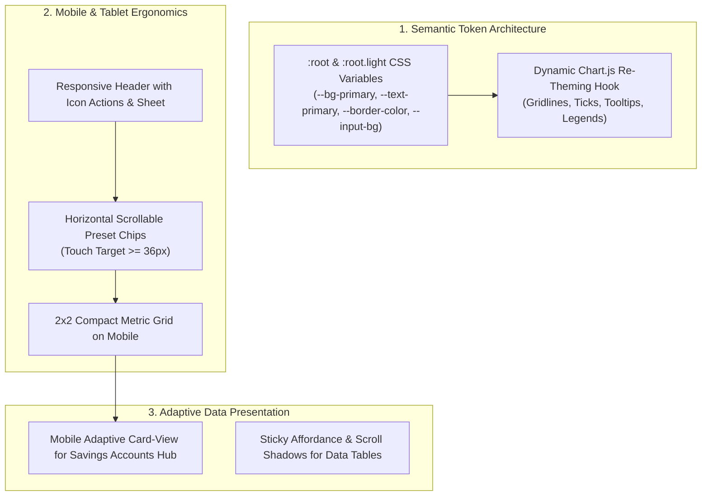

# ADR-0016: Semantic Token Light Theme & Responsive Mobile Ergonomics

## Status

Accepted

## Context

During comprehensive browser evaluation and user feedback on [`personal-finance-savings-predictor`](file:///Users/trile/dev/trile/html-standalone-tools/personal-finance-savings-predictor), significant UI/UX deficiencies were identified across both light theme mode and mobile/tablet form factors:

1. **Light Theme Contrast & Re-Theming Deficiencies**:
   - Toggling the `.light` class on the `<html>` root updated only three custom CSS rules (`:root.light`, `.light .glass-card`, `.light .metric-card:hover`), while the body and all interactive components retained hardcoded dark Tailwind classes (`bg-slate-900`, `bg-slate-950`, `text-slate-100`, `text-slate-200`, `text-slate-400`, `text-white`, `border-slate-800`).
   - Cards turned light semi-opaque (`rgba(255, 255, 255, 0.88)`), but typography remained white or light gray, resulting in severe contrast violations (< 2:1 ratio) failing WCAG 2.1 AA/AAA accessibility requirements.
   - `Chart.js` instances hardcoded dark palette colors (grid lines `#334155`, text `#94a3b8`, tooltip backgrounds) and did not react to light mode toggling.
   - Form inputs, buttons, tables, badges, and modals remained dark blocks inside light cards.

2. **Mobile & Tablet Layout & Touch Ergonomics**:
   - **Header Wrapping**: On screens `< 768px` and `< 640px`, the header title, subtitle, and 7 action buttons wrapped into 3–4 cluttered rows.
   - **Cramped Touch Targets**: Quick preset chips (`10M`, `20M`, `+1M`, etc.) wrapped into multiple dense rows with undersized touch areas (< 28px height), failing mobile touch target standards (minimum 36–44px).
   - **Vertical Scrolling Fatigue**: Four metric cards stacked vertically, pushing charts and data tables far below the mobile fold.
   - **Table Overflow on Touch Screens**: The Savings Accounts Hub (`min-w-[650px]`), YoY table, and CSV editor table overflowed horizontally without dedicated mobile touch card representations.

## Decision



<details>
<summary>ASCII Diagram (Backout Plan / Text Fallback)</summary>

```text
[1. Semantic Token Architecture]
  │
  ├── :root & :root.light CSS Variables (--bg-primary, --text-primary, --border-color, --input-bg)
  └── Dynamic Chart.js Re-Theming Hook (Gridlines, Ticks, Tooltips, Legends)
  │
[2. Mobile & Tablet Ergonomics]
  │
  ├── Responsive Header with Compact Branding & Responsive Action Sheet
  ├── Horizontal Scrollable Preset Chips Carousel (Touch Target >= 36px)
  └── 2x2 Compact Metric Grid on Mobile / Fluid Typography
  │
[3. Adaptive Data Presentation]
  │
  ├── Mobile Adaptive Card-View for Savings Accounts Hub (< 640px)
  └── Sticky Affordance & Scroll Shadows for Tabular Data
```

</details>

1. **Semantic CSS Token System**:
   - Establish semantic CSS custom properties in `:root` and `:root.light` for background colors, surface cards, typography, borders, form inputs, chips, badges, and charts:
     - `--bg-page`, `--bg-card`, `--bg-card-subtle`, `--bg-input`, `--bg-chip`, `--bg-chip-active`
     - `--text-primary`, `--text-secondary`, `--text-muted`, `--text-inverse`
     - `--border-subtle`, `--border-medium`, `--border-strong`
     - `--chart-grid`, `--chart-tick`, `--chart-tooltip-bg`, `--chart-tooltip-text`
   - Bind HTML structure and reusable UI components to design tokens.

2. **Dynamic Chart.js Re-Theming**:
   - Attach theme listeners to `toggleTheme()` that trigger immediate theme-aware chart updates for all active Chart.js instances (`chartGrowth`, `chartAllocation`, `chartMonthlyIncome`, `chartGoalRing`, `chartCompare`).
   - Automatically adapt grid line colors, label colors, tooltip backgrounds, and borders to the active theme.

3. **Responsive Mobile & Tablet Header**:
   - On screens `< 768px`, condense branding to icon + title (hiding verbose subtitle).
   - Display primary quick actions (`Theme`, `Presets`, `Language`) with touch-friendly icon buttons.
   - Group secondary utility actions (`Import CSV`, `Manage Data`, `Share`, `Help`) into a sleek responsive overflow action sheet/menu.

4. **Touch-Friendly Horizontal Preset Chip Carousel**:
   - Refactor parameter preset chips and delta increment buttons under `Salary`, `Goal`, `Auto Term Threshold`, and `Emergency Buffer` into single-row horizontal scrolling containers with touch targets (`min-height: 36px`, accessible padding) and smooth edge scroll masks.

5. **2x2 Compact Metric Grid on Mobile**:
   - Switch metric cards from 1-column stacked list on mobile to a compact 2x2 grid on `< 1024px`, utilizing fluid font scaling (`clamp(...)`) to prevent monetary number truncation.

6. **Adaptive Mobile Card-View for Savings Accounts Hub**:
   - On screens `< 640px`, render savings accounts as structured touch cards (account title, status badge, principal amount, annual rate, maturity date, estimated interest) while preserving the full desktop `<table>` view on screens `≥ 640px`.

## Consequences

- Full compliance with WCAG 2.1 AA/AAA contrast ratios across both Dark and Light themes.
- Seamless, flicker-free theme switching with dynamic chart palette adaptation.
- Intuitive, touch-first mobile and tablet experience without vertical scroll fatigue or table truncation.
- Zero external runtime build dependencies preserved for standalone single-file distribution.
