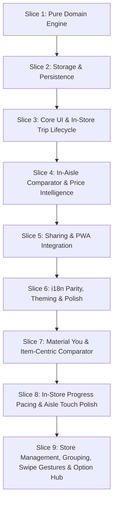

# 📋 Smart Buy-List & Unit Price Tracker — Requirements & Specification

> **Target File:** `smart-buy-list-price-tracker/index.html` (Compacted output: `dist/smart-buy-list-price-tracker.html` or `smart-buy-list-price-tracker/dist/index.html`)  
> **Source Documents:** [`CONTEXT.md`](./CONTEXT.md), [`docs/adr/`](./docs/adr/)  
> **Architecture:** Zero-Runtime Build, Standalone Single-File HTML / PWA application

---

## 🏛️ Domain Concepts & Terminology

All requirements adhere strictly to the project domain model defined in [`CONTEXT.md`](./CONTEXT.md):

- **Master Item**: Canonical product definition with default unit, aisle category, and historical purchase log.
- **List Item (Active Item)**: Shopping list entry with target quantity, estimated price, store, aisle, and checked status.
- **Package Size & Normalization**: Base unit conversion across Mass (`kg`), Volume (`l`), and Count (`ea`).
- **Normalized Unit Price**: Calculated unit cost ($/kg, $/L, $/ea, ₫/kg, ₫/L, ₫/cái).
- **Historical Purchase Ledger**: Append-only log of purchase transactions per store, date, and package size.
- **Deal Indicator**: 🟢 Great Deal ($\le$ All-Time Low / $\ge 10\%$ discount), 🟡 Fair Price, 🔴 Price Spike.
- **In-Aisle Package Comparator**: Side-by-side package size evaluator with real-time percentage savings and 1-tap list update.
- **Shopping Trip Lifecycle**: `Planning` ➔ `In-Store Shopping` ➔ `Trip Summary/Complete` (with unpurchased item rollover).
- **Store Manager & Custom Stores**: Store list CRUD with cascade renaming to active items and ledger records.
- **Active List Grouping**: Visual grouping by department (`By Aisle`) or retail venue (`By Store` with computed subtotals).
- **In-Aisle Touch Swipe Gestures**: Swipe Right (Mark Done) and Swipe Left (Open Comparator).
- **Option Hub (Settings)**: Centralized configuration modal for store management, preferences, and data portability.
- **URL State Payload**: Compressed LZ-String shareable state with dynamic QR code and Web Share API.
- **Storage Provider Seam**: `IndexedDBStorageProvider` with schema migrations and `GoogleDriveStorageProvider` sync seam.

---

## 📊 Core Requirements Matrix (R1 – R41)

| ID      | Feature                                             | Specification                                                                                                                                                                                             | Priority | ADR Reference |
| :------ | :-------------------------------------------------- | :-------------------------------------------------------------------------------------------------------------------------------------------------------------------------------------------------------- | :------- | :------------ |
| **R1**  | **Pure Unit Price Normalization Engine**            | Decoupled pure utility normalizing any package price and quantity (Weight: `g`/`kg`/`oz`/`lb`, Volume: `ml`/`l`/`fl oz`/`gal`, Count: `ea`/`pk`/`box`/`can`) to standardized base unit ($/kg, $/L, $/ea). | P0       | ADR-0002      |
| **R2**  | **Historical Purchase Ledger & Deal Scoring**       | Track historical transactions per item/store/date. Compute All-Time Low ($P_{\text{min}}$), average price, last price, and color-coded deal rating badges.                                                | P0       | ADR-0002      |
| **R3**  | **In-Aisle Package Comparator Modal**               | Interactive dual-package comparator (Package A vs Package B) calculating normalized unit prices, % savings, and 1-tap winner application to list.                                                         | P0       | ADR-0002      |
| **R4**  | **3-State Shopping Trip Lifecycle**                 | Explicit transition between `Planning` (drafting/editing), `In-Store Shopping` (large touch targets, running total), and `Trip Summary/Complete`.                                                         | P0       | CONTEXT.md    |
| **R5**  | **Trip Completion & Unpurchased Rollover**          | Finalize trip expenses, log verified prices to the historical ledger, and prompt to rollover unpurchased items to a new list or discard.                                                                  | P0       | CONTEXT.md    |
| **R6**  | **Multi-Store Management & Filtering**              | Assign items to specific stores (e.g. Costco, Trader Joe's, Local Market). Filter list view by current store.                                                                                             | P1       | CONTEXT.md    |
| **R7**  | **Aisle / Department Categorization & Ordering**    | Group items by department (Produce, Dairy, Meat, Bakery, Pantry, Household, etc.) with customizable walking route order.                                                                                  | P1       | CONTEXT.md    |
| **R8**  | **IndexedDB Storage Engine & Schema Migrations**    | Persistent local storage using `IndexedDB` (`SmartBuyListDB`, v1) with automatic schema version migrations and memory fallback.                                                                           | P0       | ADR-0001      |
| **R9**  | **Google Drive Cloud Sync Seam**                    | Abstracted `IStorageProvider` architecture ready for client-side Google OAuth 2.0 and Drive AppData sync.                                                                                                 | P1       | ADR-0001      |
| **R10** | **URL State Compression & Share Deep Links**        | Serialize active lists into compact URL hash via LZ-String compression; invoke `navigator.share()` on mobile devices.                                                                                     | P0       | ADR-0003      |
| **R11** | **Dynamic In-Memory QR Code Generator**             | Render dynamic QR code in an interactive modal for in-person instant scanning between smartphones without internet.                                                                                       | P1       | ADR-0003      |
| **R12** | **Smart Recipient Import & Merge Protocol**         | Incoming share modal offering _Import as New List_, _Merge into Active List_, and _Sync Price Catalog_.                                                                                                   | P0       | ADR-0003      |
| **R13** | **JSON Backup Export & Import**                     | 1-click JSON file backup and restore for all lists, catalog items, and historical price records.                                                                                                          | P1       | ADR-0001      |
| **R14** | **PWA Offline Shell, Vector Icon & Service Worker** | Cache-First offline caching via `sw.js` (v2), dedicated vector icon (`icon.svg`), and standalone `manifest.webmanifest` with dual `any`/`maskable` icons.                                                 | P1       | ADR-0003      |
| **R15** | **Mobile-First In-Aisle Thumb Zone Ergonomics**     | Bottom action bar, thumb-friendly hit targets ($\ge 44\text{px}$), quick item add, and single-tap check-off interactions.                                                                                 | P0       | CONTEXT.md    |
| **R16** | **Bilingual Localization (`en` & `vi`)**            | 100% Vietnamese and English dictionary parity, persisted language preference, and dynamic text switching.                                                                                                 | P0       | I18N.md       |
| **R17** | **Multi-Currency & Locale Masking**                 | Selectable currencies (USD `$`, VND `₫`, EUR `€`, GBP `£`, JPY `¥`, AUD `$`, CAD `$`) with `Intl.NumberFormat` masking and verbal helpers (`25 Triệu VND`).                                               | P1       | CONTEXT.md    |
| **R18** | **First-Time Seed Data Onboarding**                 | Pre-load realistic sample grocery items (Milk, Eggs, Rice, Coffee, Olive Oil) and historical store prices with a 1-click clear/keep banner.                                                               | P1       | CONTEXT.md    |
| **R19** | **Live Estimated vs Actual Spend Tracker**          | Real-time running total during in-store shopping comparing estimated budget vs actual checkout basket total.                                                                                              | P1       | CONTEXT.md    |
| **R20** | **Historical Price Sparklines & Trend Cards**       | Compact SVG sparkline and store price comparison chips when expanding item details.                                                                                                                       | P1       | CONTEXT.md    |
| **R21** | **Item Autocomplete & Quick Suggest**               | Instant autocomplete when typing item names, auto-filling preferred unit, department, and last paid price.                                                                                                | P1       | CONTEXT.md    |
| **R22** | **Dark / Light High-Contrast Theme**                | WCAG 2.1 AA compliant semantic theme tokens (`:root` / `:root.light`) with persisted user preference.                                                                                                     | P1       | CONTEXT.md    |
| **R23** | **Modal Lifecycle Manager**                         | Unified single-active dialog manager, scroll locking, backdrop dismissals, and `Esc` key handling.                                                                                                        | P1       | CONTEXT.md    |
| **R24** | **Non-Blocking Toast Notification Engine**          | Slide-in feedback and undo toasts with auto-dismiss timers.                                                                                                                                               | P1       | CONTEXT.md    |
| **R25** | **Printable Shopping List**                         | Clean `@media print` layout for generating paper grocery checklists with aisle grouping.                                                                                                                  | P2       | CONTEXT.md    |
| **R26** | **Keyboard Shortcuts**                              | `N` (new item), `C` (open comparator), `S` (share list), `Esc` (close modal).                                                                                                                             | P2       | CONTEXT.md    |
| **R27** | **Material You (MD3) Design & Navigation Bar**      | MD3 surface container tokens, active indicator pills, and a 4-destination bottom bar (`Planning`, `Buy Mode`, `Price History`, `Comparator`).                                                             | P0       | ADR-0004      |
| **R28** | **Distraction-Free Buy Mode with Inline Edit**      | In-store high-speed checklist with $\ge 48\text{px}$ touch targets, running basket spend, and rapid inline/bottom-sheet price adjustments.                                                                | P0       | ADR-0004      |
| **R29** | **Item-Centric In-Aisle Comparator Trigger**        | 1-tap `⚖️` trigger on list items pre-populating Package A with item's name/price/unit, prompting only Package B, with 1-tap winner application.                                                           | P0       | ADR-0004      |
| **R30** | **Top App Bar Utility Relocation**                  | Move Share (`📤`), Language, Currency, and Theme exclusively into the Top App Bar to maximize bottom thumb navigation ergonomics.                                                                         | P1       | ADR-0004      |
| **R31** | **In-Store Shopping Progress Pacing**               | Linear progress bar in Buy Mode showing `Checked X of Y items (Z%)` and remaining estimated unpurchased expenditure.                                                                                      | P0       | CONTEXT.md    |
| **R32** | **Aisle / Department Quick Filter Chips**           | Horizontal scrollable department filter chips (`All`, `Produce`, `Dairy`, `Meat`, `Bakery`, `Pantry`, `Household`, etc.) for in-aisle item isolation.                                                     | P0       | CONTEXT.md    |
| **R33** | **MD3 Mobile Bottom Sheet Presentation**            | Mobile-anchored bottom sheet modal display (`items-end`, `rounded-t-3xl`, drag handle bar) for quick price adjustments and package comparisons.                                                           | P1       | CONTEXT.md    |
| **R34** | **1-Tap Fast Price Adjustment Step Chips**          | Rapid delta chips (`+0.25`, `+0.50`, `+1.00`, `-0.25`, `-0.50`, `-1.00`) inside the Quick Price sheet for zero-keyboard price updates.                                                                    | P1       | CONTEXT.md    |
| **R35** | **Enhanced Comparator Decision Intelligence**       | Comprehensive savings summary banner in comparator calculating total money saved and explicit active item comparison advice.                                                                              | P1       | CONTEXT.md    |
| **R36** | **Navigation Streamlining & Redundancy Removal**    | Eliminate redundant mode switches from the top trip summary card; remove the extra Compare button from the Add Item section header.                                                                       | P0       | ADR-0005      |
| **R37** | **Custom Store Manager Dialog (CRUD & Cascade)**    | Dedicated modal for adding, renaming (cascading to active list and historical ledger), and deleting stores with persistent storage (`memoryState.stores`).                                                | P0       | ADR-0005      |
| **R38** | **Active List Grouping: By Aisle**                  | Partition active items into department sections with category emoji, translated title, and item count badge.                                                                                              | P0       | ADR-0005      |
| **R39** | **Active List Grouping: By Store with Subtotals**   | Partition active items by retail store with store name, item count, and computed store subtotal ($).                                                                                                      | P0       | ADR-0005      |
| **R40** | **Mobile Touch Swipe Gestures**                     | Fluid horizontal swipe actions: Swipe Right ($\Delta x > 60\text{px}$) marks item as Done with haptic feedback; Swipe Left ($\Delta x < -60\text{px}$) opens the In-Aisle Comparator pre-filled.          | P0       | ADR-0005      |
| **R41** | **Option Hub (Advanced Settings Modal)**            | Centralized settings dialog with Store Manager access, currency/unit preferences, card density options, haptic toggle, and full JSON backup/restore.                                                      | P0       | ADR-0005      |

---

## 🚀 Vertical Slice Implementation Roadmap



<details>
<summary>ASCII Roadmap (Backout Plan / Fallback)</summary>

```text
[Slice 1: Pure Domain Engine]
      │
      ▼
[Slice 2: Storage & Persistence]
      │
      ▼
[Slice 3: Core UI & In-Store Trip Lifecycle]
      │
      ▼
[Slice 4: In-Aisle Comparator & Price Intelligence]
      │
      ▼
[Slice 5: Sharing & PWA Integration]
      │
      ▼
[Slice 6: i18n Parity, Theming & Polish]
      │
      ▼
[Slice 7: Material You & Item-Centric Comparator]
      │
      ▼
[Slice 8: In-Store Progress Pacing & Aisle Touch Polish]
      │
      ▼
[Slice 9: Store Management, Grouping, Swipe Gestures & Option Hub]
```

</details>
