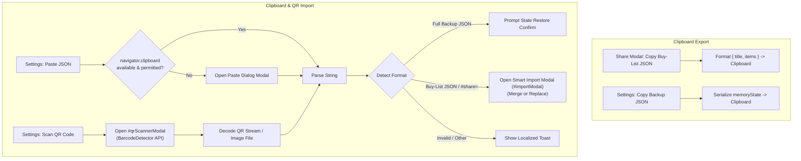

# ADR-0009: Clipboard JSON Interchange & Native BarcodeDetector QR Scanner

## Status

Accepted

## Context

In the Smart Buy-List & Unit Price Tracker application, data sharing and backup mechanisms relied on:

1. URL hash state sharing (`#share=<payload>`) via `navigator.share()` or link copying.
2. Dynamic QR code generation for the recipient to scan with an external device.
3. JSON file export and file upload (`<input type="file" accept=".json">`).

While URL sharing is lightweight for chat apps, shoppers regularly face practical friction:

- **Chat app URL truncation**: Messaging apps occasionally truncate or mangle long URL hash fragments.
- **Copying raw JSON or payloads**: Users frequently paste JSON snippets or copied share URLs directly across clipboards.
- **Lack of in-app camera scanning**: Users had to rely on native camera apps to scan the generated QR codes, requiring app switching and browser URL re-hydration.

A unified clipboard interchange architecture and native in-app QR scanner are required to provide zero-friction data portability within the single-file, offline PWA constraint ([`ADR-0002`](../../../docs/adr/0002-zero-build-standalone-single-file-html-constraint.md) / [`ADR-0003`](../../../docs/adr/0003-compacted-standalone-html-build-pipeline.md)).

---

## Decision

We implement:

1. **Contextual Dual Clipboard Export**:
   - **Active Buy-List JSON (`#shareModal`)**: Copies the formatted active list (`{ "title": "...", "items": [...] }`) to the system clipboard for lightweight messaging.
   - **Full State Backup JSON (`#settingsModal`)**: Copies the complete database (`memoryState` with active list, historical purchase ledger, stores, settings) for backup archiving.

2. **Smart Multi-Format Clipboard Import & Fallback Dialog**:
   - **Clipboard API Detection**: Attempts `navigator.clipboard.readText()`. If permissions are denied or unsupported, opens a dedicated **Paste Dialog Modal** with a `<textarea>`.
   - **Auto-Detection Hierarchy**:
     - _Full Backup_ (`activeList`, `purchaseLedger`, or `stores` present): Displays confirmation modal before restoring application state.
     - _Active Buy-List JSON_ (`{ title, items }` or `{ t, i }`): Decodes and routes to **Smart Recipient Import Modal** (`#importModal`) with _Merge into Active List_ (`🔀`) and _Import as New List_ (`🆕`).
     - _Share URL / Payload_ (`#share=` URL or raw Base64): Decodes via `decodeSharePayload()` and routes to `#importModal`.
     - _Invalid Data_: Displays localized warning toast.

3. **Native `BarcodeDetector` In-Settings QR Scanner**:
   - Integrated camera viewfinder modal (`#qrScannerModal`) with live `<video>`, green targeting reticle, camera facing flip toggle (`environment` back camera by default), and static image file upload fallback (`<input type="file" accept="image/*">`).
   - Hardware lifecycle safety: Media stream tracks (`MediaStreamTrack.stop()`) strictly terminate on modal close to release device cameras immediately.
   - Post-scan routing: Scanned `#share=` URLs or JSON automatically trigger haptic vibration (`navigator.vibrate([25])`), close scanner/settings, and open the Smart Merge Protocol modal (`#importModal`).



<details>
<summary>ASCII Diagram (Fallback)</summary>

```text
[Share Modal: Copy Buy-List JSON] ──► Format { title, items } ──► Clipboard
[Settings: Copy Backup JSON]      ──► Serialize memoryState   ──► Clipboard

[Settings: Paste JSON] ──► Read Clipboard / Fallback Dialog ──┐
                                                             │
[Settings: Scan QR]    ──► Native BarcodeDetector Camera    ──┼─► [Auto-Detect Format]
                                                              │       ├── Full Backup ──► Confirm Restore
                                                              │       ├── Buy-List / Share Link ──► Smart Import Modal (#importModal)
                                                              │       └── Invalid ──► Error Toast
```

</details>

---

## Consequences

- Zero-friction copy-pasting of buy-lists across chat apps, SMS, and notes apps.
- Native in-app camera scanning without third-party tools or external server dependencies.
- Graceful fallbacks for browsers without camera hardware or clipboard permissions.
- Full bilingual English/Vietnamese copywriting support and comprehensive automated test coverage.
