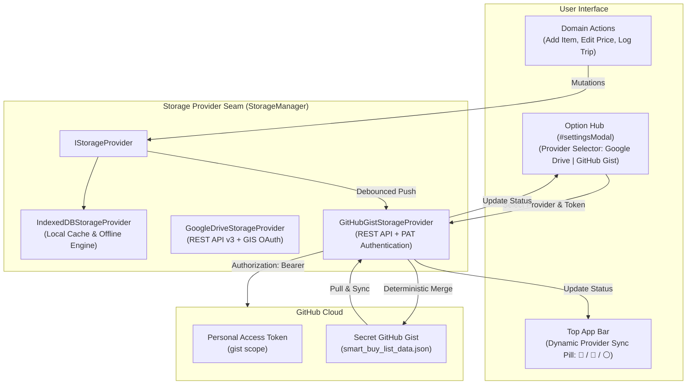

# ADR-0012: GitHub Gist Cloud Storage Provider & Multi-Provider Registry Architecture

## Status

Accepted (Extends [ADR-0001](./0001-indexeddb-storage-engine-and-google-drive-sync-seam.md) and [ADR-0011](./0011-google-drive-cloud-sync-storage-seam.md))

## Context

The Smart Buy-List & Unit Price Tracker is an offline-first, client-side PWA designed to operate without proprietary server infrastructure (ADR-0001). ADR-0011 introduced the `IStorageProvider` seam and `GoogleDriveStorageProvider` to enable multi-device synchronization via Google Drive AppData.

While Google Drive provides seamless OAuth-based sync for Google ecosystem users, technical users, developers, and privacy-conscious shoppers frequently request **GitHub-backed cloud synchronization**. GitHub Gists provide a lightweight, zero-maintenance key-value/file store with version tracking, high availability, and simple Personal Access Token (PAT) authentication that requires no external server proxies or backend relays.

To fulfill this requirement, the application needs:

1. **Zero-Backend GitHub Integration**: Direct browser-to-GitHub REST API communication using Personal Access Tokens (PATs) with minimal `gist` scope.
2. **Multi-Provider Registry Architecture**: A clean abstraction allowing users to select between **Disabled (Local Only)**, **Google Drive**, or **GitHub Gist** as their active cloud synchronization engine without architectural coupling or race conditions.
3. **Secret Gist Storage & Auto-Discovery**: Automatic creation and discovery of secret gists (`smart_buy_list_data.json`), paired with manual Gist ID override for explicit cross-device pairing.
4. **Deterministic Merge Engine Reuse**: Reusing the existing mathematical union and `updatedAt`-based deterministic conflict resolution protocol across all cloud providers.
5. **Large Payload Resilience**: Handling GitHub API payload truncation via `raw_url` fallback.

---

## Decision

We implement a decoupled GitHub Gist cloud storage architecture and upgrade the `StorageManager` into a configurable multi-provider registry:

### 1. Multi-Provider Storage Registry (`StorageManager`)

We extend `StorageManager` to manage pluggable cloud storage engines:

- **Supported Cloud Providers**:
  - `none`: Local offline persistence only (`IndexedDBStorageProvider`).
  - `googledrive`: Google Drive AppData synchronization (`GoogleDriveStorageProvider`).
  - `github`: GitHub Secret Gist synchronization (`GitHubGistStorageProvider`).
- **Active Provider Selection**: The user selects their active cloud backend in the Settings Option Hub. Only one cloud provider is active at a time to guarantee deterministic conflict resolution and prevent cross-cloud race conditions.
- **Unified Seam Contracts**: All providers implement `IStorageProvider` (`init`, `getState`, `saveState`, `sync`, `getStatus`, `exportBackup`, `importBackup`).

### 2. GitHub Gist Storage Provider (`GitHubGistStorageProvider`)

A composite provider wrapping `IndexedDBStorageProvider` as its local offline cache and orchestrating bidirectional synchronization against the GitHub REST API (`https://api.github.com`):

- **Target File**: `smart_buy_list_data.json` inside a private, secret Gist (`"public": false`).
- **Default Description**: `Smart Buy-List & Unit Price Tracker Cloud Sync Data`.
- **API Operations**:
  - **Auto-Discovery**: `GET https://api.github.com/gists?per_page=100` searches the user's gists for an existing file named `smart_buy_list_data.json` or matching description.
  - **Create Gist**: `POST https://api.github.com/gists` creates a new secret Gist if no existing one is found or configured.
  - **Read Gist**: `GET https://api.github.com/gists/{gist_id}` extracts `files["smart_buy_list_data.json"].content`. If `truncated: true` or `content` is missing, it falls back to fetching `file.raw_url` with the `Authorization` header.
  - **Update Gist**: `PATCH https://api.github.com/gists/{gist_id}` pushes the updated JSON envelope.

### 3. Authentication & Token Management

- **Personal Access Token (PAT)**: Authenticates via `Authorization: Bearer <PAT>` and `Accept: application/vnd.github+json`. Supports classic PAT (`gist` scope) and fine-grained PAT (Gists Read & Write permission).
- **1-Click Token Generator Helper**: UI includes a direct helper link to `https://github.com/settings/tokens/new?scopes=gist&description=Smart+Buy+List+PWA` with pre-filled scopes.
- **Credential Storage Options**:
  - Token input is masked (`type="password"`) with an eye visibility toggle (`👁️`).
  - User can toggle **"Remember Token on this device"** (default checked). When checked, token is stored in `localStorage` under `github_sync_token` and Gist ID under `github_sync_gist_id`. When unchecked, credentials remain strictly in ephemeral runtime memory (`githubAuthState`).

### 4. Deterministic Multi-Device Smart Merge Engine

`GitHubGistStorageProvider` shares the identical deterministic merge engine (`mergeCloudState`) and payload envelope (`createCloudPayload`) introduced in ADR-0011:

1. **Purchase Ledger**: Mathematical union of all historical records by unique transaction timestamp/ID, dynamically recalculating All-Time Lows (ATL) and Deal scores.
2. **Active Buy-List Items**: Merged by unique item ID / normalized name, taking the entry with the most recent `updatedAt` timestamp while preserving checked states.
3. **Stores**: Union of store profiles.
4. **Settings**: Adopts newest updated preferences while preserving local device language/theme.
5. **Bidirectional Commit**: Merged state is committed to local IndexedDB and pushed back to the remote Gist.

### 5. UI/UX in Option Hub & Top App Bar

- **Option Hub (`#settingsModal`)**:
  - **Provider Selector**: Dropdown selector `[Disabled / Local Only, Google Drive, GitHub Gist]`.
  - **GitHub Gist Panel**:
    - PAT password input with toggle visibility button.
    - Pre-filled "Create Token on GitHub ↗" link.
    - Gist ID input (auto-populated on discovery/creation, editable for manual linking across devices).
    - "Remember Token" checkbox.
    - Connect & Verify / Disconnect button.
    - "Sync Now", "Force Upload Local", and "Force Download Cloud" action buttons.
    - Clickable "View Gist on GitHub ↗" link (`https://gist.github.com/<gist_id>`).
    - Last Synced timestamp and live error/success alerts.
- **Top App Bar Status Pill**: Dynamic provider icon and sync state indicator:
  - 🐙 **GitHub Active**: Green dot (Synced), Yellow dot with spin (Syncing), Red dot (Error), Grey dot (Offline/Not Connected).
  - 📁 **Google Drive Active**: Green dot (Synced), Yellow dot (Syncing), Red dot (Error).
  - ⚪ **Local Only**: Offline indicator.
- **Sync Triggers**:
  - App startup pull on authentication.
  - 3-second debounced push on local mutations (items, stores, ledger, settings).
  - Tab visibility focus pull (>60s inactivity).
  - Manual 1-tap "Sync Now".

### 6. PWA Version Bump (`v3.4.0`)

- Increments Service Worker cache to `smart-buy-list-v3.4.0` and application version badge to `v3.4.0`.



<details>
<summary>ASCII Diagram (Fallback)</summary>

```text
[User Interface]
  ├── Top App Bar (Dynamic Provider Sync Pill: 🐙 / 📁 / ⚪)
  ├── Option Hub (Cloud Provider Selector: None | Google Drive | GitHub Gist)
  └── Domain Actions (Add Item, Check Item, Complete Trip)
        │
        ▼
[Storage Provider Seam (StorageManager Registry)]
  ├── IndexedDBStorageProvider (Offline Persistence Engine)
  ├── GoogleDriveStorageProvider (Google Drive AppData Adapter)
  └── GitHubGistStorageProvider (GitHub Secret Gist Adapter)
        │
        ├──► PAT Authentication (`Authorization: Bearer <token>`)
        ├──► Auto-Discovery & Secret Gist Creation
        ├──► Truncation Resilience (`raw_url` fallback)
        ├──► Deterministic Multi-Device Smart Merge
        └──► Remote Gist (`smart_buy_list_data.json`)
```

</details>

---

## Consequences

- Provides a completely serverless, zero-backend cloud synchronization option tailored for developers and GitHub users.
- Gives users transparent, direct access to view, download, or audit their data via GitHub's Web UI (`https://gist.github.com/<gist_id>`).
- Maintains clean architectural separation: adding `GitHubGistStorageProvider` requires zero alterations to core grocery domain calculations, unit price normalization, or deal rating engines.
- Enables simple multi-device pairing by sharing the same PAT or Gist ID across phone and desktop PWAs.
