# 📜 Historical Requirements & Slices Log (v1.0 – v3.9.0)

> [!NOTE]
> **Archived Milestone Record**: This document captures the completed delivery history for Slices 1 through 30 (Requirements R1 through R85).
> For current living specifications and active backlog, see [`ITEMS_TO_IMPLEMENT.md`](../../ITEMS_TO_IMPLEMENT.md).

---

## 🏛️ Domain Concepts & Terminology (Historical)

All requirements adhere strictly to the project domain model defined in [`CONTEXT.md`](../../CONTEXT.md):

- **Master Item**: Canonical product definition with default unit, aisle category, and historical purchase log.
- **List Item (Active Item)**: Shopping list entry with target quantity, estimated price, store, aisle, and checked status.
- **Package Size & Normalization**: Base unit conversion across Mass (`kg`), Volume (`l`), and Count (`ea`).
- **Normalized Unit Price**: Calculated unit cost ($/kg, $/L, $/ea, ₫/kg, ₫/L, ₫/cái).
- **Historical Purchase Ledger**: Append-only log of purchase transactions per store, date, and package size.
- **Deal Indicator**: 🟢 Great Deal ($\le$ All-Time Low / $\ge 10\%$ discount), 🟡 Fair Price, 🔴 Price Spike.
- **In-Aisle Package Comparator**: Side-by-side package size evaluator with real-time percentage savings and 1-tap list update.
- **Shopping Trip Lifecycle**: `Planning` ➔ `In-Store Shopping` ➔ `Trip Summary/Complete` (with unpurchased item rollover).
- **Store Manager & Custom Stores**: Store list CRUD with cascade renaming to active items and ledger records.
- **Active List Grouping**: Visual grouping by department (`By Aisle`) or retail venue (`By Store` with computed subtotals).
- **In-Aisle Touch Swipe Gestures**: Swipe Right (Mark Done) and Swipe Left (Open Comparator).
- **Option Hub (Settings)**: Centralized configuration modal for store management, preferences, and data portability.
- **URL State Payload**: Compressed LZ-String shareable state with dynamic QR code and Web Share API.
- **Storage Provider Seam**: `IndexedDBStorageProvider` with schema migrations and `GoogleDriveStorageProvider` sync seam.

---

## 📊 Historical Requirements Matrix (R1 – R85)

| ID      | Feature                                                          | Specification                                                                                                                                                                                                                                                     | Priority | ADR Reference                                                           | Status                               |
| :------ | :--------------------------------------------------------------- | :---------------------------------------------------------------------------------------------------------------------------------------------------------------------------------------------------------------------------------------------------------------- | :------- | :---------------------------------------------------------------------- | :----------------------------------- |
| **R1**  | **Pure Unit Price Normalization Engine**                         | Decoupled pure utility normalizing any package price and quantity (Weight: `g`/`kg`/`oz`/`lb`, Volume: `ml`/`l`/`fl oz`/`gal`, Count: `ea`/`pk`/`box`/`can`) to standardized base unit ($/kg, $/L, $/ea).                                                         | P0       | ADR-0002                                                                | ✅ Implemented                       |
| **R2**  | **Historical Purchase Ledger & Deal Scoring**                    | Track historical transactions per item/store/date. Compute All-Time Low ($P_{\text{min}}$), average price, last price, and color-coded deal rating badges.                                                                                                        | P0       | ADR-0002                                                                | ✅ Implemented                       |
| **R3**  | **In-Aisle Package Comparator Modal**                            | Interactive dual-package comparator (Package A vs Package B) calculating normalized unit prices, % savings, and 1-tap winner application to list.                                                                                                                 | P0       | ADR-0002                                                                | ✅ Implemented                       |
| **R4**  | **3-State Shopping Trip Lifecycle**                              | Explicit transition between `Planning` (drafting/editing), `In-Store Shopping` (large touch targets, running total), and `Trip Summary/Complete`.                                                                                                                 | P0       | CONTEXT.md                                                              | ✅ Implemented                       |
| **R5**  | **Trip Completion & Unpurchased Rollover**                       | Finalize trip expenses, log verified prices to the historical ledger, and prompt to rollover unpurchased items to a new list or discard.                                                                                                                          | P0       | CONTEXT.md                                                              | ✅ Implemented                       |
| **R6**  | **Multi-Store Management & Filtering**                           | Assign items to specific stores (e.g. Costco, Trader Joe's, Local Market). Filter list view by current store.                                                                                                                                                     | P1       | CONTEXT.md                                                              | ✅ Implemented                       |
| **R7**  | **Aisle / Department Categorization & Ordering**                 | Group items by department (Produce, Dairy, Meat, Bakery, Pantry, Household, etc.) with customizable walking route order.                                                                                                                                          | P1       | CONTEXT.md                                                              | ✅ Implemented                       |
| **R8**  | **IndexedDB Storage Engine & Schema Migrations**                 | Persistent local storage using `IndexedDB` (`SmartBuyListDB`, v1) with automatic schema version migrations and memory fallback.                                                                                                                                   | P0       | ADR-0001                                                                | ✅ Implemented                       |
| **R9**  | **Google Drive Cloud Sync Seam**                                 | Abstracted `IStorageProvider` architecture ready for client-side Google OAuth 2.0 and Drive AppData sync.                                                                                                                                                         | P1       | ADR-0001                                                                | ✅ Implemented                       |
| **R10** | **URL State Compression & Share Deep Links**                     | Serialize active lists into compact URL hash via LZ-String compression; invoke `navigator.share()` on mobile devices.                                                                                                                                             | P0       | ADR-0003                                                                | ✅ Implemented                       |
| **R11** | **Dynamic In-Memory QR Code Generator**                          | Render dynamic QR code in an interactive modal for in-person instant scanning between smartphones without internet.                                                                                                                                               | P1       | ADR-0003                                                                | ⚠️ Superseded by ADR-0018            |
| **R12** | **Smart Recipient Import & Merge Protocol**                      | Incoming share modal offering _Import as New List_, _Merge into Active List_, and _Sync Price Catalog_.                                                                                                                                                           | P0       | ADR-0003                                                                | ✅ Implemented                       |
| **R13** | **JSON Backup Export & Import**                                  | 1-click JSON file backup and restore for all lists, catalog items, and historical price records.                                                                                                                                                                  | P1       | ADR-0001                                                                | ✅ Implemented                       |
| **R14** | **PWA Offline Shell, Vector Icon & Service Worker**              | Offline caching via `sw.js` (v3), dedicated vector icon (`icon.svg`), and standalone `manifest.webmanifest` with dual `any`/`maskable` icons.                                                                                                                     | P1       | ADR-0003, ADR-0007                                                      | ✅ Implemented                       |
| **R15** | **Mobile-First In-Aisle Thumb Zone Ergonomics**                  | Bottom action bar, thumb-friendly hit targets ($\ge 44\text{px}$), quick item add, and single-tap check-off interactions.                                                                                                                                         | P0       | CONTEXT.md                                                              | ✅ Implemented                       |
| **R16** | **Bilingual Localization (`en` & `vi`)**                         | 100% Vietnamese and English dictionary parity, persisted language preference, and dynamic text switching.                                                                                                                                                         | P0       | I18N.md                                                                 | ✅ Implemented                       |
| **R17** | **Multi-Currency & Locale Masking**                              | Selectable currencies (USD `$`, VND `₫`, EUR `€`, GBP `£`, JPY `¥`, AUD `$`, CAD `$`) with `Intl.NumberFormat` masking and verbal helpers (`25 Triệu VND`).                                                                                                       | P1       | CONTEXT.md                                                              | ✅ Implemented                       |
| **R18** | **First-Time Seed Data Onboarding**                              | Pre-load realistic sample grocery items (Milk, Eggs, Rice, Coffee, Olive Oil) and historical store prices with a 1-click clear/keep banner.                                                                                                                       | P1       | CONTEXT.md                                                              | ⚠️ Superseded by ADR-0013 / ADR-0017 |
| **R19** | **Live Estimated vs Actual Spend Tracker**                       | Real-time running total during in-store shopping comparing estimated budget vs actual checkout basket total.                                                                                                                                                      | P1       | CONTEXT.md                                                              | ✅ Implemented                       |
| **R20** | **Historical Price Sparklines & Trend Cards**                    | Compact SVG sparkline and store price comparison chips when expanding item details.                                                                                                                                                                               | P1       | CONTEXT.md                                                              | ✅ Implemented                       |
| **R21** | **Item Autocomplete & Quick Suggest**                            | Instant autocomplete when typing item names, auto-filling preferred unit, department, and last paid price.                                                                                                                                                        | P1       | CONTEXT.md                                                              | ✅ Implemented                       |
| **R22** | **Dark / Light High-Contrast Theme**                             | WCAG 2.1 AA compliant semantic theme tokens (`:root` / `:root.light`) with persisted user preference.                                                                                                                                                             | P1       | CONTEXT.md                                                              | ✅ Implemented                       |
| **R23** | **Modal Lifecycle Manager**                                      | Unified single-active dialog manager, scroll locking, backdrop dismissals, and `Esc` key handling.                                                                                                                                                                | P1       | CONTEXT.md                                                              | ✅ Implemented                       |
| **R24** | **Non-Blocking Toast Notification Engine**                       | Slide-in feedback and undo toasts with auto-dismiss timers.                                                                                                                                                                                                       | P1       | CONTEXT.md                                                              | ✅ Implemented                       |
| **R25** | **Printable Shopping List**                                      | Clean `@media print` layout for generating paper grocery checklists with aisle grouping.                                                                                                                                                                          | P2       | CONTEXT.md                                                              | ✅ Implemented                       |
| **R26** | **Keyboard Shortcuts**                                           | `N` (new item), `C` (open comparator), `S` (share list), `Esc` (close modal).                                                                                                                                                                                     | P2       | CONTEXT.md                                                              | ✅ Implemented                       |
| **R27** | **Material You (MD3) Design & Navigation Bar**                   | MD3 surface container tokens, active indicator pills, and a 4-destination bottom bar (`Planning`, `Buy Mode`, `Price History`, `Comparator`).                                                                                                                     | P0       | ADR-0004                                                                | ✅ Implemented                       |
| **R28** | **Distraction-Free Buy Mode with Inline Edit**                   | In-store high-speed checklist with $\ge 48\text{px}$ touch targets, running basket spend, and rapid inline/bottom-sheet price adjustments.                                                                                                                        | P0       | ADR-0004                                                                | ✅ Implemented                       |
| **R29** | **Item-Centric In-Aisle Comparator Trigger**                     | 1-tap `⚖️` trigger on list items pre-populating Package A with item's name/price/unit, prompting only Package B, with 1-tap winner application.                                                                                                                   | P0       | ADR-0004                                                                | ✅ Implemented                       |
| **R30** | **Top App Bar Utility Relocation**                               | Move Share (`📤`), Language, Currency, and Theme exclusively into the Top App Bar to maximize bottom thumb navigation ergonomics.                                                                                                                                 | P1       | ADR-0004                                                                | ✅ Implemented                       |
| **R31** | **In-Store Shopping Progress Pacing**                            | Linear progress bar in Buy Mode showing `Checked X of Y items (Z%)` and remaining estimated unpurchased expenditure.                                                                                                                                              | P0       | CONTEXT.md                                                              | ✅ Implemented                       |
| **R32** | **Aisle / Department Quick Filter Chips**                        | Horizontal scrollable department filter chips (`All`, `Produce`, `Dairy`, `Meat`, `Bakery`, `Pantry`, `Household`, etc.) for in-aisle item isolation.                                                                                                             | P0       | CONTEXT.md                                                              | ✅ Implemented                       |
| **R33** | **MD3 Mobile Bottom Sheet Presentation**                         | Mobile-anchored bottom sheet modal display (`items-end`, `rounded-t-3xl`, drag handle bar) for quick price adjustments and package comparisons.                                                                                                                   | P1       | CONTEXT.md                                                              | ✅ Implemented                       |
| **R34** | **1-Tap Fast Price Adjustment Step Chips**                       | Rapid delta chips (`+0.25`, `+0.50`, `+1.00`, `-0.25`, `-0.50`, `-1.00`) inside the Quick Price sheet for zero-keyboard price updates.                                                                                                                            | P1       | CONTEXT.md                                                              | ✅ Implemented                       |
| **R35** | **Enhanced Comparator Decision Intelligence**                    | Comprehensive savings summary banner in comparator calculating total money saved and explicit active item comparison advice.                                                                                                                                      | P1       | CONTEXT.md                                                              | ✅ Implemented                       |
| **R36** | **Navigation Streamlining & Redundancy Removal**                 | Eliminate redundant mode switches from the top trip summary card; remove the extra Compare button from the Add Item section header.                                                                                                                               | P0       | ADR-0005                                                                | ✅ Implemented                       |
| **R37** | **Custom Store Manager Dialog (CRUD & Cascade)**                 | Dedicated modal for adding, renaming (cascading to active list and historical ledger), and deleting stores with persistent storage (`memoryState.stores`).                                                                                                        | P0       | ADR-0005                                                                | ✅ Implemented                       |
| **R38** | **Active List Grouping: By Aisle**                               | Partition active items into department sections with category emoji, translated title, and item count badge.                                                                                                                                                      | P0       | ADR-0005                                                                | ✅ Implemented                       |
| **R39** | **Active List Grouping: By Store with Subtotals**                | Partition active items by retail store with store name, item count, and computed store subtotal ($).                                                                                                                                                              | P0       | ADR-0005                                                                | ✅ Implemented                       |
| **R40** | **Mobile Touch Swipe Gestures**                                  | Fluid horizontal swipe actions: Swipe Right ($\Delta x > 60\text{px}$) marks item as Done with haptic feedback; Swipe Left ($\Delta x < -60\text{px}$) opens the In-Aisle Comparator pre-filled.                                                                  | P0       | ADR-0005                                                                | ✅ Implemented                       |
| **R41** | **Option Hub (Advanced Settings Modal)**                         | Centralized settings dialog with Store Manager access, currency/unit preferences, card density options, haptic toggle, and full JSON backup/restore.                                                                                                              | P0       | ADR-0005                                                                | ✅ Implemented                       |
| **R42** | **Differentiated Planning & Buy Mode Card Ergonomics**           | Tailored card rendering per trip phase: Ultra-minimalist in Buy Mode (only checkbox, item name, and clickable price); rich expanded multi-row in Planning Mode (store tag, deal badge, $/unit, historical ATL, Compare `⚖️`, Edit `✏️`, Remove `🗑️`).             | P0       | ADR-0006                                                                | ✅ Implemented                       |
| **R43** | **Network-First Navigation & PWA Update Notification**           | Network-First strategy with 2.5s timeout for HTML navigation; non-blocking Material 3 toast (`"New version available [Update Now]"`) on waiting worker; `SKIP_WAITING` + `controllerchange` clean reload.                                                         | P0       | ADR-0007                                                                | ✅ Implemented                       |
| **R44** | **Option Hub QA Update & Cache Purge Controls**                  | In-app "Check for Updates" and "Purge Cache & Reload" actions inside Option Hub settings modal for QA and manual update verification.                                                                                                                             | P0       | ADR-0007                                                                | ✅ Implemented                       |
| **R45** | **Price History Re-order & Batch Restocking Workflow**           | Enable 1-tap quick add (`+`) and multi-select batch adding from historical purchase ledger rows into the active Buy List with sticky summary action bar, snapshot attribute inheritance, case-insensitive deduplication, and actionable `[View List]` toast.      | P0       | ADR-0008                                                                | ✅ Implemented                       |
| **R46** | **Clipboard JSON Interchange (Export & Multi-Format Import)**    | Contextual dual export ("Copy Buy-List JSON" in Share Modal, "Copy Backup JSON" in Settings) and smart clipboard import with multi-format auto-detection (Full Backup, Active Buy-List JSON, `#share=` deep links) and graceful fallback textarea dialog.         | P0       | ADR-0009                                                                | ✅ Implemented                       |
| **R47** | **In-App Native QR Scanner in Settings (Option Hub)**            | Integrated camera viewfinder modal (`#qrScannerModal`) with native `BarcodeDetector` API, environment camera default, camera flip toggle, hardware track release on close, image file upload fallback, and auto-routing to Smart Merge Protocol (`#importModal`). | P0       | ADR-0009                                                                | ⚠️ Superseded by ADR-0018            |
| **R48** | **Historical Purchase Ledger Item Deletion (Single & Batch)**    | Row-level delete action (`🗑️`) calling `deleteLedgerItem(id)` and batch delete action (`btnDeleteSelectedLedger`) calling `deleteSelectedLedgerItems()` in `#ledgerBatchBar` with dynamic live recalculation of ATL and deal ratings.                             | P0       | ADR-0010                                                                | ✅ Implemented                       |
| **R49** | **In-Aisle Comparator 13-Unit Normalization & Dimension Sync**   | Universal 13-unit dropdowns in `compUnitA` and `compUnitB` with uppercase `L` unit casing parity, auto-aligning Package B dimension base unit when opened via `openItemComparator(itemId)`.                                                                       | P0       | ADR-0010                                                                | ✅ Implemented                       |
| **R50** | **Apply Winner to Form Context Pre-fill & Form Focus**           | "Apply Winner to Form" (`applyComparatorWinner`) pre-fills Name, Aisle/Category, Store, Quantity, Unit, and Price into `#addItemForm`, switches trip phase to `PLANNING`, scrolls/focuses to form, and updates live preview.                                      | P0       | ADR-0010                                                                | ✅ Implemented                       |
| **R51** | **Decoupled Storage Provider Architecture (`IStorageProvider`)** | Abstracted `StorageProvider` base interface with `IndexedDBStorageProvider` (offline engine) and `GoogleDriveStorageProvider` (composite cloud adapter) managed via global `storageManager`.                                                                      | P0       | ADR-0011                                                                | ✅ Implemented                       |
| **R52** | **Dynamic GIS Loader & OAuth 2.0 Token Client**                  | Asynchronous loader for Google Identity Services script with offline graceful degradation and ephemeral in-memory access token lifecycle (`drive.appdata` scope).                                                                                                 | P0       | ADR-0011                                                                | ✅ Implemented                       |
| **R53** | **Google Drive AppData REST v3 Sync Engine**                     | Read, query, multipart create, and media update operations targeting `smart_buy_list_data.json` inside Google Drive hidden `appDataFolder`.                                                                                                                       | P0       | ADR-0011                                                                | ✅ Implemented                       |
| **R54** | **Deterministic Multi-Device Cloud Smart Merge**                 | Non-destructive conflict resolution uniting purchase ledger transactions, synchronizing active list items by `updatedAt` timestamps, merging store profiles, and pushing consolidated state back.                                                                 | P0       | ADR-0011                                                                | ✅ Implemented                       |
| **R55** | **Option Hub Cloud Sync Card & Top Bar Live Status Pill**        | Option Hub settings interface for Client ID config, Connect/Disconnect button, Last Synced timestamp, manual Sync Now, and live Top App Bar sync status pill (🟢 Synced / 🟡 Syncing / ⚪ Offline / 🔴 Sync Error).                                               | P0       | ADR-0011                                                                | ⚠️ Partially Superseded by ADR-0014  |
| **R56** | **Multi-Provider Cloud Storage Registry Architecture**           | Extend `StorageManager` into a pluggable registry with dynamic provider selection (`none`, `googledrive`, `github`), delegating mutations to the active cloud engine.                                                                                             | P0       | ADR-0012                                                                | ✅ Implemented                       |
| **R57** | **GitHub Gist Storage Provider (`GitHubGistStorageProvider`)**   | Composite cloud provider wrapping `IndexedDBStorageProvider` and syncing `smart_buy_list_data.json` with GitHub Secret Gists via REST API with `raw_url` truncation fallback.                                                                                     | P0       | ADR-0012                                                                | ✅ Implemented                       |
| **R58** | **GitHub Personal Access Token (PAT) Authentication**            | Personal Access Token authentication with password masking, 1-click helper generator link, and optional "Remember Token" persistence in `localStorage`.                                                                                                           | P0       | ADR-0012                                                                | ✅ Implemented                       |
| **R59** | **Secret Gist Auto-Discovery & Cross-Device Linking**            | Auto-create secret Gist (`public: false`) with description lookup auto-discovery across user gists and manual Gist ID override field for multi-device pairing.                                                                                                    | P0       | ADR-0012                                                                | ✅ Implemented                       |
| **R60** | **Option Hub GitHub Panel & Dynamic Top Bar Octocat Pill**       | Option Hub provider dropdown, GitHub credentials card, direct "View Gist on GitHub ↗" link, and dynamic Top App Bar sync pill reflecting active provider (🐙 GitHub / 📁 Google Drive / ⚪ Local).                                                                | P0       | ADR-0012                                                                | ⚠️ Partially Superseded by ADR-0014  |
| **R61** | **Vietnam-First Baseline Defaults & Banner Decommissioning**     | Out-of-the-box defaults for Vietnamese shoppers (`language: 'vi'`, `currency: 'VND'`, Vietnam store roster: `WinMart`, `Bách Hoá Xanh`, `Co.opmart`, `Big C / GO!`, `Lotte Mart`, `Chợ truyền thống`, `Cửa hàng tiện lợi`; remove `#sampleDataBanner`).           | P0       | ADR-0013                                                                | ✅ Implemented                       |
| **R62** | **Flag Emoji Language Switcher (`🇻🇳` / `🇺🇸`)**                   | Compact 1-tap flag emoji header switcher displaying active language flag and toggling between Vietnamese and English.                                                                                                                                             | P0       | ADR-0013                                                                | ✅ Implemented                       |
| **R63** | **Currency-Aware Quick Price Adjustment Chips**                  | Dynamic step chips in Quick Price modal adapting to currency: `[-50k, -10k, -5k, +5k, +10k, +50k]` when in VND, and `[±0.25, ±0.50, ±1.00]` when in USD.                                                                                                          | P0       | ADR-0013                                                                | ✅ Implemented                       |
| **R64** | **Smart Quick-Entry Omnibox & NLP Parser Engine**                | Omnibox parser (`parseSmartGroceryInput`) extracting item, quantity, unit, VND price (e.g. `35k`, `35.000`), store (`@winmart`), and auto-categorizing departments with real-time live preview pill and 1-tap add.                                                | P0       | ADR-0013                                                                | ✅ Implemented                       |
| **R65** | **Multi-Line Clipboard Batch Paste Ingest**                      | Automatic multi-line paste detection parsing grocery lists copied from Zalo/Notes in parallel and staging into active list with Undo toast.                                                                                                                       | P0       | ADR-0013                                                                | ✅ Implemented                       |
| **R66** | **Expanded Vietnamese Packaging Units & Icon Polish**            | New units (`loc`, `thung`, `khay`, `tui`, `hu`) with normalization formulas and icon-first button streamlining (`+ Add` -> `➕`).                                                                                                                                 | P0       | ADR-0013                                                                | ✅ Implemented                       |
| **R67** | **Startup Language Switcher Flag Parity**                        | Ensure `#langToggleBtn` reliably renders `🇻🇳` / `🇺🇸` on initial application boot without literal text override in `initApp()`.                                                                                                                                    | P0       | ADR-0014                                                                | ✅ Implemented                       |
| **R68** | **Header Sync Status Removal & Calm Adaptive Cloud Sync**        | Decommission `#topBarSyncStatus` from top app bar, extend idle debounce to 15s (capped at 45s), flush sync on tab backgrounding (`visibilitychange`), sync on trip finish, and pull on boot / tab wakeup.                                                         | P0       | ADR-0014                                                                | ✅ Implemented                       |
| **R69** | **Google Drive Cloud Sync UI/UX Guidance & Origin Copier**       | Add direct link to setup guide, 1-click `copyCurrentOriginToClipboard()` helper for Authorized JavaScript Origins in Option Hub, and state-aware Sign In / Disconnect action buttons.                                                                             | P0       | ADR-0014                                                                | ✅ Implemented                       |
| **R70** | **Adaptive Historical Purchase Ledger Mobile Cards & Table**     | Dual-representation layout for `#priceLedgerModal`: mobile cards (`#ledgerMobileCards`) with bold titles, store badges, prominent unit price badges, and $\ge 44\text{px}$ touch targets; desktop table (`#ledgerTableContainer`) with roomy typography.          | P0       | ADR-0014                                                                | ✅ Implemented                       |
| **R71** | **Single-Source PWA Manifest Versioning (`3.6.0`)**              | Establish `manifest.webmanifest` as canonical source of truth, dynamically hydrate `#pwaVersionBadge` in dev, and statically stamp `dist/index.html` and `dist/sw.js` during build.                                                                               | P0       | ADR-0015                                                                | ✅ Implemented                       |
| **R72** | **Type-Aware Companion Asset Compactor (Terser & JSON Compact)** | `scripts/build.js` minifies `sw.js` via Terser, compacts JSON in `manifest.webmanifest`, and cleans vector assets.                                                                                                                                                | P0       | ADR-0015                                                                | ✅ Implemented                       |
| **R73** | **Tailwind CDN Cache Purge in Production Service Worker**        | Automatically purge external `https://cdn.tailwindcss.com` from `ASSETS_TO_CACHE` in `dist/sw.js` since Tailwind CSS is inlined statically.                                                                                                                       | P0       | ADR-0015                                                                | ✅ Implemented                       |
| **R74** | **Standalone Deployable PWA Release Packaging (Zip Archives)**   | `scripts/pack-release.js` packages dedicated standalone PWA deployment archives (`release-assets/<tool>-<version>.zip`) with complete companion assets.                                                                                                           | P0       | ADR-0015                                                                | ✅ Implemented                       |
| **R75** | **Clean Empty State & Main List Sample Button Removal**          | Remove `#btnLoadSampleEmpty` from `#emptyListCard`; preserve `#btnResetSampleData` in Option Hub Settings; add `#btnEmptySwitchToPlanning` in Buy mode with dynamic descriptive text.                                                                             | P0       | ADR-0017                                                                | ✅ Implemented                       |
| **R76** | **Adaptive Planning Mode Trip Completion Flow**                  | Dynamically reveal `#finishTripBar` in Planning Mode when `checkedCount > 0`; show `trip_planning_prompt`; trigger `#tripCompleteModal` and deterministic `finalizeTripCompletion()`.                                                                             | P0       | ADR-0017                                                                | ✅ Implemented                       |
| **R77** | **Standardized Right-Aligned Ledger Deletion Ergonomics**        | Reorder `#ledgerBatchBar` (Add left, Delete right with text label); update `#ledgerMobileCards` layout (Add on left `flex-1`, Delete on right with icon & localized text).                                                                                        | P0       | ADR-0017                                                                | ✅ Implemented                       |
| **R78** | **Bidirectional Unit Group Comparator Auto-Sync**                | Auto-synchronize measurement dimensions across packages in `syncComparatorUnitGroup(source)` (Weight ↔ Volume ↔ Count) and live calculate unit prices on every input/change event.                                                                                | P0       | ADR-0017                                                                | ✅ Implemented                       |
| **R79** | **PWA Version Synchronization (v3.8.0) & Test Suite**            | Synchronize version `3.8.0` in `index.html`, `sw.js`, and `manifest.webmanifest`; author comprehensive test suite in `tests/smart-buy-list-planning-completion-ledger-comparator.test.js`.                                                                        | P0       | ADR-0017                                                                | ✅ Implemented                       |
| **R80** | **Bilingual Localization Parity for v3.8.0 Keys**                | Maintain 100% dictionary symmetry for `empty_planning_desc`, `empty_buy_mode_desc`, `btn_empty_switch_to_planning`, `trip_planning_prompt`, and `btn_delete_ledger_item`.                                                                                         | P0       | ADR-0017, I18N.md                                                       | ✅ Implemented                       |
| **R81** | **In-Store Empty Buy-List Complete Trip Bar Hide**               | Hide `#finishTripBar` in Buy Mode (`IN_STORE`) when active shopping list is empty (`items.length === 0`).                                                                                                                                                         | P0       | ADR-0018                                                                | ✅ Implemented                       |
| **R82** | **GitHub Gist Sync Detailed Error Message Interpolation**        | Interpolate detailed error diagnostics (`res.error                                                                                                                                                                                                                |          | "Unknown"`) in `toast_github_sync_error` across English and Vietnamese. | P0                                   | ADR-0018 | ✅ Implemented |
| **R83** | **Complete QR Scanner Purge & Symmetrical Settings 2x2 Grid**    | Purge `#qrScannerModal`, camera streams, and barcode detection; update Settings to symmetrical 2x2 grid `[Export File \| Copy JSON] / [Import File \| Paste JSON]`.                                                                                               | P0       | ADR-0018                                                                | ✅ Implemented                       |
| **R84** | **Enhanced Share Buy-List Hub & Human-Readable Checklist**       | Re-architect Share modal without QR: Formatted text checklist copy, rich native share with item count & total, web share URL, and standalone active buy-list `.json` file download.                                                                               | P0       | ADR-0018                                                                | ✅ Implemented                       |
| **R85** | **PWA Version Synchronization (v3.9.0) & Bilingual Parity**      | Synchronize version `3.9.0` in `index.html`, `sw.js`, and `manifest.webmanifest`; maintain 100% dictionary symmetry for all new share and settings keys; author ADR-0018.                                                                                         | P0       | ADR-0018, I18N.md                                                       | ✅ Implemented                       |

---

## 🚀 Vertical Slice Implementation Roadmap (Historical Slices 1 – 30)

```mermaid
flowchart TD
    S1["Slice 1: Pure Domain Engine"]
    S2["Slice 2: Storage & Persistence"]
    S3["Slice 3: Core UI & In-Store Trip Lifecycle"]
    S4["Slice 4: In-Aisle Comparator & Price Intelligence"]
    S5["Slice 5: Sharing & PWA Integration"]
    S6["Slice 6: i18n Parity, Theming & Polish"]
    S7["Slice 7: Material You & Item-Centric Comparator"]
    S8["Slice 8: In-Store Progress Pacing & Aisle Touch Polish"]
    S9["Slice 9: Store Management, Grouping, Swipe Gestures & Option Hub"]
    S10["Slice 10: Differentiated Planning & Buy Mode Card Ergonomics"]
    S11["Slice 11: Network-First Navigation, PWA Update Lifecycle & QA Cache Controls"]
    S12["Slice 12: Price History Re-order & Batch Restocking Workflow"]
    S13["Slice 13: Clipboard JSON Export & Multi-Format Import Engine (#184)"]
    S14["Slice 14: Native BarcodeDetector QR Scanner in Option Hub (#185)"]
    S15["Slice 15: Ledger Deletion, Comparator Unit Sync & Form Pre-fill (#188)"]
    S16["Slice 16: Google Drive Cloud Sync Seam & GIS OAuth Integration (#190)"]
    S17["Slice 17: GitHub Gist Cloud Storage Provider & Multi-Provider Registry (#192)"]
    S18["Slice 18: Vietnamese-First Defaults, Smart Omnibox & Currency Ergonomics (#193)"]
    S19["Slice 19: Calm Cloud Sync, Adaptive Historical Ledger & Flag Polish (#196)"]
    S20["Slice 20: CI/CD Build Pipeline, PWA Companion Asset Compaction & Single-Source Versioning (v3.6.0) (#203)"]
    S21["Slice 21: Clean Empty State & Sample Data Removal (#222)"]
    S22["Slice 22: Complete Trip in Planning Mode (#223)"]
    S23["Slice 23: Ledger Delete Button Alignment & Text Labels (#224)"]
    S24["Slice 24: Comparator Unit Group Sync & Real-Time Recalculation (#225)"]
    S25["Slice 25: Automated Test Suite, ADR-0017 & PWA v3.8.0 (#226)"]
    S26["Slice 26: In-Store Empty Buy-List Complete Trip Bar Hide (#229)"]
    S27["Slice 27: GitHub Gist Sync Detailed Error Diagnostics (#230)"]
    S28["Slice 28: Purge QR Scanner & Settings Export File 2x2 Grid (#231)"]
    S29["Slice 29: Enhanced Share Buy-List, Checklist Text & Standalone File (#232)"]
    S30["Slice 30: Automated Test Suite, ADR-0018 & PWA v3.9.0 (#233)"]

    S1 --> S2 --> S3 --> S4 --> S5 --> S6 --> S7 --> S8 --> S9 --> S10 --> S11 --> S12 --> S13 --> S14 --> S15 --> S16 --> S17 --> S18 --> S19 --> S20 --> S21 --> S22 --> S23 --> S24 --> S25 --> S26 --> S27 --> S28 --> S29 --> S30
```

